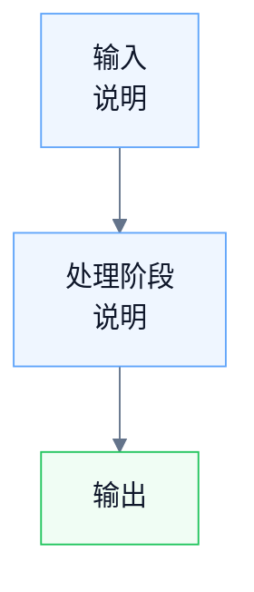

# 绘图规则

> 这份规则的目标不是追求“最花哨”的 Mermaid 图，而是保证在 **Obsidian 中稳定渲染、易读、少踩坑**。以后画流程图时，优先遵守这里的约束。

---

## 1. 总原则

- 优先保证 **稳定显示**，再考虑样式丰富。
- 优先保证 **窄屏可读**，尽量避免横向铺太宽。
- 优先保证 **节点文字完整显示**，不要为了精致样式引入渲染风险。
- 优先使用 **Mermaid 原生支持最稳的写法**，少依赖 HTML、CSS、主题覆盖。

---

## 2. 方向规则

### 2.1 主流程尽量竖向

默认使用：

```mermaid
flowchart TB
```

不要默认用：

```mermaid
flowchart LR
```

适用原则：

- 主流程图优先 `TB`
- 子流程图优先 `TB`
- 只有在确实需要横向对比时才使用 `LR`

原因：

- Obsidian 页面宽度有限
- 竖向图更适合笔记阅读
- 横向图更容易导致节点拥挤和换行异常

---

## 3. Mermaid 稳定写法

### 3.1 `br` 写法

节点内换行统一使用：

```text
<br>
```

不要使用：

```text
<br/>
```

原因：

- 在 Obsidian 中，`<br>` 的渲染更稳定
- ` <br/> ` 在部分 Mermaid/Obsidian 组合下更容易触发文字裁剪或边界计算异常

### 3.2 init 配置尽量简化

推荐：

```mermaid
%%{init: {"theme": "base", "themeVariables": {
  "background": "#ffffff",
  "primaryColor": "#eef6ff",
  "primaryBorderColor": "#60a5fa",
  "primaryTextColor": "#0f172a",
  "lineColor": "#64748b"
}}}%%
```

不要轻易在 Mermaid `init` 里加入：

- `fontFamily`
- 复杂的字体覆盖
- 不必要的额外主题变量

原因：

- Obsidian 实际字体渲染和 Mermaid 节点尺寸估算可能不一致
- 一旦手动指定字体，更容易出现中文、下划线、下行字母被裁剪

### 3.3 少用 HTML 样式包装

尽量不要在节点里写：

```text
<span style='font-size:12px'>...</span>
```

优先直接写普通文本：

```text
节点标题<br>说明文字
```

原因：

- `span`、内联样式、复杂 HTML 会增加 Mermaid 在 Obsidian 中的布局不确定性
- 尤其容易导致节点高度估算偏小，出现文字显示不全

---

## 4. 节点文案规则

### 4.1 节点文字不要太长

优先：

- 一行主标题
- 必要时一行补充说明

避免：

- 一整个句子塞进一个节点
- 同时放太多脚本名、参数名、解释语

### 4.2 手动换行优先于压缩一行

如果节点较长，优先手动换行，例如：

```text
train_qwen_lora.py<br>Qwen2.5-1.5B + PEFT LoRA
```

不要强行挤成一行。

原因：

- 手动换行比自动换行更可控
- Mermaid 自动换行不可预测，容易导致节点宽度或高度异常

### 4.3 少用高风险字符组合

以下内容更容易出现裁剪或显示不稳：

- 中文
- 下划线 `_`
- 带下行部件的字母：`g / j / p / y`

这不是说不能用，而是：

- 如果某个节点反复被裁，先检查是否包含这些字符
- 可以优先尝试手动换行
- 必要时再调整节点文案

---

## 5. 如果节点文字显示不全，修复顺序

### 第一优先级：改写法，不改 CSS

按下面顺序处理：

1. 检查是否用了 `<br/>`，如有改成 `<br>`
2. 检查 Mermaid `init` 是否写了 `fontFamily`，如有先删掉
3. 检查节点里是否用了 `span style=...`，如有先删掉
4. 把过长节点拆成两行
5. 必要时把节点文案稍微简化

### 第二优先级：再考虑增加冗余空间

如果仍有问题，可以做轻量“投机修复”：

- 在节点中手动多分一行
- 必要时在节点尾部补一个 `<br>`

例如：

```text
prompt_ids<br>list[int] → tensor(1, seq_len)<br>
```

这个方法的作用不是语义换行，而是**强行给节点多留一点高度**。

说明：

- 这比单纯补空格更有效
- 比改 CSS 更局部、更可控
- 只在个别问题节点上使用，不要默认全图都加

### 第三优先级：最后才考虑 CSS

只有在以下情况才考虑 CSS：

- 同一篇文档大量图都显示异常
- 已确认不是 Mermaid 写法问题
- 已确认不是单个节点文案问题

默认不要先上 CSS snippet。

原因：

- CSS 会引入主题耦合
- 换主题或换环境后容易再次出问题
- 文档可迁移性更差

---

## 6. 推荐模板

以后画流程图，优先从这个模板起步：



---

## 7. 本次已验证结论

这次在 MicroLM 全流程文档中，已经验证过下面这些结论：

- `flowchart TB` 比 `LR` 更适合 Obsidian 阅读
- `<br>` 比 `<br/>` 更稳定
- 去掉 `fontFamily` 后，节点文字裁剪问题明显改善
- 不使用 `span style='font-size:12px'` 更稳
- 如果仍有裁剪，优先手动换行；必要时在节点末尾补一个 `<br>`

---

## 8. 一句话执行规则

以后画 Mermaid 图时，默认这样做：

- 用 `flowchart TB`
- 用 `<br>` 换行
- 不写 `fontFamily`
- 不写 `span style=...`
- 节点文字短一点，必要时手动拆两行
- 出现裁剪时，先改节点写法，不先改 CSS
