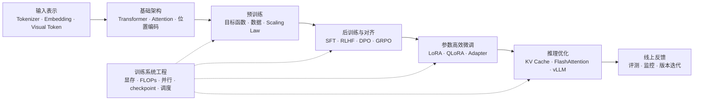

# 0a.LLM 全流程总览

> [!abstract] 页面定位
> 这是一页入门导读，只负责建立全局路线。具体概念和资料入口请回到 [[0.LLM学习地图]] 或对应主题页。

## 1. 一条主线

LLM 可以先看成一条从输入到上线的链路：

```text
文本 / 图像 / 工具请求
  -> 输入表示与模型结构
  -> 预训练形成基座能力
  -> 后训练与对齐塑造行为
  -> 参数高效微调适配场景
  -> 推理优化支撑服务
  -> 线上反馈推动迭代

训练系统工程横切所有阶段。
```

## 2. 全流程图



## 3. 六个主题域

| 主题 | 解决的问题 | 入口 |
|---|---|---|
| 基础架构 | 输入如何进入模型，Transformer 如何处理上下文 | [[基础架构]] |
| 预训练 | 模型如何获得基础语言和知识能力 | [[预训练]] |
| 后训练与对齐 | 模型如何变得会协作、可控、能推理 | [[后训练与对齐]] |
| 参数高效微调 | 如何低成本适配具体任务 | [[参数高效微调]] |
| 推理优化 | 如何低延迟、高吞吐、低成本地服务请求 | [[推理优化]] |
| 训练系统工程 | 上述阶段如何在真实硬件和框架里跑起来 | [[训练系统工程]] |

## 4. 推荐阅读顺序

1. [[基础架构]]：先理解 tokenizer、embedding、Transformer、Attention、位置编码。
2. [[预训练]]：再理解 next token prediction、数据、loss、optimizer、Scaling Law。
3. [[后训练与对齐]]：然后区分 SFT、RLHF、DPO、PPO、GRPO、Reasoning RL。
4. [[参数高效微调]]：需要做任务适配时，再看 LoRA、QLoRA、Adapter。
5. [[推理优化]]：需要上线或加速时，看 KV Cache、FlashAttention、vLLM。
6. [[训练系统工程]]：遇到显存、吞吐、并行、checkpoint、框架问题时回到这里。

## 5. 本页和总图的分工

| 页面 | 职责 |
|---|---|
| [[0a.LLM全流程总览]] | 建立全局感，解释为什么这样分层 |
| [[0.LLM学习地图]] | 做主题导航，告诉你下一步去哪页 |
| 各主题页 | 承接概念、重点资料、边界和待补问题 |
