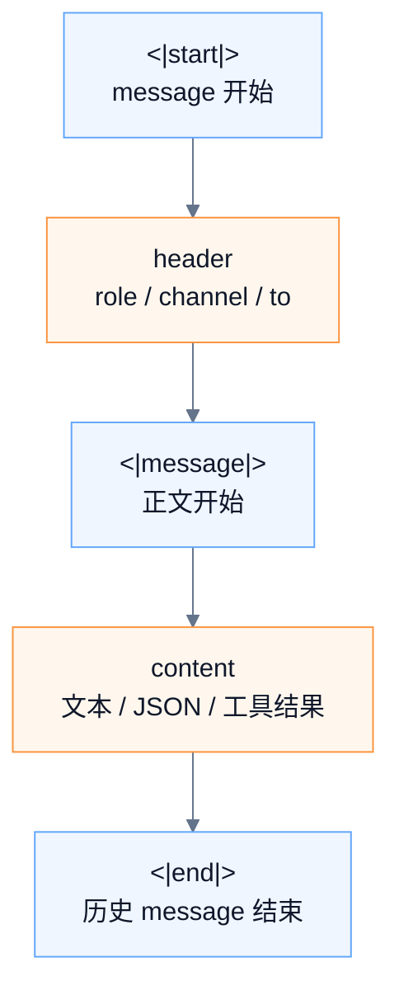
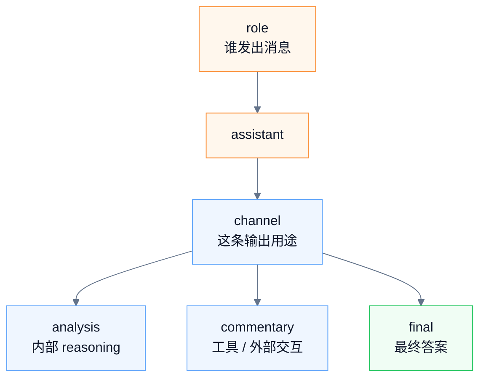
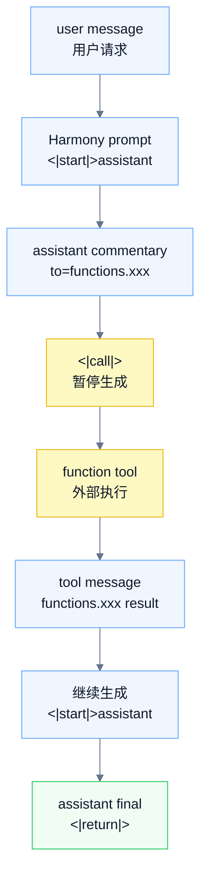
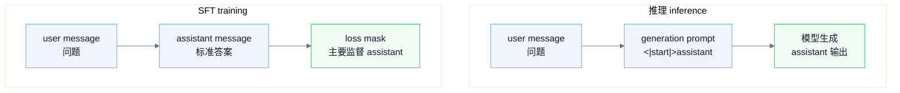

# gpt-oss Chat Template 与 Harmony 格式学习笔记

> 版本：2026-05-11  
> 主线：理解原始 `messages` 如何经过 chat template / Harmony renderer 变成 gpt-oss 真正吃到的字符串和 token 序列，以及模型输出如何再解析回应用层消息。

---

## 整体概念理解

gpt-oss 的 chat template 本质上是在做一件事：把应用层的结构化 `messages` 渲染成模型真正吃的 Harmony token 序列，并在模型输出后再把 Harmony output 解析回应用层消息。

```text
应用层 messages
  ↓ chat template / Harmony renderer
Harmony prompt
  ↓ tokenizer
input_ids
  ↓ model.generate()
Harmony output
  ↓ parser
final answer / tool call / structured assistant message
```

也就是说，`messages` 是应用层抽象；Harmony 才是 gpt-oss 的输入输出协议；模型真正吃的是 token ids。

总览 Canvas：


[打开原始 Canvas](../08-%E5%9B%BE%E7%89%87/gpt_oss_harmony_overview.canvas)

### Message 结构

Harmony 会话由一条条 message 组成。一条历史 message 的基本结构是：

```text
<|start|>{header}<|message|>{content}<|end|>
```

其中，`<|start|>`、`<|message|>`、`<|end|>` 是特殊 token：

| token | 作用 |
|---|---|
| `<|start|>` | 表示一条 message 开始 |
| `<|message|>` | 表示 header 结束、content 开始 |
| `<|end|>` | 表示这条历史 message 结束 |

`header` 是 `<|start|>` 和 `<|message|>` 之间的区域，用来描述消息元信息。它至少包含 role，也可能包含 channel、recipient、constraint 等信息。

`content` 是 `<|message|>` 之后的正文区域。它可以是普通自然语言，也可以是 developer instructions、system 元信息、assistant final answer、analysis 内容、tool call JSON 参数或 tool 返回结果。

注意，`header` 和 `content` 是逻辑区域，不是特殊 token；并不存在 `<|header|>` 或 `<|content|>`。



### Role

role 描述“这条 message 是谁发出的”。常见 role 包括 `system`、`developer`、`user`、`assistant`，以及 tool role / function name。

| role | 作用 |
|---|---|
| `system` | 模型运行层，存储模型级元信息和协议配置 |
| `developer` | 开发者指令层，通常对应普通应用里的 system prompt |
| `user` | 用户输入 |
| `assistant` | 模型输出，包括回答、reasoning、工具调用请求 |
| tool role / function name | 工具执行后的返回结果，例如 `functions.get_weather` |

`system` message 主要存储模型级元信息和运行配置，例如模型身份、知识截止日期、当前日期、reasoning effort、valid channels、内置工具等。它不是普通应用里“你是一个中文助手”那种业务系统提示词，而更像模型运行元信息和协议配置层。

`developer` message 承载开发者指令，通常对应普通应用里说的 system prompt，也可能包含自定义工具定义、response format 等工程配置。因此可以记成：

```text
应用层 system prompt ≈ Harmony developer message
Harmony system message ≈ 模型元信息 / 运行协议配置
```

`user` message 表示用户输入：

```text
<|start|>user<|message|>KV cache 是什么？<|end|>
```

`assistant` message 表示模型输出。assistant 输出可以是 `analysis`、`commentary` 或 `final`。例如：

```text
<|start|>assistant<|channel|>final<|message|>KV cache 是一种缓存历史 key/value 张量的机制。<|end|>
```

### Channel

channel 描述“assistant 这条输出的用途”。channel 和 role 不是一回事：role 描述消息发送者，channel 描述 assistant 输出意图。

核心 channel 有三类：`analysis`、`commentary`、`final`。

| channel      | 含义                                    | 默认展示策略  |
| ------------ | ------------------------------------- | ------- |
| `analysis`   | 模型内部 reasoning / raw chain-of-thought | 默认隐藏    |
| `commentary` | 与外部世界交互，尤其常用于 function tool call      | 按产品策略处理 |
| `final`      | 最终回答                                  | 默认展示    |



`analysis` 是内部 reasoning 通道，包含模型的推理、分析过程、工具选择思路等内容，不应直接展示给终端用户。

`commentary` 是与外部世界交互的通道，尤其常用于 function tool call。它可以包含工具调用请求、工具调用参数、工具调用前的 preamble，或与工具交互相关的中间内容。`commentary` 不是最终答案，其中的自然语言内容是否展示给用户取决于产品策略；tool call 本体通常不直接展示为用户最终回答。

`final` 是最终回答通道，面向用户展示。普通聊天 UI 通常只提取 `final` 内容作为最终答案。

最短心智模型：

```text
analysis = 模型内部想
commentary = 模型和工具 / 外部系统交互
final = 模型最终对用户说
```

工程展示策略：

```text
analysis 默认隐藏；
commentary 按产品策略处理；
final 默认展示。
```

### Tool Calling

工具调用请求和工具返回结果是两种不同 message。

assistant 发起工具调用时，message 的 role 仍然是 `assistant`，只是 header 里通过 `to=...` 指定目标工具，并用 `<|call|>` 表示需要暂停生成、执行工具：

```text
<|start|>assistant<|channel|>commentary to=functions.search <|constrain|>json<|message|>{"query":"gpt-oss harmony"}<|call|>
```

工具执行后的返回结果，才会作为 tool role / function name message 追加回上下文：

```text
<|start|>functions.search to=assistant<|channel|>commentary<|message|>{"results":[...] }<|end|>
```

最容易混淆的一点是：

```text
调用工具的是 assistant。
返回结果的是 tool / function name。
```



### 生成与停止 Token

`<|end|>` 主要用于历史上下文中的完整 message。模型生成阶段还可能用 `<|return|>` 或 `<|call|>` 结束本轮生成。

| token | 使用场景 | 工程含义 |
|---|---|---|
| `<|end|>` | 历史上下文中的完整 message 结束 | message 已完成，可作为后续 prompt 的一部分 |
| `<|return|>` | 生成阶段，模型完成最终 response | 停止生成；通常表示可以向用户返回 final |
| `<|call|>` | 生成阶段，模型请求调用工具 | 停止生成；外部系统执行工具，然后把工具结果追加回上下文 |

推理时，prompt 通常会预填到：

```text
<|start|>assistant
```

所以模型第一段 completion 可能直接从 `<|channel|>` 开始：

```text
<|channel|>final<|message|>...<|return|>
```

完整 assistant message 是 prompt 里的 prefill 和模型生成的 completion 拼起来的结果。

### 推理与 SFT

推理时，assistant 当前回答还不存在，chat template 通常只把 prompt 渲染到 generation prompt：

```text
<|start|>user<|message|>解释 KV cache<|end|>
<|start|>assistant
```

然后由模型继续生成 assistant 输出。

SFT 训练时，一条 training example / sample 里通常包含多条 messages，例如相邻的一条 user message 和一条 assistant 标准答案 message：

```text
<|start|>user<|message|>解释 KV cache<|end|>
<|start|>assistant<|channel|>final<|message|>KV cache 是...<|end|>
```

所以不是“一个 message 里同时放提问和回答”，而是：

```text
一条 SFT sample 里面有多条 messages；
提问是一条 user message；
回答是一条 assistant message。
```

训练时，整段 token 序列会被喂给模型，但通常通过 loss mask 主要监督 assistant 输出部分。user message 主要作为上下文，assistant message 作为标准答案。



---

## 0. 一句话结论

gpt-oss 不是普通的“把 user 文本拼到 prompt 后面就能稳定工作的模型”。它训练时使用的是 OpenAI 的 **Harmony response format**。因此，如果你直接用 gpt-oss 权重做推理，就必须让输入符合 Harmony 格式；如果你通过某些上层框架、推理服务或兼容 API 调用，框架可能已经自动帮你完成了 chat template 渲染。

最重要的理解是：

```text
应用层 messages
  ↓ chat template / Harmony renderer
Harmony prompt 字符串
  ↓ tokenizer
input_ids
  ↓ model.generate()
Harmony output tokens
  ↓ parser
应用层 assistant message / tool call / final answer
```

Harmony 不是“额外输入层”，而是 gpt-oss 的最终 prompt 组织协议。

---

## 1. gpt-oss 基础背景

### 1.1 gpt-oss 是什么

gpt-oss 是 OpenAI 发布的开放权重 reasoning 模型系列，主要包括：

- `gpt-oss-120b`
- `gpt-oss-20b`

它们适合在自有基础设施、私有云、第三方推理服务、本地推理框架中运行。它们的重点能力包括 reasoning、tool calling、structured output，以及较灵活的部署和微调。

### 1.2 open-weight 与 open-source 的区别

学习 gpt-oss 时，要区分两个概念：

| 概念 | 含义 |
|---|---|
| open-weight | 模型权重开放，可下载、部署、修改、再分发，通常受特定许可约束 |
| open-source | 不仅权重开放，训练代码、训练数据、完整管线等也可能开放 |

所以更严谨的说法是：gpt-oss 是 **open-weight model**，不是“完整开源的 OpenAI 训练体系”。

### 1.3 为什么 gpt-oss 需要专门的 chat template

因为 gpt-oss 的对话结构不是简单的：

```json
{"role": "user", "content": "你好"}
```

模型实际看到的是一串特殊格式化后的 token。这个格式需要表达：

- 谁说的话：`system` / `developer` / `user` / `assistant` / tool
- assistant 的输出意图：`analysis` / `commentary` / `final`
- 是否要调用工具
- 工具调用的目标 recipient
- 工具调用参数是否受 JSON 等格式约束
- 最终回答在哪里结束

普通 ChatML 或 Llama chat template 通常只关心 role 和 content；Harmony 还要关心 reasoning、tool calling、final answer 分离等结构。

---

## 2. Chat Template 的作用

### 2.1 应用层 messages 是什么

在应用层，我们通常用结构化对象保存会话：

```python
messages = [
    {"role": "system", "content": "你是一个中文技术助手。"},
    {"role": "user", "content": "KV cache 是什么？"}
]
```

这只是应用层数据结构，不是模型直接吃到的最终输入。

### 2.2 模型实际输入是什么

模型最终吃到的是 token id 序列：

```text
input_ids = [200006, ..., 200008, ..., 200007, ...]
```

这些 token id 对应的是经过 Harmony 格式化后的文本，例如：

```text
<|start|>system<|message|>...模型元信息...<|end|>
<|start|>developer<|message|># Instructions

你是一个中文技术助手。<|end|>
<|start|>user<|message|>KV cache 是什么？<|end|>
<|start|>assistant
```

### 2.3 `apply_chat_template()` 做了什么

`apply_chat_template()` 的作用是把应用层 messages 渲染成模型期望的 prompt 格式。

它通常负责：

1. 插入必要的 system 元信息；
2. 把应用层 system prompt 映射到 Harmony developer message；
3. 渲染 user / assistant 历史消息；
4. 添加 generation prompt，例如最后的 `<|start|>assistant`；
5. 再交给 tokenizer 编码成 `input_ids`。

所以不要把 `{role, content}` 对象直接输入模型。模型不会直接理解 Python dict 或 JSON messages；它只理解 token 序列。

---

## 3. Harmony 格式总览

### 3.1 Harmony 是什么

Harmony 是 gpt-oss 使用的会话序列化格式。它解决的是：

- 如何组织多角色消息；
- 如何区分 assistant 的内部 reasoning 与最终回答；
- 如何表达 tool calling；
- 如何把工具返回结果重新喂回模型；
- 如何让 parser 从模型输出中提取 final answer 或 tool call。

### 3.2 Harmony 的核心设计

Harmony 把一次对话拆成一条条 message。每条 message 大体由三部分组成：

```text
<|start|>{header}<|message|>{content}<|end|>
```

其中：

| 部分 | 作用 |
|---|---|
| `<|start|>` | 表示一条 message 开始 |
| `{header}` | 表示 role、channel、recipient、constraint 等元信息 |
| `<|message|>` | 表示 header 结束、content 开始 |
| `{content}` | 消息正文 |
| `<|end|>` | 表示一条完整 message 结束 |

注意：`header` 和 `content` 是逻辑区域，不是名为 `<|header|>` 或 `<|content|>` 的特殊 token。

---

## 4. 一条 Message 的基本结构

### 4.1 最小结构

```text
<|start|>user<|message|>你好<|end|>
```

解释：

```text
<|start|>      message 开始
user           header：role=user
<|message|>    header 结束，content 开始
你好           content
<|end|>        message 结束
```

### 4.2 assistant message 示例

assistant 的 message 通常会带 channel：

```text
<|start|>assistant<|channel|>final<|message|>你好，我可以帮你。<|end|>
```

含义：

- role 是 `assistant`
- channel 是 `final`
- content 是最终回答

### 4.3 tool call message 示例

```text
<|start|>assistant<|channel|>commentary to=functions.get_weather <|constrain|>json<|message|>{"location":"Tokyo"}<|call|>
```

含义：

- role 是 `assistant`
- channel 是 `commentary`
- recipient 是 `functions.get_weather`
- 参数格式约束是 JSON
- content 是工具参数
- `<|call|>` 表示模型希望调用工具，此时推理应暂停，等待外部系统执行工具

---

## 5. Header 的设计

### 5.1 header 是什么

header 是 `<|start|>` 和 `<|message|>` 之间的区域，用来描述 message 的元信息。

常见 header 形态：

```text
user
assistant<|channel|>final
assistant<|channel|>analysis
assistant<|channel|>commentary to=functions.get_weather <|constrain|>json
functions.get_weather to=assistant<|channel|>commentary
```

### 5.2 header 可以包含什么

| 元信息 | 示例 | 说明 |
|---|---|---|
| role | `user` | 消息角色 |
| channel | `<|channel|>final` | assistant 输出通道 |
| recipient | `to=functions.get_weather` | 工具调用目标 |
| constraint | `<|constrain|>json` | 工具调用参数格式约束 |

### 5.3 为什么没有 `<|header|>` token

Harmony 使用 `<|start|>` 开始 message，然后直接进入 header。直到遇到 `<|message|>`，才说明 header 结束、content 开始。

所以：

```text
<|start|>{header}<|message|>{content}<|end|>
```

而不是：

```text
<|start|><|header|>{header}<|content|>{content}<|end|>
```

这是一个常见误区。

---

## 6. Content 的设计

### 6.1 content 是什么

content 是 `<|message|>` 后面的正文区域。它可以是：

- 普通自然语言文本；
- system 元信息；
- developer instructions；
- user 输入；
- assistant final answer；
- assistant analysis 内容；
- assistant commentary 内容；
- tool call JSON 参数；
- tool 返回的 JSON 或文本结果。

### 6.2 不同 role 下 content 的含义

| role / channel | content 含义 |
|---|---|
| `system` | 模型身份、日期、reasoning effort、可用 channel、内置工具定义等 |
| `developer` | 开发者指令、应用层 system prompt、自定义 function tools、response format 等 |
| `user` | 用户输入 |
| `assistant + analysis` | 模型内部 reasoning / raw CoT，不应展示给终端用户 |
| `assistant + commentary` | 工具调用、工具调用前的用户可见 preamble，或与工具交互相关的中间内容 |
| `assistant + final` | 最终用户可见回答 |
| tool name | 工具返回值，例如 `functions.get_weather` 的输出 |

---

## 7. Role 体系

Harmony 中主要有五类 role：

| role | 作用 |
|---|---|
| `system` | 模型级元信息：身份、日期、reasoning effort、channel、内置工具等 |
| `developer` | 开发者指令：通常对应其他 chat template 里的 system prompt；也用于定义自定义 function tools |
| `user` | 用户输入 |
| `assistant` | 模型输出，可以是 final answer，也可以是 reasoning 或 tool call |
| tool role / function name | 工具返回消息，role 通常就是具体工具名 |

### 7.1 优先级

Harmony 中的指令层级可以理解为：

```text
system > developer > user > assistant > tool
```

如果不同层级之间存在冲突，高层级优先。

### 7.2 Harmony system 不等于传统 system prompt

这是理解 gpt-oss chat template 的关键。

在很多模型或 API 中，`system` 就是“开发者给模型的最高层指令”。但在 Harmony 里，`system` 更像模型运行元信息层，通常包括：

```text
You are ChatGPT, a large language model trained by OpenAI.
Knowledge cutoff: ...
Current date: ...

Reasoning: high

# Valid channels: analysis, commentary, final. Channel must be included for every message.
```

而你在应用层写的：

```python
{"role": "system", "content": "你是一个中文技术助手。"}
```

在许多 chat template 实现中，实际会被映射为 Harmony 的 `developer` message，例如：

```text
<|start|>developer<|message|># Instructions

你是一个中文技术助手。<|end|>
```

结论：

```text
应用层 system prompt ≈ Harmony developer message
Harmony system message ≈ 模型元信息 + 运行配置
```

不要假设二者一一等价。

---

## 8. Channel 体系

Harmony 的 assistant 输出有三个核心 channel：

| channel      | 作用                                          | 是否给终端用户展示              |
| ------------ | ------------------------------------------- | ---------------------- |
| `analysis`   | 内部 reasoning / raw CoT / 工具推理链              | 不展示                    |
| `commentary` | function tool call；有时也包含工具调用前的用户可见 preamble | 视内容而定，不能当 final answer |
| `final`      | 最终回答                                        | 展示                     |

### 8.1 `analysis`

`analysis` 是模型的内部 reasoning 通道。它可能包含 raw chain-of-thought。

工程上要记住：

- 不要把 `analysis` 原样展示给终端用户；
- 不要把 `analysis` 当作最终答案；
- 普通多轮对话中，上一轮已经有 `final` 后，通常不应把旧的 analysis 再塞回下一轮 prompt；
- 但工具调用链是例外，后文会讲。

### 8.2 `commentary`

`commentary` 主要用于 function tool call，例如：

```text
<|start|>assistant<|channel|>commentary to=functions.search <|constrain|>json<|message|>{"query":"..."}<|call|>
```

它也可能出现工具调用前的 preamble，例如模型告诉用户“我会先查询资料，再整理结论”。这种 preamble 可以展示，但它仍然不是最终答案。

因此，不要简单地说“commentary 都给用户看”或“commentary 都不给用户看”。更准确的策略是：

```text
final：默认展示
analysis：默认隐藏
commentary：按内容和产品设计处理；tool call 本体一般不直接展示为最终回答
```

### 8.3 `final`

`final` 是最终答案通道。面向用户的 UI 通常只展示 final 内容。

---

## 9. 特殊 Token 详解

Harmony 中常见特殊 token：

| token | 作用 |
|---|---|
| `<|start|>` | message 开始 |
| `<|message|>` | header 结束，content 开始 |
| `<|end|>` | 一条完整 message 结束 |
| `<|channel|>` | header 中 channel 信息开始 |
| `<|constrain|>` | tool call 参数格式约束开始 |
| `<|return|>` | 模型完成本轮 response message；有效 stop token |
| `<|call|>` | 模型请求调用工具；有效 stop token |

### 9.1 `<|end|>`、`<|return|>`、`<|call|>` 的区别

这三个 token 很容易混淆。

| token | 使用场景 | 工程含义 |
|---|---|---|
| `<|end|>` | 历史上下文中的完整 message 结束 | message 已完成，可作为后续 prompt 的一部分 |
| `<|return|>` | 生成阶段，模型完成最终 response | 停止生成；通常表示可以向用户返回 final |
| `<|call|>` | 生成阶段，模型请求调用工具 | 停止生成；外部系统执行工具，然后把工具结果追加回上下文 |

关键规则：

```text
生成时可以以 <|return|> 停止。
保存到历史上下文时，通常应把已完成 assistant message 规范化为 <|end|>。
工具调用以 <|call|> 停止，然后等待工具返回。
```

---

## 10. 从原始 messages 到 Harmony prompt

### 10.1 原始 messages

```python
messages = [
    {"role": "system", "content": "你是一个中文技术助手。"},
    {"role": "user", "content": "KV cache 是什么？"}
]
```

### 10.2 Harmony 渲染后的可能形态

```text
<|start|>system<|message|>You are ChatGPT, a large language model trained by OpenAI.
Knowledge cutoff: 2024-06
Current date: 2026-05-11

Reasoning: medium

# Valid channels: analysis, commentary, final. Channel must be included for every message.<|end|>
<|start|>developer<|message|># Instructions

你是一个中文技术助手。<|end|>
<|start|>user<|message|>KV cache 是什么？<|end|>
<|start|>assistant
```

### 10.3 逐步解释

第一条：Harmony system message

```text
<|start|>system<|message|>...<|end|>
```

用于注入模型身份、日期、reasoning effort、可用 channel 等。

第二条：Harmony developer message

```text
<|start|>developer<|message|># Instructions

你是一个中文技术助手。<|end|>
```

应用层 system prompt 被转换成 developer instructions。

第三条：user message

```text
<|start|>user<|message|>KV cache 是什么？<|end|>
```

用户输入被正常渲染为 user message。

第四条：generation prompt

```text
<|start|>assistant
```

这不是完整 message，而是告诉模型：现在轮到 assistant 开始生成。

---

## 11. Assistant 输出格式

### 11.1 普通 final-only 输出

模型可能直接输出 final：

```text
<|channel|>final<|message|>KV cache 是 Transformer 推理中用于缓存历史 token 的 key/value 张量的机制。<|return|>
```

因为 prompt 已经以 `<|start|>assistant` 结尾，所以模型输出可以从 `<|channel|>` 开始。

### 11.2 analysis + final 输出

reasoning 模型也可能先输出 analysis，再输出 final：

```text
<|channel|>analysis<|message|>{reasoning text}<|end|>
<|start|>assistant<|channel|>final<|message|>KV cache 是 Transformer 推理中用于缓存历史 token 的 key/value 张量的机制。<|return|>
```

应用层 parser 应提取 `final` 内容给用户，而不是展示 `analysis`。

### 11.3 tool call 输出

如果模型需要调用工具，输出可能是：

```text
<|channel|>analysis<|message|>{reasoning text}<|end|>
<|start|>assistant<|channel|>commentary to=functions.search <|constrain|>json<|message|>{"query":"gpt-oss harmony format"}<|call|>
```

此时生成应在 `<|call|>` 处停止，外部程序执行工具。

---

## 12. Tool Calling 设计

Tool calling 是 Harmony 设计中最重要的部分之一。

### 12.1 自定义 function tools

自定义 function tools 通常放在 developer message 的 `# Tools` 区块里，使用 TypeScript-like namespace 写法。

示例：

```text
<|start|>developer<|message|># Instructions

你是一个可以查询天气的助手。

# Tools

## functions

namespace functions {

// Gets the current weather in the provided location.
type get_weather = (_: {
  // City name, e.g. Tokyo
  location: string,
}) => any;

} // namespace functions<|end|>
```

系统消息中还应说明 function call 走 `commentary` channel：

```text
Calls to these tools must go to the commentary channel: 'functions'.
```

### 12.2 工具调用 message

当模型决定调用工具时：

```text
<|start|>assistant<|channel|>commentary to=functions.get_weather <|constrain|>json<|message|>{"location":"Tokyo"}<|call|>
```

解析时要提取：

```json
{
  "tool_name": "functions.get_weather",
  "arguments": {"location": "Tokyo"}
}
```

### 12.3 工具返回 message

外部系统执行工具后，需要把结果作为新的 tool message 放回上下文：

```text
<|start|>functions.get_weather to=assistant<|channel|>commentary<|message|>{"temperature":20,"condition":"sunny"}<|end|>
```

然后继续生成：

```text
<|start|>assistant
```

模型再基于工具结果输出 final。

### 12.4 内置 tools 与 function tools 的区别

需要特别区分：

| 类型 | 定义位置 | 常见 channel |
|---|---|---|
| 自定义 function tools | developer message 的 `# Tools` 区块 | `commentary` |
| 内置工具，如 browser / python | system message 的 `# Tools` 区块 | 通常是 `analysis`，也可能出现在 `commentary` |

如果你只实现普通业务函数调用，大多数情况下重点掌握 function tools 即可。若要模拟模型训练时见过的浏览器或 Python 工具格式，则要按 system message 的 built-in tools 方式定义。

---

## 13. 多轮对话中的消息管理

多轮对话的难点在于：哪些消息应该保留，哪些应该丢弃。

### 13.1 普通对话：保留 final，丢弃 raw CoT

第一轮：

```text
<|start|>user<|message|>2 + 2 等于几？<|end|>
<|start|>assistant
```

模型输出：

```text
<|channel|>analysis<|message|>{reasoning text}<|end|>
<|start|>assistant<|channel|>final<|message|>2 + 2 = 4。<|return|>
```

下一轮保存历史时，应变成：

```text
<|start|>user<|message|>2 + 2 等于几？<|end|>
<|start|>assistant<|channel|>final<|message|>2 + 2 = 4。<|end|>
<|start|>user<|message|>那 9 / 2 呢？<|end|>
<|start|>assistant
```

注意：上一轮 `analysis` 被丢弃，上一轮 final 的 `<|return|>` 被规范化为 `<|end|>`。

### 13.2 工具调用链：临时保留 analysis

如果上一轮 assistant 的最后输出是 tool call，则情况不同。

模型可能先生成：

```text
<|channel|>analysis<|message|>{reasoning text}<|end|>
<|start|>assistant<|channel|>commentary to=functions.get_weather <|constrain|>json<|message|>{"location":"Tokyo"}<|call|>
```

工具返回：

```text
<|start|>functions.get_weather to=assistant<|channel|>commentary<|message|>{"temperature":20}<|end|>
```

此时继续生成时，需要保留与工具调用相关的上下文，包括刚才的 analysis、tool call 和 tool result。原因是模型需要这些上下文来完成推理链并生成 final。

一旦模型最终输出 `final`，下一轮普通对话再回到“保留 final、丢弃 raw CoT”的策略。

### 13.3 推荐状态管理表

| 场景 | 保存到下一轮吗 |
|---|---|
| user message | 保存 |
| assistant final | 保存，结尾规范化为 `<|end|>` |
| assistant analysis，且本轮已 final | 通常丢弃 |
| assistant analysis，且仍在 tool call 链中 | 临时保留 |
| assistant commentary tool call | tool 链中保留 |
| tool result | tool 链中保留 |
| raw CoT 给用户展示 | 不展示 |

---

## 14. 训练数据中的 Message 设计

### 14.1 SFT 数据与推理时 messages 的区别

推理时：

```python
messages = [
    {"role": "user", "content": "解释 KV cache"}
]
```

这表示：用户提出了一个问题，当前 assistant 的回答还不存在，需要模型继续生成。

经过 chat template / Harmony renderer 后，推理 prompt 通常类似：

```text
<|start|>user<|message|>解释 KV cache<|end|>
<|start|>assistant
```

最后的：

```text
<|start|>assistant
```

是 generation prompt，用来告诉模型“现在轮到 assistant 开始输出”。模型接下来才生成：

```text
<|channel|>final<|message|>KV cache 是...<|return|>
```

所以推理时的核心是：

```text
给模型上下文，让模型预测后续 assistant 输出。
```

训练时则不同。SFT 是 supervised fine-tuning，也就是监督微调。一条训练样本通常不仅包含用户输入，还包含 assistant 的标准答案，有时还会包含 assistant reasoning、tool call、tool result 后的 final answer 等信息。

例如一条 SFT 样本可能是：

```json
{
  "messages": [
    {"role": "user", "content": "解释 KV cache"},
    {"role": "assistant", "content": "KV cache 是 Transformer 推理中缓存历史 key/value 张量的机制。"}
  ]
}
```

这里要特别区分两个概念：

| 概念 | 含义 |
|---|---|
| SFT sample / training example | 一条训练样本，里面可以包含一整段对话 |
| message | 对话中的一条消息，例如一条 user message 或一条 assistant message |

所以不是“一个 message 里同时放提问和回答”。更准确地说是：

```text
一条 SFT sample 里面有多条 messages；
提问是一条 user message；
回答是一条 assistant message；
它们在渲染后是相邻的两条 Harmony message。
```

上面的训练样本渲染成 Harmony 后，大概是：

```text
<|start|>user<|message|>解释 KV cache<|end|>
<|start|>assistant<|channel|>final<|message|>KV cache 是 Transformer 推理中缓存历史 key/value 张量的机制。<|end|>
```

注意，这里是两条相邻 message：

```text
<|start|>user<|message|>解释 KV cache<|end|>
```

以及：

```text
<|start|>assistant<|channel|>final<|message|>KV cache 是 Transformer 推理中缓存历史 key/value 张量的机制。<|end|>
```

不要把它们合并成一条 user message，例如：

```text
<|start|>user<|message|>解释 KV cache
答案：KV cache 是 Transformer 推理中缓存历史 key/value 张量的机制。<|end|>
```

这样模型会以为“问题 + 答案”都是用户说的话，而不是 assistant 应该学习输出的内容。

也不要合并成一条 assistant message，例如：

```text
<|start|>assistant<|message|>用户问：解释 KV cache
回答：KV cache 是 Transformer 推理中缓存历史 key/value 张量的机制。<|end|>
```

这样会破坏 `user -> assistant` 的角色结构，模型学到的就不是正常的对话轮次。

推理和训练的另一个关键区别是：推理时 assistant 当前回答还没有，所以 prompt 只预填到 `<|start|>assistant`；而 SFT 训练时标准答案已经在数据里，所以会把完整 assistant message 渲染出来。

对比一下：

```text
推理时：
<|start|>user<|message|>解释 KV cache<|end|>
<|start|>assistant

SFT 训练时：
<|start|>user<|message|>解释 KV cache<|end|>
<|start|>assistant<|channel|>final<|message|>KV cache 是...<|end|>
```

训练时，整段 token 序列都会被喂给模型。但计算 loss 时，通常会做 loss mask：user message 主要作为上下文，assistant message 作为监督目标。

可以理解成：

```text
输入给模型的完整 token：
[user message][assistant answer]

希望模型学习预测的部分：
              [assistant answer]
```

更具体地说：

```text
<|start|>user<|message|>解释 KV cache<|end|>
^^^^^^^^^^^^^^^^^^^^^^^^^^^^^^^^^^^^^^^^^^^^^^
这部分通常作为上下文，不作为主要学习目标

<|start|>assistant<|channel|>final<|message|>KV cache 是...<|end|>
^^^^^^^^^^^^^^^^^^^^^^^^^^^^^^^^^^^^^^^^^^^^^^^^^^^^^^^^^^^^^^^^^^^
这部分作为 assistant 标准输出，计算 loss
```

有些训练实现会从 assistant message 的开头就开始算 loss，包括：

```text
<|start|>assistant<|channel|>final<|message|>
```

因为模型不仅要学习答案正文，也要学习正确输出 Harmony 的 role、channel 和控制 token。也有些实现只对正文内容算 loss，具体取决于训练框架和数据处理策略。

因此，14.1 这一节的重点是：

```text
推理时：给问题，让模型答。
SFT 时：给问题和标准答案，让模型学。
Harmony：两种场景最终都要渲染成模型认识的格式。
```

但注意：训练数据的抽象字段不一定等于最终 token 格式。你不应该随手在训练样本里硬拼控制 token，除非你完全确认 tokenizer、renderer、loss mask、stop token 和 parser 都匹配。

### 14.2 reasoning 与 final 的分离

如果你的训练框架支持 reasoning 数据，常见抽象可能会把 assistant 的 reasoning 与最终回答分开，例如：

```json
{
  "messages": [
    {"role": "user", "content": "解释 KV cache"},
    {
      "role": "assistant",
      "thinking": "...",
      "content": "KV cache 是 Transformer 推理中缓存历史 key/value 的机制。"
    }
  ]
}
```

这里的 `thinking` / `content` 只是数据层抽象，字段名依具体框架而定。最终仍应由官方 tokenizer、Transformers chat template 或 `openai-harmony` 渲染成 Harmony 格式。

### 14.3 不建议手写控制 token

不推荐这样做：

```json
{
  "text": "<|start|>user<|message|>...<|end|><|start|>assistant..."
}
```

除非你非常清楚：

- 特殊 token 是否被 tokenizer 当作单个 token；
- 是否正确设置 stop tokens；
- 是否正确区分 prompt 和 completion loss；
- 是否处理了 `<|return|>` 与 `<|end|>` 的差异；
- 是否会污染训练数据中的 role / channel 结构。

更推荐：保留结构化 messages，让 tokenizer 或 renderer 统一渲染。

---

## 15. 工程实现建议

### 15.1 优先使用官方或框架内置 chat template

如果使用 Transformers：

```python
from transformers import AutoModelForCausalLM, AutoTokenizer

model_name = "openai/gpt-oss-20b"

tokenizer = AutoTokenizer.from_pretrained(model_name)
model = AutoModelForCausalLM.from_pretrained(
    model_name,
    torch_dtype="auto",
    device_map="auto"
)

messages = [
    {"role": "system", "content": "你是一个中文技术助手。"},
    {"role": "user", "content": "解释 KV cache。"},
]

inputs = tokenizer.apply_chat_template(
    messages,
    add_generation_prompt=True,
    return_tensors="pt",
    return_dict=True,
).to(model.device)

outputs = model.generate(
    **inputs,
    max_new_tokens=512,
    temperature=0.7,
)

text = tokenizer.decode(outputs[0])
```

重点是：不要跳过 `apply_chat_template()`。

这里的“官方或框架内置 chat template”指的是：不要自己手写 Harmony 控制 token，而是让 tokenizer / 推理框架里已经配置好的模板把结构化 `messages` 渲染成模型输入。`apply_chat_template()` 是 Transformers tokenizer 的方法名，它更像一个方便入口：

```text
messages
  ↓ tokenizer.apply_chat_template(...)
Harmony prompt / input_ids
```

它和 `openai-harmony` 的关系可以理解为：

| 工具 | 定位 | 常见方法名 |
|---|---|---|
| Transformers chat template | 框架内置的模板渲染入口，适合普通推理和简单对话 | `tokenizer.apply_chat_template(...)` |
| `openai-harmony` | OpenAI Harmony 专用工具箱，适合更精细地渲染、解析、处理 tool call 和 stop token | `render_conversation_for_completion(...)` / `parse_messages_from_completion_tokens(...)` |

所以，`openai-harmony` 不一定提供名为 `apply_chat_template()` 的方法；这个名字主要属于 Transformers。它提供的是概念上等价、但更底层也更完整的 Harmony renderer，例如：

```text
Conversation / Message
  ↓ render_conversation_for_completion(...)
Harmony prefill token ids
```

因此，本笔记研究的不是某一个具体库的 API，而是 gpt-oss 所需的 Harmony 格式规则本身。Transformers 的 `apply_chat_template()` 和 `openai-harmony` 都是实现这些规则的工具；前者偏方便集成，后者偏完整协议工具箱。

### 15.2 什么时候使用 `openai-harmony`

当你需要更细控制时，使用 `openai-harmony` 更合适，例如：

- 自己写推理服务；
- 需要精确控制 system / developer / tool definitions；
- 需要解析 tool call；
- 需要处理 streaming；
- 需要拿到 structured message，而不是只拿一段 decoded text；
- 需要正确配置 stop tokens。

典型流程：

```text
Conversation / Message 对象
  ↓
render_conversation_for_completion
  ↓
prefill_ids
  ↓
model.generate(..., eos_token_id=stop_token_ids)
  ↓
completion_ids
  ↓
parse_messages_from_completion_tokens
  ↓
structured assistant messages
```

### 15.3 自己写 renderer 时的最小要求

如果你必须自己写 renderer，至少要覆盖：

1. system message 注入；
2. developer instructions 渲染；
3. user message 渲染；
4. assistant 历史 final 渲染；
5. tool call message 渲染；
6. tool result message 渲染；
7. generation prompt 添加；
8. stop token 配置；
9. output parser；
10. 多轮状态管理。

### 15.4 Parser 设计

parser 至少要能识别：

```text
assistant + final        → final answer
assistant + commentary   → preamble 或 tool call
to=functions.xxx         → tool name
<|constrain|>json        → JSON 参数
<|call|>                 → 需要执行工具
<|return|>               → 本轮最终完成
analysis                 → 内部 reasoning，不展示给用户
```

### 15.5 Stop token 配置

推理时应把有效 stop token 配好，尤其是：

- `<|return|>`：模型完成本轮 response；
- `<|call|>`：模型请求工具调用。

否则可能出现：

- 模型生成了 tool call 后还继续胡乱生成；
- final 后继续生成额外 message；
- parser 无法稳定判断本轮是否结束。

### 15.6 Structured output 的限制

Harmony 支持在 developer message 中定义 response format，例如 JSON Schema。但这通常只是影响模型行为，不等于强约束。

如果你需要强保证 JSON 合法，工程上还应配合：

- constrained decoding；
- grammar-based decoding；
- JSON schema validator；
- 失败重试；
- parser 容错。

---

## 16. 常见误区

### 误区 1：把 Harmony 当成额外输入层

错误理解：

```text
模型同时吃 messages 和 Harmony 字符串
```

正确理解：

```text
messages 只是应用层结构
Harmony 是最终 prompt 字符串
模型真正吃 input_ids
```

### 误区 2：直接把 `{role, content}` 输入模型

模型不会直接理解 Python dict。必须先渲染成 prompt，再 tokenizer 编码。

### 误区 3：把应用层 system 当成 Harmony system

很多框架会把应用层 system prompt 映射为 Harmony developer message。Harmony system 通常由模板注入模型元信息。

### 误区 4：把 `header` 当成特殊 token

`header` 是逻辑区域，不是 `<|header|>` token。

### 误区 5：把 `content` 当成特殊 token

`content` 也是逻辑区域，不存在 `<|content|>` token。content 的开始由 `<|message|>` 标记。

### 误区 6：把 `analysis` 展示给用户

`analysis` 是 raw CoT / internal reasoning 通道，不应直接展示给终端用户。

### 误区 7：忽略 `<|call|>` 和 `<|return|>` 的区别

`<|call|>` 表示要调用工具；`<|return|>` 表示模型完成本轮 response。它们都是生成阶段的重要 stop token，但后续处理完全不同。

### 误区 8：手写模板时遗漏 generation prompt

没有最后的：

```text
<|start|>assistant
```

模型就不知道应该开始生成 assistant message。

### 误区 9：把 structured output 当作强保证

developer message 里的 response format 只是提示模型，不一定保证严格符合 schema。需要强保证时必须在 decoding 或后处理层做约束。

### 误区 10：多轮对话中无脑保留全部历史

无脑保留 analysis 会增加上下文长度，也可能带来安全和行为问题。普通多轮应保留 final，丢弃 raw CoT；tool call 链中才临时保留相关 reasoning。

---

## 17. 调试 Checklist

当 gpt-oss 输出异常时，可以按这个顺序检查：

### 17.1 输入侧

- 是否使用了正确的 chat template？
- 是否使用了 `add_generation_prompt=True`？
- 应用层 system 是否被正确映射到 developer？
- Harmony system 是否包含 reasoning effort 和 valid channels？
- function tools 是否放在 developer 的 `# Tools` 区块？
- built-in tools 是否放在 system 的 `# Tools` 区块？
- tool call 是否声明必须走 commentary channel？

### 17.2 生成侧

- 是否设置了 `<|return|>` stop token？
- 是否设置了 `<|call|>` stop token？
- max tokens 是否足够？
- sampling 参数是否过于激进？
- 是否错误地把历史 `<|return|>` 留在 prompt 里，而不是规范化为 `<|end|>`？

### 17.3 输出解析侧

- 是否只把 `final` 展示给用户？
- 是否正确识别 tool call 的 `to=...`？
- 是否正确解析 `<|constrain|>json` 后的 JSON？
- 是否在 `<|call|>` 后暂停生成并执行工具？
- 工具返回是否用正确格式追加回上下文？
- tool 链最终完成后，是否清理了 raw CoT？

---

## 18. 总结图

```text
原始会话层
[
  {"role": "system", "content": "..."},
  {"role": "user", "content": "..."}
]

        ↓ chat_template / Harmony renderer

Harmony Prompt
<|start|>system<|message|>...模型元信息...<|end|>
<|start|>developer<|message|>...开发者指令...<|end|>
<|start|>user<|message|>...用户输入...<|end|>
<|start|>assistant

        ↓ tokenizer

input_ids

        ↓ model.generate()

Harmony Output
<|channel|>analysis<|message|>{reasoning text}<|end|>
<|start|>assistant<|channel|>final<|message|>...最终回答...<|return|>

        ↓ parser

用户可见 final answer
```

如果有 tool call：

```text
Harmony Output
<|channel|>analysis<|message|>{reasoning text}<|end|>
<|start|>assistant<|channel|>commentary to=functions.xxx <|constrain|>json<|message|>{...}<|call|>

        ↓ parser

执行 functions.xxx

        ↓ append tool result

<|start|>functions.xxx to=assistant<|channel|>commentary<|message|>{result}<|end|>
<|start|>assistant

        ↓ model.generate()

<|channel|>final<|message|>...结合工具结果后的最终回答...<|return|>
```

---

## 19. 最终心智模型

学习 gpt-oss chat template 时，最重要的不是背每一个 token，而是建立这个心智模型：

```text
messages 是应用层抽象；
Harmony 是模型输入输出协议；
tokenizer 把 Harmony 变成 input_ids；
model.generate 生成 Harmony output；
parser 把 output 拆回 final answer / tool call / internal reasoning；
最终用户只应该看到 final，必要时看到安全处理过的 commentary preamble。
```

如果你能清楚解释下面三句话，就基本掌握了 gpt-oss chat template 的核心：

1. 应用层 `system` 不一定等于 Harmony `system`，很多时候会被映射到 Harmony `developer`。
2. `<|end|>`、`<|return|>`、`<|call|>` 分别对应历史 message 完成、生成完成、工具调用请求。
3. `analysis` 是内部 reasoning，`commentary` 主要服务工具调用，`final` 才是用户最终可见回答。

---

## 20. 我们项目里的原始输入到最终结果

学完 gpt-oss 的 chat template 后，再回头看自己的项目，可以把所有链路都压成同一个问题：

> 原始输入怎样一步步变成模型真正吃的 token，又怎样从模型输出还原成我们要的结果？

### 20.1 通用流程

```text
原始输入
  ↓
数据样本化 / 消息化
把原始字段整理成结构化样本：
query、image、bbox、schema、input text、answer、metadata、conversations/messages 等
  ↓
任务模板 / 任务内容
决定 content 里要写什么：
system prompt、developer instructions、工具说明、schema、输出协议、few-shot 示例等
  ↓
messages
决定谁在说：
system / developer / user / assistant / tool，以及多模态 content 结构
  ↓
模型 chat template
决定按模型协议怎么写出来：
Harmony / ChatML / 自定义 ROLE_MARKERS
  ↓
tokenizer / processor
  ↓
input_ids / labels / multi_modal_inputs
  ↓
model.generate 或 training forward
  ↓
模型输出 token
  ↓
decode / parser / reward / 后处理
  ↓
最终结果
```

所以更精确的分层是：

| 层                     | 作用                         | 例子                                                           |
| --------------------- | -------------------------- | ------------------------------------------------------------ |
| 数据样本化 / 消息化           | 把原始数据整理成可训练 / 可推理的结构化样本 | ChartQA image/query/bbox -> parquet；InstructIE relation -> instruction/schema/input/output；聊天数据 -> conversations |
| 任务模板 / 任务内容           | 决定“说什么、要求什么”               | system prompt、developer 指令、工具说明、schema、输出协议、few-shot         |
| messages              | 决定“谁对谁说”                   | `{"role": "user", "content": "..."}`、多模态 `{"type": "image"}` |
| chat template         | 决定“按模型协议怎么写出来”             | Harmony、Qwen ChatML、MicroLM `ROLE_MARKERS`                   |
| tokenizer / processor | 决定“怎么变成 token ids / 多模态张量” | `input_ids`、`labels`、`pixel_values`、`multi_modal_inputs`     |

最短记法：

```text
原始数据先变成结构化样本；
任务模板决定 content；
messages 决定 role；
chat template 决定序列化格式；
tokenizer 决定 token ids。
```

注意：`[start + header + message + content + end]` 是 gpt-oss Harmony 的具体形式，不是所有模型的通用形式。Qwen 是 `<|im_start|>role ... <|im_end|>`，MicroLM 自研线是 `<|user|>` / `<|assistant|>` 这套自定义 markers。

### 20.2 gpt-oss / Harmony

```text
用户输入 / 应用配置
user question、system prompt、tools、response format

  ↓ 应用层消息化
  把原始请求整理成 role + content

任务模板 / 应用层指令
system prompt / developer instructions / tools / response format

  ↓ 组织成应用层 messages

应用层 messages
[
  {"role": "system", "content": "..."},
  {"role": "user", "content": "..."}
]

  ↓ Harmony renderer / chat template

<|start|>system<|message|>...模型元信息...<|end|>
<|start|>developer<|message|>...开发者指令...<|end|>
<|start|>user<|message|>...用户输入...<|end|>
<|start|>assistant

  ↓ tokenizer

input_ids

  ↓ model.generate

<|channel|>analysis<|message|>...<|end|>
<|start|>assistant<|channel|>final<|message|>...<|return|>

  ↓ parser

final answer / tool call / structured assistant message
```

这里的关键是：

- 应用层 `system` 里的业务指令，渲染到 Harmony 时可能会进入 `developer` message。
- Harmony `system` 更像模型元信息 / 运行协议配置。
- `[<|start|> + header + <|message|> + content + <|end|>]` 是 Harmony 的 chat template 形式。
- `analysis / commentary / final` 是 Harmony 协议内的 channel，不是普通文本约定。

### 20.3 Mini_ChartQA

```text
ChartQA 原始数据
image / query / answer / chart metadata

  ↓ preprocess.py
  字段整理、bbox 信息整理、图像 bytes 写入、answer 写入

parquet 单条样本
prompt: "<image> # USER REQUEST #: ... bbox ..."
images: image bytes
metadata: bbox JSON
answer: ground truth

  ↓ 任务模板 chartQA.jinja
  决定 content 里要写什么

长工具 prompt
= 基础题面 + 工具说明 + 行为约束 + few-shot 示例 + FINAL ANSWER 协议

  ↓ _build_messages()
  决定 role / content 结构

[
  {
    "role": "user",
    "content": [
      {"type": "image"},
      {"type": "text", "text": "...长工具 prompt..."}
    ]
  }
]

  ↓ Qwen2.5-VL processor.apply_chat_template()
  按 Qwen ChatML 序列化 messages

<|im_start|>user
<|vision_start|><|image_pad|><|vision_end|>
...长工具 prompt...
<|im_end|>
<|im_start|>assistant

  ↓ processor(images, prompt)

input_ids / raw_prompt_ids / multi_modal_data / multi_modal_inputs

  ↓ first rollout / tool execution / second rollout

THOUGHT / ACTION / OBSERVATION / FINAL ANSWER

  ↓ reward parser

抽取 FINAL ANSWER，与 ground_truth 比较
```

Mini_ChartQA 里有两层模板：

- `preprocess.py` 是原始数据到结构化样本的入口，负责把 ChartQA 原始字段整理成 parquet 里的 `prompt / images / metadata / answer`。
- `chartQA.jinja` 是任务模板，负责定义 content 里的工具使用和输出格式。
- `processor.apply_chat_template()` 是 Qwen2.5-VL 的模型 chat template，负责生成 `<|im_start|>...<|im_end|>` 格式。

所以 Mini_ChartQA 的 `THOUGHT / ACTION / FINAL ANSWER` 不是 Harmony channel，而是普通文本里的项目协议。

### 20.4 MicroLM 自研线

```text
原始聊天 / 指令数据
用户问题、assistant 标准回答、可选 system 信息

  ↓ SFT 数据构造
  整理成 conversations JSONL

conversations JSONL
[
  {"role": "user", "content": "..."},
  {"role": "assistant", "content": "..."}
]

  ↓ 任务内容 / 可选 system prompt
  决定 content 里是否加入系统指令

  ↓ normalize_conversations()
  决定规范化后的 messages

[
  {"role": "system", "content": "..."},
  {"role": "user", "content": "..."},
  {"role": "assistant", "content": "..."}
]

  ↓ render_chat_prompt()
  按自研 ROLE_MARKERS 序列化 messages

<|system|>
...
<|user|>
...
<|assistant|>
...
<|endoftext|>

  ↓ BPETokenizer.encode()

input_ids

  ↓ build_loss_labels()

labels:
system/user/marker = -100
assistant content + EOS = token id

  ↓ training forward

assistant-only SFT loss
```

MicroLM 自研线没有使用 Qwen ChatML，也没有 Harmony。它的 chat template 是自己手写的 `ROLE_MARKERS`。训练和推理必须保持同一套 marker 规则，否则模型看到的格式就会偏离 SFT 分布。

### 20.5 MicroLM Qwen 迁移线

```text
InstructIE 原始数据
text/input、cate、relation、head、tail 等字段

  ↓ 01_normalize / 02_filter / 03_quality_tier
  字段标准化、过滤坏样本、质量分层

  ↓ 04_derive_tasks / 05_stratified_sample
  派生 instruction/schema/input/output，按 task/topic/quality 分层采样

InstructIE 派生样本
instruction / schema / input / output

  ↓ 06_to_chat_jsonl.py
  把任务内容组织进 messages

messages:
[
  {"role": "system", "content": "你是一个严格遵循 schema 的信息抽取助手"},
  {"role": "user", "content": "Schema: ...\nInput: ..."},
  {"role": "assistant", "content": "{...JSON...}"}
]

  ↓ tokenizer.apply_chat_template(full_messages)
  按 Qwen ChatML 序列化完整 messages

full_ids:
<|im_start|>system ...
<|im_start|>user ...
<|im_start|>assistant
{...JSON...}
<|im_end|>

  ↓ tokenizer.apply_chat_template(prefix_messages, add_generation_prompt=True)
  按 Qwen ChatML 序列化无回答 prefix

prefix_ids:
<|im_start|>system ...
<|im_start|>user ...
<|im_start|>assistant

  ↓ prefix 对比法

labels:
prefix 部分 = -100
assistant JSON + <|im_end|> = token id

  ↓ PEFT LoRA training

schema-guided JSON 输出能力
```

MicroLM Qwen 迁移线和自研线的共同点是 assistant-only loss；不同点是 assistant 区间定位方式：

| 链路 | 模板 | assistant 区间定位 |
| --- | --- | --- |
| MicroLM 自研线 | `<|user|>` / `<|assistant|>` | 搜索 assistant marker + EOS |
| MicroLM Qwen 线 | Qwen ChatML | full_ids 与 prefix_ids 长度对比 |

### 20.6 最短总记忆

```text
gpt-oss:
用户请求/应用配置 -> messages -> Harmony chat template -> input_ids -> Harmony output -> final/tool parser

Mini_ChartQA:
ChartQA 原始数据 -> parquet prompt/images/metadata -> chartQA.jinja 任务模板 -> multimodal messages -> Qwen ChatML -> rollout -> FINAL ANSWER reward

MicroLM 自研:
原始聊天数据 -> conversations -> ROLE_MARKERS chat template -> input_ids -> assistant-only labels

MicroLM Qwen:
InstructIE 原始数据 -> 派生任务样本 -> messages -> Qwen ChatML -> prefix 对比 labels -> JSON SFT
```

所有项目共同的底层逻辑是：

> 原始数据先要被整理成结构化样本，通常是 `role + content` 的 messages / conversations，或能进一步构造 messages 的字段集合；  
> 任务模板决定 content 里的任务要求；  
> messages 决定 role 和结构；  
> chat template 把 messages 稳定翻译成模型训练时见过的文本协议；  
> tokenizer / processor 再把文本协议变成 token ids 和多模态张量。  
> 模型最终吃的不是 Python dict、JSON object 或图片 bytes，而是这些 token / tensor。
