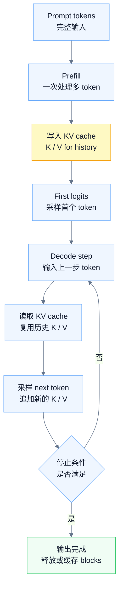
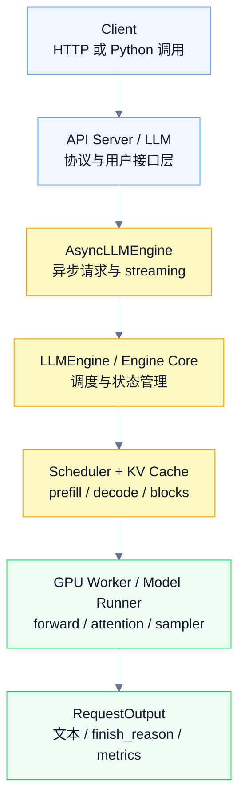
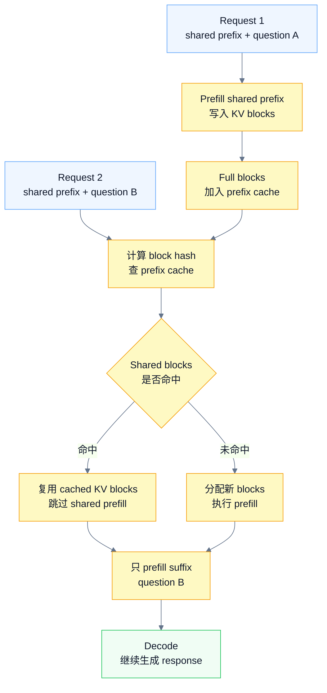

# vLLM 学习笔记

## 0. 总览

vLLM 的核心不是某一个模型结构，也不是某一个训练算法，而是一个 **LLM inference / serving runtime**。

它做的事情可以概括为：

```text
把用户请求组织成可持续调度的推理任务，
再通过高效的 KV cache 管理、continuous batching、优化 kernel 和分布式推理，
让大语言模型生成 token 的吞吐更高、显存浪费更少、服务接口更易用。
```

所以学习 vLLM 时，不要一开始就陷进某个 CUDA kernel、某个 attention backend、某个量化格式。应该先抓住这条主线：

```text
request 进入系统
    -> input processing / tokenization
    -> scheduler 调度 prefill / decode
    -> KV cache manager 分配 block
    -> GPU worker 执行 model forward
    -> sampler 采样 token
    -> output processor / detokenizer 返回文本
    -> request 完成后释放或缓存 KV block
```

一句话记忆：

> vLLM = API Server + Engine Core + Scheduler + KV Cache Manager + GPU Worker / Model Runner + PagedAttention + Continuous Batching。

官方文档对 vLLM 的定位是 fast and easy-to-use LLM inference and serving library。它的主要能力包括 PagedAttention、continuous batching、chunked prefill、prefix caching、CUDA/HIP graphs、量化、优化 attention / GEMM / MoE kernel、speculative decoding、disaggregated prefill/decode、OpenAI-compatible API server，以及 tensor / pipeline / data / expert / context parallelism 等。

学习 vLLM 时最重要的视角是：

```text
训练系统关注：parameters / gradients / optimizer states / activations。
推理系统关注：weights / KV cache / request scheduling / decoding latency / throughput。
```

在 veRL / RLHF / GRPO / PPO 这类后训练系统里，vLLM 通常不是训练后端，而是 rollout engine：它负责高吞吐生成 responses；actor trainer 负责 backward 和 optimizer step；actor 更新后再把最新权重同步给 vLLM。

图示：先把 vLLM 看成一条 request 生命周期，而不是单个 `model.forward()`。

![[08-图片/vllm_request_lifecycle.canvas]]

---

## 1. LLM 推理是一条 request dataflow

普通深度学习训练里的 dataflow 节点通常是：

```text
forward
loss
backward
optimizer.step
```

LLM serving 里的 dataflow 节点更接近：

```text
HTTP / Python request
input processing
prefill
decode
sampling
streaming output
KV cache allocation / free
metrics / tracing
```

vLLM 的设计就是把这些推理阶段的高层操作拆成可调度、可并发、可分布式执行的任务。

可以分成两层：

```text
Control Plane
    接收请求、维护 request 状态、决定每个 step 调度哪些 request、
    管理 KV cache block、决定请求何时结束。

Computation Plane
    在 GPU worker 上加载权重，执行 model forward、attention kernel、
    sampler、logprob 计算和可能的分布式通信。
```

这和训练框架的重点不同。训练框架要解决“模型如何训得动”；vLLM 要解决“模型如何生成得快、服务得稳”。

---

## 2. LLM 推理基础：prefill、decode、KV cache

### 2.1 Prefill

prefill 是处理 prompt 的阶段。

给定一个 prompt：

```text
prompt tokens = [x1, x2, ..., xN]
```

模型需要一次性处理这些 token，计算 hidden states，并把每层 attention 里的 Key / Value 写入 KV cache。

可以理解为：

```text
prompt tokens
    -> Transformer forward
    -> logits for next token
    -> KV cache for prompt history
```

prefill 的特点：

```text
输入 token 多；
一次 forward 可能处理完整 prompt；
计算量大，通常更 compute-heavy；
直接影响首 token 延迟，也就是 TTFT。
```

TTFT 是 time to first token。用户发出请求后，到第一个 token 返回前，主要要经历 input processing、prefill、第一次 sampling 等阶段。长 prompt、RAG、长上下文、多模态输入都会增加 TTFT。

### 2.2 Decode

decode 是自回归生成阶段。

模型每一步根据已有上下文生成下一个 token：

```text
step t:
    输入上一步 token + KV cache
    -> model forward
    -> logits
    -> sampler
    -> new token
    -> append new K/V to KV cache
```

decode 的特点：

```text
每个 request 每步通常只生成一个 token；
每一步都要读之前所有 token 的 KV cache；
输出越长，decode step 越多；
多请求并发时，decode 阶段非常依赖调度和 KV cache 管理。
```

decode 相关指标常见有：

```text
TPOT: time per output token
ITL: inter-token latency
output throughput: output tokens / second
```

### 2.3 KV cache

KV cache 是推理阶段最关键的显存对象之一。

在 Transformer decoder 中，每一层 attention 都会产生 Key 和 Value。生成下一个 token 时，模型需要看历史 token。如果没有 KV cache，每生成一个 token 都要重新计算完整历史，成本非常高。

KV cache 的作用是：

```text
保存历史 token 的 Key / Value，
让后续 decode step 直接读取历史 K/V，
避免重复计算 prompt 和已经生成过的 token。
```

粗略 shape 可以理解为：

```text
KV cache
    layers
        key:   [num_blocks or seq_len, num_kv_heads, head_dim]
        value: [num_blocks or seq_len, num_kv_heads, head_dim]
```

不同实现会在维度布局、block 化方式、page size、dtype、attention backend 上有差异，但核心思想一样：

```text
用显存保存历史注意力信息，换取 decode 阶段的速度。
```

图示：prefill 负责把 prompt 写入 KV cache，decode 反复读取并追加 KV cache。



KV cache 会成为瓶颈，因为：

```text
每个 request 都有自己的上下文；
上下文越长，KV cache 越大；
并发请求越多，KV cache 总量越大；
生成长度不确定，KV cache 动态增长；
请求结束时间不同，显存容易碎片化。
```

训练显存和推理显存的重点可以这样对比：

```text
训练显存：
    parameters
    gradients
    optimizer states
    activations
    communication buffers

推理显存：
    model weights
    KV cache
    logits / sampler temporary buffers
    CUDA graph / attention backend workspace
```

---

## 3. vLLM 总体架构：API Server + Engine Core + GPU Worker

vLLM V1 采用多进程架构，核心目标是分离职责并提高吞吐。

整体结构可以这样理解：

```text
Client / OpenAI API / Python API
    |
    v
API Server Process
    - HTTP request
    - OpenAI-compatible protocol
    - tokenization
    - chat template
    - multi-modal data loading
    - streaming response

    |
    | internal communication, e.g. ZMQ
    v

Engine Core Process
    - request queue
    - scheduler
    - KV cache manager
    - dispatch work to GPU workers
    - request state management

    |
    v

GPU Worker Process
    - model weights
    - model runner
    - forward pass
    - attention kernel
    - sampler
    - GPU memory management
```

官方架构文档中，API Server 负责 HTTP 请求、输入处理和流式返回；Engine Core 运行 scheduler、管理 KV cache、协调 GPU worker；GPU Worker 则负责加载模型权重、执行 forward、管理 GPU memory。

### 3.1 API Server Process

API Server 面向用户或上层应用。

它主要负责：

```text
接收 HTTP 请求；
兼容 OpenAI API；
解析 completions / chat completions 请求；
应用 chat template；
执行 tokenization；
处理多模态输入，例如 image / audio / video；
把请求发给 engine core；
把输出 token detokenize 后返回；
支持 streaming。
```

常见启动方式：

```bash
vllm serve Qwen/Qwen2.5-1.5B-Instruct
```

vLLM 也支持 Python offline inference：

```python
from vllm import LLM, SamplingParams

llm = LLM(model="Qwen/Qwen2.5-1.5B-Instruct")
sampling_params = SamplingParams(temperature=0.0, max_tokens=64)

outputs = llm.generate(["介绍一下 vLLM"], sampling_params)
for output in outputs:
    print(output.prompt)
    print(output.outputs[0].text)
```

可以粗略记成：

```text
online serving:
    vllm serve
    OpenAI-compatible API
    AsyncLLMEngine
    streaming

offline inference:
    LLM.generate / LLM.chat
    批量 prompt
    本地 Python 调用
```

### 3.2 Engine Core Process

Engine Core 是 vLLM 的调度中枢。

它主要负责：

```text
维护 waiting requests；
维护 running requests；
每个 engine step 调用 scheduler；
决定哪些 request 做 prefill；
决定哪些 request 做 decode；
管理 KV cache block 的分配、释放、复用；
把本 step 的模型执行任务发给 GPU workers；
接收 worker 输出并更新 request 状态。
```

可以把它理解成：

```text
Engine Core = request scheduler + KV cache manager + worker coordinator。
```

### 3.3 GPU Worker Process

GPU Worker 是实际执行模型计算的进程。

它主要负责：

```text
加载 model weights；
创建 model runner；
管理本 GPU 的显存；
准备 input tensors；
执行 model forward；
调用 attention backend；
调用 sampler；
处理 CUDA graph / torch.compile 相关优化；
参与 TP / PP / DP / EP 等分布式执行。
```

通常一张 GPU 对应一个 worker process。若开启 tensor parallelism 和 pipeline parallelism，worker 数量会随着并行度增加。

### 3.4 LLMEngine / AsyncLLMEngine

从用户接口看，vLLM 有两个重要 engine 概念：`LLMEngine` 和 `AsyncLLMEngine`。

它们都不是模型结构本身，而是 vLLM 把 request、scheduler、KV cache、worker 和 output 组织起来的 engine 层。

官方架构文档里把二者放在 LLM Engine 这一层：`LLMEngine` 负责接收请求并生成输出，包含 input processing、scheduling、model execution 和 output processing；`AsyncLLMEngine` 是 `LLMEngine` 的异步 wrapper，使用 `asyncio` 后台循环处理请求，面向 online serving 和 streaming。


层级关系可以这样记：



#### 3.4.1 LLM、LLMEngine、AsyncLLMEngine 的边界

这三个名字容易混在一起。

可以粗略分成：

```text
LLM:
    面向用户的 offline inference facade。
    常见入口是 LLM.generate / LLM.chat。

LLMEngine:
    更底层的同步推理调度核心。
    负责 request state、scheduler、KV cache、worker execution、output processing。

AsyncLLMEngine:
    面向 online serving 的异步 wrapper。
    负责 async generate、后台 engine loop、streaming、abort / disconnect。
```

可以用一句话区分：

```text
LLM 让本地 Python 用户方便调用；
LLMEngine 负责怎么一步步调度和执行推理；
AsyncLLMEngine 负责怎么把这个推理引擎接到异步在线服务里。
```

#### 3.4.2 LLMEngine：同步推理调度核心

`LLMEngine` 不是普通的 `model.forward(input_ids)`。

更准确地说：

```text
LLMEngine = request state manager + scheduler coordinator + KV cache coordinator + worker executor caller + output processor。
```

它关心的不是单条 tensor 如何过模型，而是一批动态到来的 request 如何被持续调度。

概念上的使用方式类似：

```python
engine.add_request(
    request_id="req-1",
    prompt="介绍一下 vLLM",
    sampling_params=sampling_params,
)

while engine.has_unfinished_requests():
    request_outputs = engine.step()
    for output in request_outputs:
        handle(output)
```

这里最关键的是 `step()`。

每个 engine step 通常会做：

```text
1. 查看 waiting requests 和 running requests；
2. 调 scheduler，决定本 step 处理哪些 prefill / decode；
3. 检查 token budget、max_num_seqs 和 KV cache budget；
4. 为新增 token 分配或复用 KV cache blocks；
5. 准备 worker / model runner 需要的 input tensors；
6. 执行模型 forward、attention backend、sampler；
7. 收集 sampled token、logprobs、finish reason 等输出；
8. 更新 request 状态；
9. 对 finished request 释放或缓存 KV blocks；
10. 返回本 step 产生的 RequestOutput。
```

这就是为什么 vLLM 的 engine 不能理解成“一次 generate 完整 batch”。它更像：

```text
每个 step 都重新组织一次 batch，
让新 request 可以加入，
让 finished request 离开，
让 running request 继续 decode，
并在 token budget 和 KV cache budget 之间做取舍。
```

这也是 continuous batching 能成立的核心。

#### 3.4.3 AsyncLLMEngine：异步在线服务封装

`AsyncLLMEngine` 的重点不是让 GPU forward 本身变成“异步算法”，而是让 vLLM 的 engine 可以自然接入在线服务。

在线服务面对的是不断到来的请求：

```text
t0: request A 到来；
t1: request B 到来；
t2: request A stream 一个 token；
t3: request C 到来；
t4: request B 被用户断开或 abort；
t5: request A 完成并释放 KV cache。
```

如果只暴露同步 `LLMEngine.step()`，API Server 需要自己处理很多问题：

```text
后台 loop 什么时候启动；
多个 HTTP request 如何进入 engine；
每个 request 的 output 如何分发回对应客户端；
streaming 如何边生成边返回；
客户端断开时如何 abort；
engine 空闲时如何避免 busy loop；
异常如何传回对应 request。
```

`AsyncLLMEngine` 把这些服务化逻辑包装成 async interface。概念上可以理解为：

```text
AsyncLLMEngine
    async generate()
        接收 prompt / sampling params / request_id；
        把 request 加入底层 engine；
        返回一个 async output stream。

    background engine loop
        持续驱动底层 engine；
        从每个 engine step 收集 outputs；
        把 outputs 分发给对应 request。

    async abort()
        用户取消、超时或断连时，
        把 abort 信号传给底层 engine。
```

在线 streaming 的模型可以写成：

```python
async for request_output in engine.generate(
    prompt=prompt,
    sampling_params=sampling_params,
    request_id=request_id,
):
    yield request_output
```

所以：

```text
LLMEngine:
    解决“怎么调度和执行推理”。

AsyncLLMEngine:
    解决“怎么并发、流式、可取消地服务用户请求”。
```

OpenAI-compatible API server 通常使用异步引擎，因为 HTTP serving 天然需要并发、streaming 和 disconnect 处理。

#### 3.4.4 Engine 层的常见误区

##### 误区一：LLMEngine 就是模型本体

不准确。

模型权重和 forward 主要在 worker / model runner 里执行。`LLMEngine` 更像控制与协调层。

```text
不是：
    LLMEngine.forward(input_ids)

而是：
    LLMEngine.add_request(...)
    LLMEngine.step()
```

##### 误区二：AsyncLLMEngine 会让 forward 更快

不准确。

`AsyncLLMEngine` 主要改善 online serving 的并发接入方式，不是新的 attention kernel，也不是新的采样算法。

它带来的价值是：

```text
API Server 不需要直接管理每个 engine step；
每个 request 可以拥有自己的 async output stream；
streaming / abort / disconnect 更容易表达；
多个客户端请求可以共用底层 continuous batching。
```

##### 误区三：API Server 和 AsyncLLMEngine 是同一个东西

不准确。

```text
API Server:
    HTTP 协议层、OpenAI-compatible request / response、chat template、SSE streaming。

AsyncLLMEngine:
    异步推理接口层、background engine loop、request output stream、abort。

LLMEngine / Engine Core:
    request queue、scheduler、KV cache manager、worker coordination。
```

##### 误区四：Scheduler 就是 LLMEngine

不准确。

Scheduler 是 engine 里的关键组件之一，但 engine 还要管理 request lifecycle、KV cache、worker execution、output processor、metrics 等。

可以记成：

```text
LLMEngine / Engine Core > Scheduler。
```

---

## 4. 一次 request 如何跑起来

这是理解 vLLM 的主线。

可以把一次请求从进入系统到返回结果的过程压缩成：

```text
User Request
    -> API Server
    -> Input Processing
    -> Tokenization / Chat Template
    -> Request Object
    -> Waiting Queue
    -> Scheduler
    -> KV Cache Allocation
    -> Prefill
    -> First Token
    -> Decode Loop
    -> Sampling
    -> Output Processing
    -> Stream / Final Response
    -> Free or Cache KV Blocks
```

### 4.1 输入处理

对于 completions 请求：

```text
prompt: "San Francisco is a"
    -> tokenizer
    -> input_ids
```

对于 chat completions 请求：

```text
messages:
    system: ...
    user: ...

    -> chat template
    -> formatted prompt
    -> tokenizer
    -> input_ids
```

这里要注意：

```text
chat template 会影响最终 token；
generation_config.json 可能影响默认 sampling 参数；
不同模型 tokenizer 和 special tokens 不同；
多模态模型会把 image/audio/video 转换成特殊 placeholder 或 embedding。
```

### 4.2 请求进入 waiting queue

tokenization 后，vLLM 会构造 request 对象。

request 通常需要记录：

```text
request_id
prompt token ids
sampling params
arrival time
status: waiting / running / finished
already computed tokens
generated tokens
stop conditions
KV cache blocks
metrics metadata
```

sampling_params 可以理解成：
  > 告诉 vLLM：这次生成应该怎么采样、生成多长、什么时候停、要不要返回 logprobs、要不要做结构化约束
  > 的一组参数。
  
新请求不会直接进入 GPU forward，而是先进入 waiting queue，等待 scheduler 选择。

### 4.3 Scheduler 选择 prefill / decode

每个 engine step，scheduler 都要决定：

```text
哪些 waiting requests 可以进入 prefill；
哪些 running requests 继续 decode；
当前 step token budget 是否足够；
KV cache block 是否足够；
是否需要 chunked prefill；
是否需要 preemption 或延迟某些请求。
```

这一点是 vLLM 和简单 `model.generate()` 的重要区别。

简单 generate 更像是：

```text
给一个 batch，一次性生成完。
```

vLLM serving 更像是：

```text
每个 step 根据当前系统状态重新组织 batch。
```

### 4.4 Prefill 执行

当 request 第一次被调度时，需要处理 prompt。

```text
prompt tokens
    -> model forward
    -> write K/V into KV cache
    -> logits for next token
    -> sampler 得到第一个 output token
```

如果 prompt 很长，prefill 会很重。vLLM 可以通过 chunked prefill 把长 prompt 拆成多个 chunk，避免一个超长 prompt 长时间占住计算资源并阻塞其他 decode 请求。

### 4.5 Decode loop

进入 decode 后，请求每一轮通常生成一个新 token。

```text
last generated token
    + KV cache
    -> model forward
    -> logits
    -> sampler
    -> next token
    -> append K/V to KV cache
```

这一过程重复，直到满足停止条件。

常见停止条件包括：

```text
生成 EOS token；
达到 max_tokens；
匹配 stop token ids；
匹配 stop strings；
用户 abort request；
服务端超时或调度策略终止。
```

### 4.6 输出处理与 streaming

每生成一个 token 后，vLLM 可以：

```text
把 token id 解码成文本；
处理 detokenization 边界；
检查 stop string；
把 partial text stream 给客户端；
或者等请求完成后一次性返回。
```

streaming 的价值是降低用户感知延迟。即使完整回答还没生成完，用户也能先看到前几个 token。

### 4.7 请求结束后的 KV cache 处理

请求结束后，KV blocks 不一定简单全部丢掉。

有几类情况：

```text
普通请求结束：
    释放 request 持有的 KV blocks。

prefix caching 开启且 block 可复用：
    完整 block 可以保留在 cache 中，等待后续相同前缀请求复用。

cache 满了：
    使用 eviction 策略，例如 LRU，回收可回收 block。
```

这就是为什么 vLLM 的 request lifecycle 不能只看 model forward。KV cache 的生命周期同样重要。

---

## 5. KV cache 与 PagedAttention

### 5.1 问题：KV cache 巨大、动态、碎片化

LLM serving 的一个核心瓶颈不是只有模型权重大，而是每个并发 request 都会产生自己的 KV cache。

KV cache 的困难在于：

```text
每个 request 的 prompt length 不同；
每个 request 的 output length 不同；
request 生成长度事先不可知；
request 结束时间不同；
KV cache 随生成动态增长；
如果要求连续显存，容易产生碎片；
beam search、parallel sampling、shared prefix 会产生重复 KV cache。
```

传统做法如果为每条 sequence 预留连续显存，可能出现：

```text
实际只用了部分空间，但预留不能给别人用；
短请求结束后留下碎片；
长请求需要扩展时找不到连续空间；
共享前缀被重复存储。
```

PagedAttention 论文指出，LLM serving 要获得高吞吐，需要把足够多请求 batch 起来；但每个 request 的 KV cache 很大，且会动态增长/收缩。如果管理低效，fragmentation 和 redundant duplication 会显著浪费显存，从而限制 batch size。

### 5.2 PagedAttention 的核心思想

PagedAttention 的思想类似操作系统虚拟内存分页：

```text
不要让每条 sequence 占用一整块连续显存；
而是把 KV cache 切成固定大小的 block；
每条 sequence 维护 logical block 到 physical block 的映射；
scheduler / KV cache manager 按需分配和释放 block。
```

可以画成：

```text
Sequence logical tokens
    token 0 ... token 15      -> logical block 0
    token 16 ... token 31     -> logical block 1
    token 32 ... token 47     -> logical block 2

Block table
    logical block 0 -> physical block 103
    logical block 1 -> physical block 27
    logical block 2 -> physical block 501

GPU KV cache memory
    physical block 27
    physical block 103
    physical block 501
    ...
```

注意：logical blocks 连续，但 physical blocks 不需要连续。

图示：PagedAttention 的关键不是改 attention 公式，而是通过 block table 让 logical block 映射到不连续的 physical block。

![[08-图片/vllm_paged_attention.canvas]]

这带来的好处是：

```text
按需分配，减少预留浪费；
不同请求不要求连续显存；
请求结束后 block 可以回收；
共享 prefix 时可以复用 block；
parallel sampling / beam search 可以减少重复 KV cache；
更容易维持较大的 active batch。
```

### 5.3 Block table

block table 是理解 PagedAttention 的关键。

它记录：

```text
某个 request 的第 i 个 logical KV block
    对应 GPU memory 中哪个 physical KV block。
```

attention kernel 在读取历史 KV 时，不再假设 KV cache 是一条连续数组，而是通过 block table 找到对应物理 block。

可以理解成：

```text
自回归 attention 想访问历史 token 的 K/V；
PagedAttention kernel 通过 block table 找到这些 K/V；
然后完成 attention computation。
```

### 5.4 KV block allocation / free

一个 request 进入 prefill 或 decode 时，可能需要新的 KV block。

典型流程：

```text
scheduler 准备调度 request；
KV cache manager 判断需要多少 block；
检查 free block queue 是否足够；
分配 physical blocks；
更新 request -> blocks 映射；
GPU worker forward 时把 K/V 写到对应 blocks；
request 结束后减少 ref count 或释放 block。
```

如果开启 prefix caching，那么某些 block 可能不会立即释放，而是保留在 cache 中等待复用。

### 5.5 为什么 PagedAttention 不等于“attention 公式改变了”

PagedAttention 的重点不是改变 Transformer attention 的数学定义。

它改变的是：

```text
KV cache 如何组织；
attention kernel 如何根据 block table 读取 K/V；
内存如何分配、共享、释放。
```

所以更准确地说：

```text
PagedAttention 是围绕 KV cache 的 memory management + attention execution 机制。
```

不是：

```text
把 softmax(QK^T)V 换成另一个公式。
```

### 5.6 KV cache OOM 的本质

推理阶段 OOM 经常不是因为单个 prompt 太大，而是：

```text
model weights 已经占据大量显存；
剩余显存要分给 KV cache；
并发 request 太多；
max_model_len 太大；
每个 request 预期可生成 token 太多；
KV cache block 不够；
chunked prefill / prefix caching / speculative decoding 引入额外调度压力；
某些临时 buffer 或 CUDA graph workspace 增加峰值显存。
```

简化公式：

```text
可服务并发数 ≈ GPU KV cache 可容纳 token 总数 / 每个 request 需要的 token 数
```

vLLM 启动日志中常见的：

```text
GPU KV cache size: xxx tokens
Maximum concurrency for yyy tokens per request: zzz  ##如果一个请求需要消耗yyy个token， 那么最大的并发数为zzz
```

就是在帮助你估算 KV cache 维度上的并发能力。

---

## 6. Scheduler 与 Continuous Batching

### 6.1 Static batching 的问题

普通 static batching 可以理解为：

```text
收集一批 request；
一起 prefill；
一起 decode；
等整批结束后再处理下一批。
```

问题是 LLM 生成长度高度不均匀：

```text
request A 生成 10 tokens 就结束；
request B 生成 200 tokens 才结束；
如果必须等 B，A 结束后留下的计算槽位就浪费了。
```

这会导致：

```text
GPU 利用率下降；
短请求被长请求拖慢；
吞吐下降；
尾延迟上升。
```

### 6.2 Continuous batching

continuous batching 的核心是：

```text
每个 decode step 都重新调度。
```

也就是：

```text
已经 finished 的 request 离开 batch；
新的 request 可以加入 batch；
running request 继续 decode；
prefill request 和 decode request 可以按策略混排；
GPU 尽量持续保持有活干。
```

对比：

```text
static batching:
    batch 是一批固定 request。

continuous batching:
    batch 是每个 engine step 动态形成的工作集合。
```

图示：continuous batching 的核心是每个 engine step 都重新看 waiting / running / budget，而不是固定一批请求跑到底。

![[08-图片/vllm_scheduler_loop.canvas]]

### 6.3 Scheduler 关心什么

scheduler 每步要考虑：

```text
waiting requests:
    还没开始 prefill 的请求。

running requests:
    已经进入 decode 或正在继续处理的请求。

token budget:
    本 step 最多处理多少 token。

KV cache budget:
    是否有足够 block 分配给新增 token。

max_num_batched_tokens:
    一次调度中允许处理的 token 总量上限。

max_num_seqs:
    同时参与调度的 sequence 数上限。

prefill / decode priority:
    当前更偏向降低 TTFT，还是更偏向降低 ITL。

chunked prefill:
    长 prompt 是否拆成多个 chunk。

preemption:
    资源不够时，是否暂停或抢占某些 request。
```

### 6.4 为什么按 token budget 调度

LLM 推理的工作量不只取决于 request 数量，还取决于 token 数。

两个 batch 都有 8 个 request，但成本可能完全不同：

```text
batch A:
    8 个 request，每个 prompt 128 tokens。

batch B:
    8 个 request，每个 prompt 32k tokens。
```

所以 scheduler 不能只看 request 数，而要看 token budget、KV cache budget 和模型执行成本。

### 6.5 max_num_batched_tokens

`max_num_batched_tokens` 控制一个 scheduling step 中最多处理多少 token。

它影响：

```text
prefill 吞吐；
decode 和 prefill 的混排；
GPU utilization；
TTFT；
ITL；
显存峰值；
长 prompt 是否阻塞其他请求。
```

如果设得太小：

```text
长 prompt 需要很多 step 才能 prefill 完；
TTFT 可能变差；
GPU 可能吃不满。
```

如果设得太大：

```text
单个长 prefill 可能占用太多 token budget；
decode 请求被延迟；
ITL / tail latency 可能变差；
峰值显存和临时 buffer 压力可能上升。
```

### 6.6 max_num_seqs

`max_num_seqs` 控制同时参与调度的 sequence 数量。

如果设得太小：

```text
并发不足；
GPU 利用率可能低；
吞吐下降。
```

如果设得太大：

```text
KV cache 压力上升；
调度和输出处理开销上升；
太多 request 同时活跃可能导致 preemption 或 OOM。
```

### 6.7 Chunked prefill

长 prompt 的 prefill 很重。如果一次性 prefill 完整长 prompt，可能让 decode 请求等很久。

chunked prefill 的思想是：

```text
把长 prompt 的 prefill 拆成多个 chunk；
每个 step 处理一部分 prompt token；
让 decode 请求可以穿插进来；
降低长 prompt 对其他请求 ITL 的影响。
```

可以理解成：

```text
不让一个超长 prompt 独占整个调度周期。
```

### 6.8 Preemption

当 KV cache block 不够或调度资源不够时，系统可能需要 preempt 某些请求。

概念上有几种选择：

```text
延迟 waiting request；
暂停某些 running request；
释放或交换部分 KV cache；
重算某些上下文；
等待已有请求完成释放 block。
```

实际行为取决于 vLLM 版本、配置和 workload。理解 preemption 的关键是：

```text
scheduler 不只是“拼 batch”，还要处理资源不足时的取舍。
```

---

## 7. PagedAttention、Prefix Caching、Chunked Prefill 的关系

这几个概念容易混，但它们解决的是不同层的问题。

```text
PagedAttention:
    解决 KV cache 如何存、如何访问、如何减少显存碎片。

Continuous batching:
    解决多个 request 如何动态调度，避免 GPU 空转。

Chunked prefill:
    解决长 prompt prefill 太重，阻塞 decode 的问题。

Prefix caching:
    解决多个 request 共享相同前缀时，如何复用已计算的 KV cache。
```

可以按层次记：

```text
Memory layout / attention execution:
    PagedAttention

Request scheduling:
    continuous batching
    chunked prefill

KV cache reuse:
    prefix caching

Serving interface:
    OpenAI-compatible API
    streaming
```

### 7.1 三者分别解决什么

这三个机制经常同时出现，但它们的切入点不同：

```text
PagedAttention:
    先把 KV cache 变成可按 block 管理的对象。
    重点是 memory layout、block table、attention kernel 如何读写 K/V。

Prefix caching:
    在 block 化 KV cache 之上，复用已经算过的完整前缀 blocks。
    重点是 cache hit、block hash、ref count、eviction。

Chunked prefill:
    把长 prompt 的 prefill 拆成多个 step。
    重点是调度公平性，避免长 prefill 长时间阻塞 decode。
```

可以记成：

```text
PagedAttention 让 KV cache 可以高效分块管理；
Prefix caching 让重复前缀的 KV blocks 可以被复用；
Chunked prefill 让长 prompt 的 prefill 可以分期调度。
```

三者的关系不是互相替代，而是叠加：

```text
PagedAttention 提供 block 化基础；
prefix caching 复用这些 blocks；
chunked prefill 决定长 prompt 如何逐步填充这些 blocks。
```

### 7.2 Prefix caching 的核心思想

prefix caching，也叫 automatic prefix caching，目标是避免重复 prefill。

如果两个请求有相同前缀：

```text
Request 1:
    system prompt + document + question A

Request 2:
    system prompt + document + question B
```

它们的 `system prompt + document` 可能完全相同。如果 Request 1 已经计算过这部分 KV cache，Request 2 就可以复用对应 KV blocks，而不必重新 prefill 这段前缀。

它省掉的是：

```text
重复前缀的 prefill 计算；
重复写入相同前缀 KV cache；
重复占用相同前缀的 KV blocks。
```

它不会改变模型输出，因为命中的 KV cache 本来就是相同前缀经过同一个模型计算得到的 K/V。

直观理解：

```text
第一次请求：
    shared prefix 需要 prefill；
    full KV blocks 被缓存。

第二次请求：
    shared prefix 命中 prefix cache；
    只需要 prefill 未命中的 suffix。
```

### 7.3 Prefix caching 的命中流程

一次请求进入系统后，prefix caching 可以按这条链路理解：

```text
request 到来；
tokenizer 得到 prompt tokens；
prompt tokens 按 block size 切成 logical blocks；
对每个 full block 计算 block hash；
KV cache manager 查 prefix cache / block pool；
命中的 blocks 直接复用；
未命中的 suffix 分配新 blocks 并执行 prefill；
prefill 后变成 full block 的部分加入 cache；
request 结束后 blocks 根据 ref count、cache 状态决定释放或保留；
cache 满时按 eviction 策略回收。
```

图示：



注意：命中后不是“跳过整个 request”，而是只跳过已经缓存的共享前缀。后面的不同 suffix，例如不同 question、不同 response decode，仍然要继续计算。

### 7.4 Block hash 与 parent hash

vLLM 的 prefix caching 使用 hash-based approach。它会根据 block tokens、parent hash、以及额外信息，比如 LoRA ID、多模态输入 hash、cache salt 等，构造 block hash。

可以概念化为：

```text
block hash = hash(parent_hash, block_tokens, extra_hashes)
```

这样只有 token 和上下文前缀都匹配的 block 才会命中。

这里 `parent_hash` 很关键。

原因是：仅仅当前 block 的 token 相同，不代表这个 block 的 KV cache 可以复用。attention 的 K/V 是在完整上下文中产生的。前面的 prefix 不同，当前 block 在模型里的语义位置和可见历史就不同。

举例：

```text
Request A:
    system A + block X

Request B:
    system B + block X
```

如果只看 `block X`，两个请求可能完全一样。但它们前面的 system prompt 不同，所以不能只凭 `block X` 的 tokens 就复用 KV cache。

因此 block hash 要表达：

```text
当前 block 的 tokens 相同；
并且当前 block 之前的完整前缀也相同；
并且 LoRA、多模态输入、cache salt 等额外条件也相同。
```

这就是 parent hash 的作用：

```text
Block 0:
    hash(block_0_tokens, extra_hashes)

Block 1:
    hash(block_0_hash, block_1_tokens, extra_hashes)

Block 2:
    hash(block_1_hash, block_2_tokens, extra_hashes)
```

这样 block hash 本身就隐含了“从开头到当前 block 的完整前缀链路”。

### 7.5 为什么只缓存 full blocks

prefix caching 通常以 block 为单位。

如果某个 block 没满，复用起来会更复杂。因此 vLLM 的设计文档中强调只缓存 full blocks。

这意味着：

```text
只有填满的 KV block 才会被计算 hash 并进入 cache；
partial block 通常不能作为稳定 cache 单元复用；
共享前缀即使很长，也只能命中完整 block 边界之前的部分。
```

举例，假设 block size = 16：

```text
两个请求共享前缀长度 = 40 tokens

可缓存 / 可命中的部分：
    block 0: token 0  - 15
    block 1: token 16 - 31

不能作为 full block 命中的尾部：
    token 32 - 39
```

所以实际命中粒度不是任意 token，而是 block 级别。

这也解释了为什么：

```text
prefix 越长、重复越多，prefix caching 收益越明显；
短 prompt 或随机 prompt 不一定有明显收益；
block size 会影响 cache 粒度和命中率。
```

### 7.6 Prefix caching 与 PagedAttention 的关系

可以这样理解二者边界：

```text
PagedAttention:
    解决 KV cache 如何切成 block；
    logical block 如何映射 physical block；
    attention kernel 如何通过 block table 读取 K/V。

Prefix caching:
    解决哪些已经算过的 full blocks 可以被后续请求复用；
    如何通过 block hash 判断 cache hit；
    如何管理 ref count、free queue、eviction。
```

所以：

```text
PagedAttention 是 KV cache block 化和访问机制；
prefix caching 是基于 KV blocks 的复用策略。
```

没有 PagedAttention，也可以设计 prefix cache，但 vLLM 的 prefix caching 正是借助 block 化 KV cache 才更自然：命中、引用、释放、eviction 都可以围绕 block 来做。

### 7.7 Prefix caching 的收益场景与局限

收益明显的场景：

```text
RAG：
    多个问题共享同一个长 document。

长 system prompt：
    大量请求共享相同 instruction / policy / tool description。

agent / tool use：
    工具说明、格式约束、历史模板重复出现。

GRPO / parallel sampling：
    同一个 prompt 采样多个 responses。

多轮服务：
    用户上下文前缀在连续请求中高度重复。
```

收益主要体现在：

```text
降低后续相同前缀请求的 TTFT；
减少重复 prefill 计算；
减少重复 KV cache 写入；
提高共享长前缀 workload 的吞吐。
```

收益不明显或可能受限的场景：

```text
prompt 都很短；
请求前缀几乎不重复；
共享前缀长度不足一个或多个 full blocks；
cache 被频繁 eviction；
多租户场景使用不同 cache_salt；
LoRA、多模态输入等 extra hashes 不同；
请求主要瓶颈在 decode，而不是 prefill。
```

还要注意：prefix caching 主要省的是 prefill，不是 decode。

如果请求之间只共享 prompt，但输出很长，那么：

```text
shared prompt 的 prefill 可以省；
后续 response decode 仍然要逐 token 生成；
输出越长，decode 成本占比越高。
```

### 7.8 Prefix caching 与安全

共享 cache 在多租户场景下可能带来隐私风险：

```text
攻击者可能通过延迟差异推断某些内容是否已被缓存。
```

vLLM 支持通过 cache salt 做 cache isolation：只有相同 salt 的请求可以共享缓存。这个设计用于在信任组内复用 cache，同时避免不同租户之间泄露信息。

可以理解成：

```text
不使用 cache_salt 或 salt 相同：
    相同前缀可能命中同一个 cached block。

cache_salt 不同：
    即使 tokens 相同，block hash 也不同；
    不同租户或不同信任域之间不会共享 prefix cache。
```

所以在多租户 serving 中，prefix caching 不只是性能问题，也涉及 cache 隔离策略。

---

## 8. Worker / Model Runner / Kernel 执行层

当 scheduler 选出本 step 要执行的请求后，GPU worker 负责实际计算。

可以压缩成：

```text
GPU Worker
    -> Model Runner
        -> prepare input tensors
        -> model forward
            -> embedding
            -> attention
            -> MLP / MoE
            -> logits
        -> sampler
        -> output
```

### 8.1 Model Runner

每个 worker 通常有一个 model runner。

它负责：

```text
加载模型；
准备输入 tensor；
管理 batch metadata；
组织 KV cache block table；
执行 forward；
处理 CUDA graph capture / replay；
调用 sampler；
返回 token ids / logprobs / hidden states 等输出。
```

### 8.2 Attention backend

attention 是推理性能核心之一。

vLLM 支持多种 attention backend / kernel，例如官方首页列出的 FlashAttention、FlashInfer、TRTLLM-GEN、FlashMLA、Triton 等。

注意这些 backend 不是都适用于所有模型、所有硬件、所有 feature。实际选择取决于：

```text
GPU 类型；
模型架构；
dtype；
KV cache dtype；
是否多模态；
是否 sliding window attention；
是否 MLA；
是否启用 speculative decoding；
是否使用 CUDA graph。
```

学习源码时，不建议一开始就读 kernel。建议先读：

```text
scheduler 如何形成 batch；
KV cache block 如何传给 worker；
model runner 如何准备 forward input；
attention layer 如何拿到 block table；
最后再读具体 backend。
```

### 8.3 Sampler

model forward 输出 logits 后，sampler 负责从 logits 得到 token。

常见 sampling 参数包括：

```text
temperature
top_p
top_k
min_p
presence_penalty
frequency_penalty
repetition_penalty
max_tokens
stop
n
best_of
logprobs
seed
```

sampler 需要处理：

```text
贪心解码；
随机采样；
top-k / top-p filtering；
惩罚项；
logprob 返回；
多候选生成；
beam search；
structured output 约束；
speculative decoding 的接受 / 拒绝逻辑。
```

### 8.4 CUDA graph / torch.compile

decode 阶段每步都要执行 forward。如果每一步都有大量 Python overhead、kernel launch overhead，会影响吞吐。

CUDA graph 的作用是：

```text
把固定形状或可复用执行路径捕获成图；
后续 replay，减少调度和 launch overhead。
```

torch.compile 和相关 graph-level transformation 则用于进一步优化 PyTorch 执行路径。

需要注意：

```text
CUDA graph 通常要求形状和执行路径相对稳定；
LLM serving 的 batch shape 动态变化很大；
vLLM 需要通过 padding、bucketing、piecewise capture 等机制适配动态 workload。
```

---

## 9. 分布式推理：TP、PP、DP、EP、CP

vLLM 的并行是 inference parallelism，不是训练里的 gradient / optimizer sharding。

### 9.1 Tensor Parallelism

Tensor Parallelism，简称 TP。

它把模型层里的大矩阵按维度切到多张 GPU 上。

适用场景：

```text
模型太大，单卡放不下；
模型能放进单节点多卡；
GPU 间通信较快，例如有 NVLink；
希望一个模型副本跨多卡执行。
```

例子：

```python
from vllm import LLM
llm = LLM("facebook/opt-13b", tensor_parallel_size=4)
```

服务启动：

```bash
vllm serve facebook/opt-13b --tensor-parallel-size 4
```

### 9.2 Pipeline Parallelism

Pipeline Parallelism，简称 PP。

它把模型按层切分到多张 GPU 或多个节点上。

适用场景：

```text
模型单节点放不下；
需要多节点推理；
GPU 数不能整齐做 tensor parallel；
节点间通信较慢，不适合把 tensor parallel 拉到跨节点。
```

官方 parallelism 文档建议：如果模型太大，单节点放不下，可以结合 tensor parallel 和 pipeline parallel；常见做法是 `tensor_parallel_size = 每个节点 GPU 数`，`pipeline_parallel_size = 节点数`。

例子：

```bash
vllm serve /path/to/model \
    --tensor-parallel-size 8 \
    --pipeline-parallel-size 2 \
    --distributed-executor-backend ray
```

### 9.3 Data Parallelism

Data Parallelism，简称 DP。

这里的 DP 不是训练里的数据并行梯度同步，而是 serving 里的多个模型副本 / engine core 分摊请求。


概念上：

```text
DP rank 0 处理一部分请求；
DP rank 1 处理另一部分请求；
每个 DP rank 可能内部又使用 TP / PP。
```

适用场景：

```text
单个模型副本已经能放下；
但请求量很大；
需要多个 replica 横向扩展；
希望提高总吞吐。
```

### 9.4 Expert Parallelism

Expert Parallelism，简称 EP。

MoE 模型里有很多 expert。EP 让不同 expert 分布到不同 GPU 上，利用 expert 层天然稀疏激活的结构。

适用场景：

```text
Mixtral、DeepSeek-V3、Qwen-MoE 等 MoE 模型；
expert 数量多；
需要把 expert 层分散到多卡；
希望提高 MoE 层吞吐。
```

### 9.5 Context Parallelism

Context Parallelism，简称 CP。

它主要面向长上下文场景，把上下文相关的计算拆到多个设备上。

适用场景：

```text
超长上下文；
单卡 KV cache 或 attention 计算压力太大；
需要跨设备处理长序列。
```

### 9.6 如何选择并行策略

可以先按这个顺序判断：

```text
1. 模型能否放进单卡？
   能：单卡即可，优先避免分布式复杂度。

2. 模型能否放进单节点多卡？
   能：优先考虑 tensor parallel。

3. 模型是否需要跨节点？
   是：通常 TP within node + PP across nodes。

4. 请求量是否大到一个 replica 不够？
   是：增加 data parallel replicas。

5. 是否 MoE 模型？
   是：考虑 expert parallel。

6. 是否超长上下文？
   是：考虑 context parallel、prefix caching、KV cache 相关优化。
```

---

## 10. 高级能力地图

这一节不建议一开始深挖源码，但要知道有哪些能力，以及它们属于哪一层。

### 10.1 Serving features

```text
OpenAI-compatible API server
Anthropic Messages API
streaming outputs
structured outputs
tool calling
reasoning parsers
gRPC support
metrics / observability
```

这些能力主要位于 serving interface 和 output processing 层。

### 10.2 Model adaptation

```text
LoRA / multi-LoRA
quantization
compressed weights
weight loading plugins
```

LoRA 适合多 adapter serving：

```text
一个 base model；
多个 LoRA adapter；
不同请求可以使用不同 adapter；
无需为每个 adapter 启动完整模型副本。
```

量化用于降低权重显存、提升吞吐或降低部署成本。常见格式包括：

```text
FP8
INT8
INT4
GPTQ
AWQ
GGUF
compressed-tensors
TorchAO
```

是否提升速度取决于：

```text
硬件是否支持；
kernel 是否高效；
模型结构；
batch size；
瓶颈在权重读取、KV cache、attention 还是 sampling。
```

### 10.3 Model types

vLLM 支持多种模型类型：

```text
decoder-only LLM
MoE LLM
hybrid attention / state-space model
multi-modal model
embedding model
retrieval model
reward model
classification model
```

学习时可以先聚焦 decoder-only LLM，再看多模态和 MoE。

### 10.4 Speculative decoding

Speculative decoding 的目标是减少 decode 阶段的逐 token 串行瓶颈。

基本思想：

```text
用一个 draft model 或 draft mechanism 一次提出多个候选 token；
再用 target model 验证这些 token；
接受一部分 token，从而减少 target model forward 次数。
```

vLLM 支持多种 speculative decoding 路线，例如 n-gram、suffix、EAGLE、DFlash 等。

需要注意：

```text
speculative decoding 不一定总是提升吞吐；
draft model 成本、接受率、batch 形状、硬件利用率都会影响收益；
和 pipeline parallel、LoRA、多模态等功能可能存在兼容性限制。
```

### 10.5 Disaggregated prefill / decode

prefill 和 decode 的性能特征不同：

```text
prefill:
    prompt token 多；
    更 compute-heavy；
    影响 TTFT。

decode:
    每步 token 少；
    高频读取 KV cache；
    影响 ITL / TPOT。
```

Disaggregated prefill 的思想是：

```text
把 prefill 和 decode 放到不同 vLLM instance；
prefill instance 负责 prompt 计算；
decode instance 负责后续生成；
中间通过 connector 传递 KV cache。
```

它主要用于分别调优 TTFT 和 ITL，尤其是控制 tail ITL。官方文档明确提示，disaggregated prefilling 是 experimental，并且本身不提高 throughput。

---

## 11. vLLM 在 veRL / RL 后训练中的作用

结合 veRL 来看，vLLM 通常位于 rollout 侧。

### 11.1 veRL 中的分工

可以这样理解：

```text
Actor trainer model
    - 训练 actor
    - forward / backward
    - optimizer.step
    - FSDP / Megatron / DeepSpeed / 其他训练后端

vLLM rollout engine
    - 加载 actor 当前权重
    - 高吞吐生成 responses
    - 管理 KV cache
    - 执行 sampling
    - 支持 n responses per prompt
    - 返回 responses / logprobs / metadata

Weight sync
    - actor 更新后，把最新权重同步到 rollout engine
    - 保证下一轮 rollout 尽量 on-policy
```

一句话：

> 在 veRL 中，FSDP / Megatron 解决 actor 训练显存和分布式训练问题；vLLM 解决 rollout 生成吞吐和 KV cache 管理问题。

### 11.2 rollout 为什么适合用 vLLM

RLHF / RLVR / GRPO / PPO 的训练循环通常包括：

```text
prompt batch
    -> rollout 生成 responses
    -> actor / ref / critic / reward 补齐字段
    -> compute advantage
    -> update actor / critic
    -> sync rollout weights
```

其中 rollout 很重：

```text
每个 prompt 可能采样多个 responses；
response 可能很长；
不同 responses 长度差异大；
需要 temperature / top_p 等采样；
需要高吞吐生成大量 token。
```

这些正是 vLLM 擅长的场景：

```text
continuous batching 处理不同长度生成；
PagedAttention 管理大量 KV cache；
prefix caching 复用相同 prompt 前缀；
TP / PP 支持大模型推理；
OpenAI-compatible / engine API 方便接入服务化 rollout。
```

### 11.3 rollout logprobs 和 actor compute_log_prob

在 RL 训练中，经常会看到两类 logprob：

```text
rollout logprobs:
    rollout engine 生成 token 时顺便返回的 logprob。

actor compute_log_prob:
    actor training model 对生成好的 responses 重新 forward，
    计算 old_log_probs 或 new_log_probs。
```

需要注意：

```text
vLLM rollout 侧的模型实例和训练 actor 侧的模型实例经常不是同一个；
数值精度、并行方式、截断、mask、logprob 实现细节可能不同；
PPO / GRPO 里通常要明确 old_log_probs 来自哪里；
如果对数值一致性要求高，需要检查 rollout logprobs 和 training forward logprobs 的差异。
```

### 11.4 Weight sync

actor 更新后，rollout engine 必须拿到最新权重。

否则：

```text
actor trainer 已经 optimizer.step；
vLLM rollout engine 还在用旧权重；
下一轮 rollout 用的是 stale policy；
训练逐渐偏离 on-policy 假设。
```

同步链路可以写成：

```text
actor update
    -> latest trainer weights
    -> export / transfer weights
    -> vLLM update_weights
    -> rollout engine 使用最新 actor 生成下一批 responses
```

图示：vLLM 在 veRL 中处在 rollout 侧，关键边界是训练 actor 更新后必须同步到 rollout engine。

![[08-图片/vllm_verl_rollout_sync.canvas]]

需要检查：

```text
update_actor 后是否调用 update_weights；
weight sync 是否在下一次 generate_sequences 前完成；
日志里是否有 sync_rollout_weights / update_weights time；
actor global step 和 rollout global step 是否一致；
async rollout 是否允许 one-step stale。
```

### 11.5 sleep / wake_up

在 RL 系统里，训练和 rollout 可能共享 GPU，或者 actor / rollout colocate。

sleep / wake_up 的意义通常是：

```text
rollout 暂时不生成时，释放或让出部分资源；
需要生成时，再加载 / 激活 rollout engine；
配合 weight sync 和 GPU memory 管理。
```

具体行为取决于 veRL 配置、vLLM 版本和部署方式，但理解核心即可：

```text
训练阶段和推理阶段争用 GPU 资源时，需要显式管理 rollout engine 的生命周期。
```

### 11.6 n responses per prompt

GRPO 常见做法是同一个 prompt 采样多个 responses。

这对 vLLM 的影响是：

```text
同一个 prompt 前缀可能被重复使用；
KV cache / prefix caching 可能有收益；
并发 sequence 数增加；
response 长度分布更不均匀；
max_num_seqs 和 max_num_batched_tokens 更重要；
每个 prompt 的 group 关系需要在上层数据协议里保留。
```

在 veRL 中，vLLM 只负责生成；GRPO 的 group advantage、reward normalization、actor loss 仍然由训练流程处理。

---

## 12. 关键配置参数与调优思路

vLLM 配置很多，学习时建议按机制分类。

### 12.1 模型加载相关

```text
model:
    模型路径或 HuggingFace repo id。

tokenizer:
    tokenizer 路径，默认通常跟随 model。

dtype:
    权重和计算精度，例如 auto / float16 / bfloat16。

trust_remote_code:
    是否信任模型仓库自定义代码。

max_model_len:
    模型最大上下文长度，也会影响 KV cache 预算和最大并发估算。

generation_config:
    是否使用模型仓库里的 generation_config.json。
```

注意：

```text
max_model_len 不是越大越好。
```

因为它会影响每个 request 最坏情况下需要多少 KV cache。如果你部署场景只需要 8k，却把 max_model_len 开到 128k，可能显著降低可并发请求数。

### 12.2 显存相关

```text
gpu_memory_utilization:
    vLLM 可以使用的 GPU memory 比例。

kv_cache_dtype:
    KV cache 使用的 dtype，例如 auto / fp8 等。

swap_space:
    CPU swap 空间，可能用于特定场景下缓解显存压力。

cpu_offload:
    把部分权重或状态 offload 到 CPU，换显存但可能损失速度。

max_model_len:
    直接影响 KV cache 最大需求。
```

调优思路：

```text
OOM 时先判断是权重放不下，还是 KV cache 不够。

权重放不下：
    考虑更小模型、量化、TP / PP、offload。

KV cache 不够：
    降低 max_model_len、max_num_seqs、max_tokens；
    增加 GPU；
    调整 gpu_memory_utilization；
    考虑 KV cache dtype；
    优化 prompt / output 长度。
```

### 12.3 调度相关

```text
max_num_batched_tokens:
    每个 step 最大 token budget。

max_num_seqs:
    每个 step 最大 active sequence 数。

enable_chunked_prefill:
    是否开启 chunked prefill。

enable_prefix_caching:
    是否开启 prefix caching。

scheduler policy:
    控制请求调度策略，具体可用项取决于版本。
```

调优思路：

```text
TTFT 高：
    检查 prompt 长度、prefill 负载、chunked prefill、并发压力。

ITL / TPOT 高：
    检查 decode batch、KV cache 压力、attention backend、GPU 利用率。

吞吐低：
    检查 max_num_batched_tokens、max_num_seqs、并发请求数、模型大小。

tail latency 高：
    检查长 prompt 是否阻塞 decode；考虑 chunked prefill 或 disaggregated prefill。
```

### 12.4 并行相关

```text
tensor_parallel_size:
    TP 大小。

pipeline_parallel_size:
    PP 大小。

data_parallel_size:
    DP replica 数。

enable_expert_parallel:
    MoE expert parallel。

distributed_executor_backend:
    mp 或 ray。
```

选择原则：

```text
单卡放得下：
    不要过早上分布式。

单卡放不下、单节点能放下：
    用 TP。

单节点放不下：
    TP within node + PP across nodes。

请求量大：
    增加 DP replica。

MoE 模型：
    考虑 EP。
```

### 12.5 生成相关

```text
temperature:
    控制随机性。

top_p / top_k:
    控制采样候选集合。

max_tokens:
    最大生成 token 数。

stop / stop_token_ids:
    停止条件。

n:
    每个 prompt 生成几个 responses。

logprobs:
    是否返回 token logprobs。

seed:
    控制随机性复现。
```

在 RL rollout 中要特别关注：

```text
n 越大，并发 sequence 越多；
max_tokens 越大，KV cache 压力越大；
temperature / top_p 会影响 response 多样性和 reward 分布；
logprobs 返回会增加输出和计算/内存开销。
```

### 12.6 服务相关

```text
host / port:
    服务监听地址。

api_key:
    简单鉴权。

served_model_name:
    对外暴露的模型名。

metrics:
    Prometheus / Grafana / OpenTelemetry 等监控。

request timeout / max concurrency:
    控制服务稳定性。
```

---

## 13. 源码阅读路线

源码阅读建议从 request lifecycle 开始，不要一开始读 kernel。

### 第一阶段：跑通最小 offline inference

重点对象：

```text
vllm.LLM
SamplingParams
LLM.generate
LLM.chat
```

目标：

```text
理解 prompt 如何进入 vLLM；
生成结果的 outputs 结构是什么；
sampling params 如何影响输出；
offline inference 和 online serving 的区别。
```

最小代码：

```python
from vllm import LLM, SamplingParams

llm = LLM(model="Qwen/Qwen2.5-1.5B-Instruct")
params = SamplingParams(temperature=0.0, max_tokens=64)
outputs = llm.generate(["介绍一下 vLLM"], params)

for output in outputs:
    print(output.prompt)
    print(output.outputs[0].text)
```

### 第二阶段：看 online serving 入口

重点文件：

```text
vllm/entrypoints/cli/main.py
vllm/entrypoints/openai/api_server.py
```

目标：

```text
理解 vllm serve 如何启动；
OpenAI-compatible API 请求如何进入系统；
chat completions 和 completions 怎么解析；
streaming response 如何返回。
```

### 第三阶段：看 Engine / Async Engine

重点对象：

```text
LLMEngine
AsyncLLMEngine
LLM / LLMEngine / AsyncLLMEngine 边界
request add / generate / abort / step
output processor
```

重点文件：

```text
vllm/engine/llm_engine.py
vllm/engine/async_llm_engine.py
vllm/v1/engine/llm_engine.py
vllm/v1/engine/async_llm.py
```

目标：

```text
理解 LLM.generate 和底层 engine 的关系；
理解 AsyncLLMEngine 如何创建 async output stream；
理解后台 engine loop 如何驱动底层 step；
理解 generate / abort 如何进入底层 engine；
理解 LLMEngine 如何维护 request 状态；
理解每个 step 如何调用 scheduler；
理解 scheduler 输出如何变成 worker input；
理解 worker output 如何更新 request；
理解 finished request 如何清理 KV cache；
理解 output processor 如何返回 partial / final outputs。
```

阅读时可以带着这些问题：

```text
AsyncLLMEngine:
    generate 什么时候把 request 加入 engine？
    background loop 什么时候启动和停止？
    每个 request 的 output stream 保存在哪里？
    engine step 的 outputs 如何分发回对应 request？
    abort 如何处理用户取消或连接断开？

LLMEngine:
    add_request 保存哪些字段？
    step 内部先调 scheduler，还是先处理输出？
    scheduler result 如何描述 prefill / decode 工作？
    KV cache block allocation 在哪里发生？
    executor / worker 返回后如何更新 RequestOutput？
    请求结束后哪些状态会被释放或缓存？
```

### 第四阶段：看 V1 Engine Core 和 Scheduler

重点文件：

```text
vllm/v1/engine/core.py
vllm/v1/engine/utils.py
vllm/v1/core/sched/scheduler.py
```

目标：

```text
理解 waiting / running request；
理解每个 engine step 做什么；
理解 prefill / decode 如何被选中；
理解 token budget 和 sequence budget；
理解 scheduler 如何请求 KV cache allocation。
```

### 第五阶段：看 KV cache 管理

重点文件：

```text
vllm/v1/core/kv_cache_manager.py
vllm/v1/core/single_type_kv_cache_manager.py
vllm/v1/core/kv_cache_coordinator.py
vllm/v1/core/block_pool.py
```

目标：

```text
理解 block pool；
理解 free block queue；
理解 request -> block 映射；
理解 block hash；
理解 prefix caching；
理解 free / eviction / ref_cnt。
```

### 第六阶段：看 Worker / Executor / Model Runner

重点文件：

```text
vllm/v1/executor/
vllm/v1/worker/gpu_worker.py
vllm/v1/worker/gpu_model_runner.py
vllm/v1/worker/gpu_input_batch.py
```

目标：

```text
理解 worker 如何加载模型；
理解 executor 如何管理多 worker；
理解 model runner 如何准备 input tensors；
理解 forward 输出如何进入 sampler。
```

### 第七阶段：看 attention backend 和 paged KV cache

重点方向：

```text
attention layer
paged attention kernel
block table
FlashAttention / FlashInfer / Triton backend
MLA / sliding window attention / hybrid KV cache
```

目标：

```text
理解 attention kernel 如何通过 block table 读取 KV；
理解 prefill 和 decode 在 kernel 层的差异；
理解不同 backend 的适用条件。
```

### 第八阶段：看高级 features

重点方向：

```text
LoRA
multi-LoRA
quantization
structured outputs
speculative decoding
disaggregated prefill
metrics
RLHF weight transfer
```

目标：

```text
知道 feature 插在 request lifecycle 的哪一层；
知道它改变的是模型加载、调度、KV cache、sampler，还是 output processor。
```

---

## 14. 六条核心链路

### 链路一：request 进入链路

```text
Client
    -> API Server
    -> OpenAI protocol parsing
    -> chat template
    -> tokenizer
    -> request object
    -> waiting queue
```

重点问题：

```text
offline LLM.generate 和 online vllm serve 有什么区别？
chat template 在哪里起作用？
generation_config.json 会不会覆盖默认 sampling 参数？
request_id、sampling_params、prompt_token_ids 保存在哪里？
```

简要回答：

```text
LLM.generate 是本地 Python 批量推理接口；
vllm serve 是在线服务接口，通常使用 OpenAI-compatible API；
chat request 会先应用 chat template，再 tokenization；
request object 会携带 prompt tokens、sampling params、状态和 metadata。
```

### 链路二：scheduler 调度链路

```text
waiting requests
    -> scheduler
    -> check token budget
    -> check KV cache budget
    -> choose prefill / decode
    -> dispatch to worker
```

重点问题：

```text
为什么每个 step 都要重新调度？
max_num_batched_tokens 控制什么？
max_num_seqs 控制什么？
prefill 和 decode 如何混排？
chunked prefill 什么时候有用？
```

简要回答：

```text
LLM request 长度不同、结束时间不同，static batch 会浪费 GPU；
continuous batching 让每个 step 都重新形成 batch；
max_num_batched_tokens 控制 token budget；
max_num_seqs 控制活跃 sequence 数；
chunked prefill 用来减少长 prompt 对 decode 的阻塞。
```

### 链路三：KV cache 分配链路

```text
request needs tokens
    -> compute required blocks
    -> allocate physical KV blocks
    -> update request block table
    -> model forward writes K/V
    -> decode reads K/V through block table
    -> request finished frees or caches blocks
```

重点问题：

```text
logical block 和 physical block 有什么区别？
block table 记录什么？
KV cache 为什么会 OOM？
prefix caching 如何复用 block？
full block 为什么更适合缓存？
```

简要回答：

```text
logical block 是 sequence 视角里的连续 token block；
physical block 是 GPU KV cache memory 中的真实 block；
block table 记录 logical -> physical 映射；
KV cache OOM 通常来自 max_model_len、并发数、输出长度和剩余显存；
prefix caching 通过 block hash 复用已计算的完整 KV block。
```

### 链路四：prefill / decode 执行链路

```text
prefill:
    prompt tokens
        -> model forward
        -> write KV cache
        -> first logits
        -> first token

decode:
    last token + KV cache
        -> model forward
        -> logits
        -> sampler
        -> next token
        -> append KV cache
```

重点问题：

```text
prefill 和 decode 为什么性能特征不同？
为什么 decode 阶段通常每步只生成一个 token？
TTFT 和 ITL 分别受什么影响？
```

简要回答：

```text
prefill 处理 prompt，一次 token 多，更 compute-heavy，主要影响 TTFT；
decode 自回归生成，每步一个或少量 token，需要频繁读 KV cache，主要影响 ITL / TPOT；
LLM 的自回归性质使得后一个 token 依赖前一个 token，因此 decode 很难完全并行展开。
```

### 链路五：输出与 streaming 链路

```text
logits
    -> logits processor
    -> sampler
    -> token id
    -> detokenizer
    -> stop check
    -> stream / final response
```

重点问题：

```text
temperature / top_p / top_k 在哪里起作用？
logprobs 如何返回？
stop token / stop string 如何截断？
streaming 为什么能降低感知延迟？
```

简要回答：

```text
sampling 参数作用在 logits 到 token 的阶段；
logprobs 通常在 sampler 或输出处理阶段收集；
stop 条件在生成 token 后检查；
streaming 允许每产生一部分文本就返回给客户端，而不是等完整 response 完成。
```

### 链路六：RL rollout 权重同步链路

```text
actor update
    -> latest trainer weights
    -> export / transfer
    -> vLLM update_weights
    -> rollout engine uses new actor
    -> generate next responses
```

重点问题：

```text
为什么 vLLM 里的模型实例和训练 actor 不是同一个？
如果不同步会发生什么？
on-policy / stale-policy 和 rollout engine 有什么关系？
sleep / wake_up 是否影响权重同步？
```

简要回答：

```text
训练 actor 负责 backward 和 optimizer step；
vLLM rollout engine 负责高吞吐 generation；
二者工程上常是不同模型实例；
如果 actor 更新后不把权重同步给 vLLM，下一轮 rollout 会用旧 policy，导致数据变 stale，偏离同步 PPO / GRPO 的 on-policy 预期。
```

---

## 15. 最小实验：观察 request、KV cache、吞吐和延迟

### 实验一：offline inference

```python
from vllm import LLM, SamplingParams

llm = LLM(model="Qwen/Qwen2.5-1.5B-Instruct")
sampling_params = SamplingParams(
    temperature=0.0,
    max_tokens=64,
)

prompts = [
    "介绍一下 vLLM。",
    "什么是 KV cache？",
]

outputs = llm.generate(prompts, sampling_params)
for output in outputs:
    print("prompt:", output.prompt)
    print("generated:", output.outputs[0].text)
    print("finish_reason:", output.outputs[0].finish_reason)
```

观察点：

```text
output.prompt 是什么；
output.outputs[0].text 是什么；
finish_reason 是 stop、length 还是其他；
max_tokens 如何影响输出长度；
temperature=0 和 temperature>0 的输出差异。
```

### 实验二：online serving

启动：

```bash
vllm serve Qwen/Qwen2.5-1.5B-Instruct \
    --host 0.0.0.0 \
    --port 8000 \
    --generation-config vllm
```

请求：

```bash
curl http://localhost:8000/v1/chat/completions \
  -H "Content-Type: application/json" \
  -d '{
    "model": "Qwen/Qwen2.5-1.5B-Instruct",
    "messages": [
      {"role": "user", "content": "介绍一下 vLLM。"}
    ],
    "temperature": 0,
    "max_tokens": 128
  }'
```

观察点：

```text
server 启动日志；
模型 dtype；
max_model_len；
GPU KV cache size；
Maximum concurrency；
请求 latency；
streaming 与非 streaming 的差异。
```

### 实验三：KV cache 与并发估算

启动时关注：

```text
GPU KV cache size: xxx tokens
Maximum concurrency for yyy tokens per request: zzz
```

粗略理解：

```text
maximum concurrency ≈ GPU KV cache size / max_model_len
```

实验方式：

```text
固定模型；
分别设置不同 max_model_len；
观察 GPU KV cache size 和 maximum concurrency；
用 benchmark 或并发请求压测；
观察吞吐、TTFT、ITL、OOM、preemption。
```

### 实验四：调度参数变化

固定模型和数据，依次调整：

```text
max_num_batched_tokens
max_num_seqs
enable_chunked_prefill
max_model_len
gpu_memory_utilization
```

观察：

```text
requests/s
total tokens/s
output tokens/s
TTFT
ITL / TPOT
GPU utilization
GPU memory
preemption count
cache hit rate
```

### 实验五：prefix caching

构造一批共享长前缀的请求：

```text
同一个 system prompt；
同一个长 document；
不同 question。
```

观察：

```text
第一次请求 TTFT；
后续相同前缀请求 TTFT；
prefix cache hit；
不同 cache_salt 是否隔离 cache。
```

### 实验六：RL rollout 场景

在 veRL / GRPO 里观察：

```text
每个 prompt 的 n responses；
rollout throughput；
response length distribution；
rollout engine GPU memory；
update_actor 后 update_weights 耗时；
rollout global step 是否跟 actor global step 对齐。
```

关键日志：

```text
generate_sequences time
sync_rollout_weights time
vLLM wake_up / sleep
GPU KV cache usage
rollout tokens/s
actor update time
```

---

## 16. 常见问题与排查

### 16.1 vLLM 和 HuggingFace Transformers.generate 的区别是什么？

```text
Transformers.generate:
    通用、研究友好、易调试；
    适合单条或小批量实验；
    不专门优化高并发 serving。

vLLM:
    面向高吞吐 inference / serving；
    有 scheduler、KV cache manager、continuous batching；
    支持 OpenAI-compatible API、streaming、prefix caching、分布式推理。
```

一句话：

```text
Transformers.generate 更像模型调用接口；
vLLM 更像完整推理运行时。
```

### 16.2 vLLM 和 FSDP / DeepSpeed 的区别是什么？

```text
FSDP / DeepSpeed:
    主要解决训练中的参数、梯度、optimizer state、activation、通信和 checkpoint。

vLLM:
    主要解决推理中的 request scheduling、KV cache、decode throughput、serving API。
```

一句话：

```text
FSDP 让模型训得动；vLLM 让模型生成得快。
```

### 16.3 PagedAttention 是否减少了模型权重显存？

不是。

PagedAttention 主要优化 KV cache memory management，不会让模型参数本身变小。

如果模型权重放不下，需要考虑：

```text
更小模型；
量化；
tensor parallel；
pipeline parallel；
CPU offload；
换更大显存 GPU。
```

### 16.4 prefix caching 是否总是有收益？

不一定。

收益明显的场景：

```text
大量请求共享长 system prompt；
RAG 中多个问题共享同一长 document；
agent / tool 场景有重复上下文；
GRPO 中同一个 prompt 采样多个 responses。
```

收益不明显的场景：

```text
prompt 都很短；
请求前缀几乎不重复；
cache 被频繁 eviction；
cache_salt 导致请求不能共享 cache。
```

### 16.5 为什么 max_model_len 会影响并发？

因为每个 request 最坏情况下需要的 KV cache 与最大序列长度有关。

如果 max_model_len 设得很大，系统要为长上下文能力预留更多 KV cache 预算，导致可并发请求数下降。

可以粗略记：

```text
max_model_len 越大，单 request 最坏 KV cache 需求越大；
在固定 GPU memory 下，maximum concurrency 越低。
```

### 16.6 OOM 应该先查什么？

按顺序查：

```text
1. 模型权重是否放得下？
2. max_model_len 是否过大？
3. max_num_seqs 是否过大？
4. max_num_batched_tokens 是否过大？
5. max_tokens / output length 是否过长？
6. gpu_memory_utilization 是否合理？
7. 是否启用了额外功能：LoRA、speculative decoding、多模态、structured outputs？
8. 是否需要量化、TP / PP、KV cache dtype 调整？
```

### 16.7 吞吐低怎么办？

可能原因：

```text
并发请求太少，GPU 吃不满；
max_num_batched_tokens 太小；
max_num_seqs 太小；
模型太小但 Python / serving overhead 占比高；
模型太大，计算瓶颈明显；
attention backend 不合适；
TP / PP 通信开销过大；
请求长度分布极不均衡；
大量长 prefill 阻塞 decode。
```

排查：

```text
看 total tokens/s 和 output tokens/s；
分别压 offline throughput 和 online serving；
看 TTFT 和 ITL；
看 GPU utilization；
看 KV cache usage；
看 preemption / queueing。
```

### 16.8 TTFT 高怎么办？

重点检查：

```text
prompt 是否太长；
是否大量请求同时 prefill；
chunked prefill 是否启用；
prefix caching 是否命中；
model loading / cold start 是否影响；
多模态 preprocessing 是否慢；
API server input processing 是否瓶颈。
```

### 16.9 ITL / TPOT 高怎么办？

重点检查：

```text
decode batch 是否太小；
是否被长 prefill 插队；
attention backend 是否合适；
KV cache 访问是否成为瓶颈；
是否启用了过重的 structured output / logits processor；
TP / PP 通信是否成为瓶颈；
是否需要 disaggregated prefill 控制 tail ITL。
```

---

## 17. 理解检查表

学完一个模块后，用这些问题检查自己是否真的理解。

```text
1. vLLM 主要解决训练问题还是推理问题？

2. prefill 和 decode 的区别是什么？
   哪个主要影响 TTFT？哪个主要影响 ITL / TPOT？

3. KV cache 保存的是什么？
   为什么它会成为推理显存瓶颈？

4. PagedAttention 解决的是 attention 公式问题，
   还是 KV cache memory management 问题？

5. logical block 和 physical block 有什么区别？
   block table 记录什么？

6. continuous batching 为什么比 static batching 更适合 LLM serving？

7. scheduler 每个 step 主要考虑哪些资源？
   token budget、KV cache budget、max_num_seqs 分别是什么？

8. chunked prefill 解决的是显存问题、吞吐问题，还是长 prompt 阻塞问题？

9. prefix caching 和 PagedAttention 是什么关系？
   为什么 prefix caching 要按 block hash 复用？

10. API Server、Engine Core、GPU Worker 分别负责什么？

11. LLMEngine 和 AsyncLLMEngine 的区别是什么？

12. Model Runner 负责什么？Sampler 负责什么？

13. max_model_len 为什么会影响 maximum concurrency？

14. max_num_batched_tokens 和 max_num_seqs 分别控制什么？

15. TP、PP、DP、EP、CP 分别解决什么问题？

16. 单机多卡推理时，什么时候用 TP？什么时候用 PP？

17. disaggregated prefill 的目标是什么？
   为什么官方说它本身不提升 throughput？

18. speculative decoding 的基本思想是什么？
   为什么它不一定总是提速？

19. 在 veRL 中，vLLM 和 actor trainer 的权重如何同步？

20. 如果 rollout engine 使用旧权重，会对 PPO / GRPO 产生什么影响？

21. vLLM 和 Transformers.generate 的本质区别是什么？

22. vLLM 和 FSDP / DeepSpeed 的边界在哪里？

23. vLLM OOM 时，如何判断是权重问题还是 KV cache 问题？

24. prefix caching 在 RAG / GRPO / agent 场景里为什么可能很有用？

25. 学源码时，为什么应该先追 request lifecycle，而不是先读 CUDA kernel？
```

---

## 18. 最后再压缩成一张图

整篇笔记最核心的一张图是：

```text
Client / Python API
    |
    v
API Server / LLM.generate
    - parse request
    - chat template
    - tokenization
    - input processing
    |
    v
AsyncLLMEngine / LLMEngine
    - async generate / streaming
    - add_request / step
    - request state
    - output stream
    |
    v
Engine Core
    - waiting queue
    - running requests
    - scheduler
    - KV cache manager
    |
    v
GPU Worker / Model Runner
    - model weights
    - prepare input tensors
    - paged attention
    - model forward
    - sampler
    |
    v
Output Processor
    - token ids
    - detokenization
    - stop check
    - streaming / final output
    |
    v
KV Cache Lifecycle
    - allocate blocks
    - write K/V
    - read K/V
    - prefix cache
    - free / eviction
```

最终记住这句话：

> vLLM 的核心实现不是单个模型 forward，而是把 LLM 推理拆成一组可持续调度、可高并发执行、可复用 KV cache、可分布式扩展的 request dataflow 节点。源码阅读的关键，是追踪一个 request 从 API / LLM.generate 进入 AsyncLLMEngine / LLMEngine，再到 scheduler、KV cache、worker forward、sampler、output 的完整生命周期。

---

## 19. 参考入口

官方文档与论文：

```text
vLLM official docs:
    https://docs.vllm.ai/en/latest/

Quickstart:
    https://docs.vllm.ai/en/latest/getting_started/quickstart/

Architecture Overview:
    https://docs.vllm.ai/en/latest/design/arch_overview/

vLLM API module:
    https://docs.vllm.ai/en/latest/api/vllm/

PagedAttention paper:
    https://arxiv.org/abs/2309.06180

Automatic Prefix Caching design:
    https://docs.vllm.ai/en/latest/design/prefix_caching/

Parallelism and Scaling:
    https://docs.vllm.ai/en/latest/serving/parallelism_scaling/

Disaggregated Prefilling:
    https://docs.vllm.ai/en/latest/features/disagg_prefill/

Benchmark CLI:
    https://docs.vllm.ai/en/latest/benchmarking/cli/
```

源码阅读入口：

```text
vllm/entrypoints/cli/main.py
vllm/entrypoints/openai/api_server.py
vllm/engine/llm_engine.py
vllm/engine/async_llm_engine.py
vllm/v1/engine/core.py
vllm/v1/core/sched/scheduler.py
vllm/v1/core/kv_cache_manager.py
vllm/v1/core/single_type_kv_cache_manager.py
vllm/v1/core/kv_cache_coordinator.py
vllm/v1/core/block_pool.py
vllm/v1/executor/
vllm/v1/worker/gpu_worker.py
vllm/v1/worker/gpu_model_runner.py
vllm/v1/worker/gpu_input_batch.py
vllm/model_executor/layers/attention/
vllm/sampling_params.py
```

与 veRL 关联阅读：

```text
verl/workers/rollout/
verl/workers/rollout/llm_server.py
verl/workers/engine_workers.py
verl/trainer/ppo/ray_trainer.py
verl/trainer/main_ppo.py
verl/trainer/main_ppo_sync.py
```
