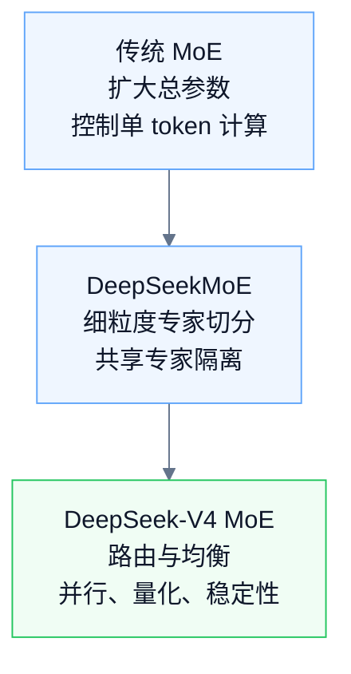
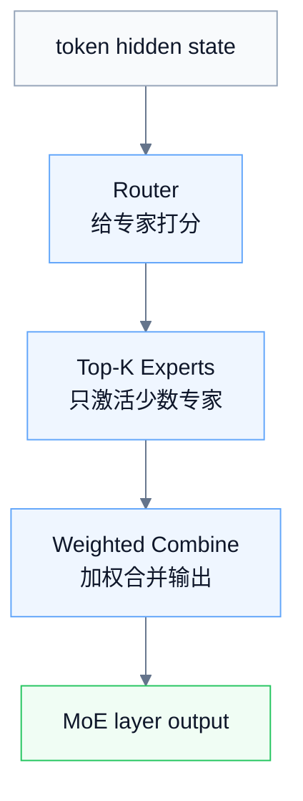
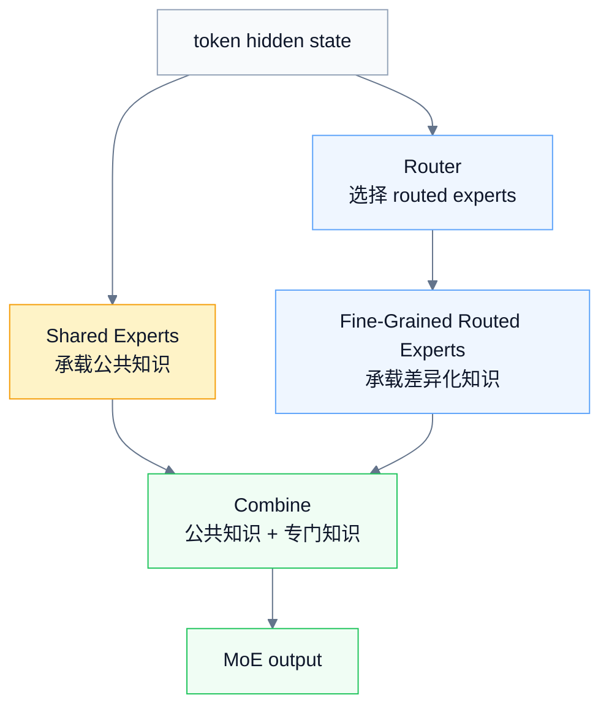
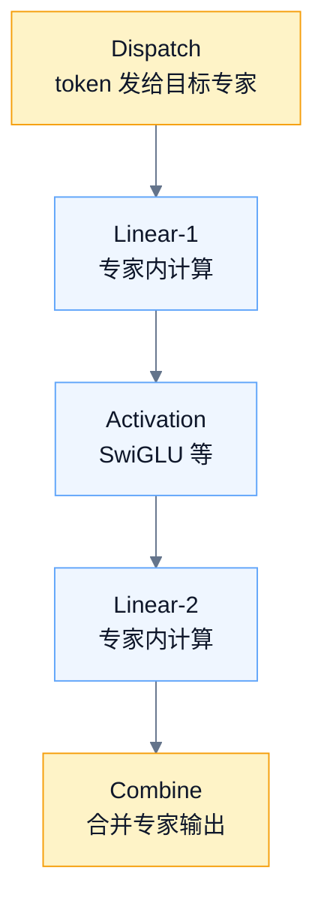
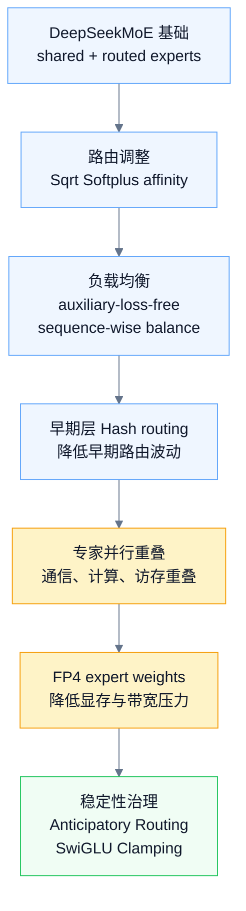

# MoE / DeepSeekMoE / DeepSeek-V4 MoE 学习笔记

> [!info] 原始来源
> - [DeepSeekMoE: Towards Ultimate Expert Specialization in Mixture-of-Experts Language Models](https://arxiv.org/abs/2401.06066)
> - [DeepSeek-V4 官方模型卡 / Technical Report](https://huggingface.co/deepseek-ai/DeepSeek-V4-Pro)

> [!summary] 一句话主线
> **MoE** 先解决“参数规模大但计算成本可控”；**DeepSeekMoE** 进一步解决“专家是否真的专业”；**DeepSeek-V4 MoE** 则把 DeepSeekMoE 放进超大规模训练和推理场景里，重点处理路由、通信、量化和稳定性问题。

---

## 0. 学习导航

### 0.1 先记住三层递进



### 0.2 本笔记回答的三个问题

| 问题                 | 对应章节                                              | 核心答案                                             |
| ------------------ | ------------------------------------------------- | ------------------------------------------------ |
| MoE 是什么？           | [1. 传统 MoE 基础：从 Dense FFN 到 Sparse Experts](#1-%E4%BC%A0%E7%BB%9F-moe-%E5%9F%BA%E7%A1%80%E4%BB%8E-dense-ffn-%E5%88%B0-sparse-experts)    | 把 Transformer 的 FFN 换成多个专家 FFN，每个 token 只激活少数专家。 |
| DeepSeekMoE 改了什么？  | [2. DeepSeekMoE：从“有专家”到“专家专业化”](#2-deepseekmoe%E4%BB%8E%E6%9C%89%E4%B8%93%E5%AE%B6%E5%88%B0%E4%B8%93%E5%AE%B6%E4%B8%93%E4%B8%9A%E5%8C%96)                | 把大专家切成小专家，并隔离 shared experts，减少知识混杂和知识冗余。        |
| DeepSeek-V4 如何规模化？ | [3. DeepSeek-V4 的规模化改造：让 DeepSeekMoE 在超大规模下可用](#3-deepseek-v4-%E7%9A%84%E8%A7%84%E6%A8%A1%E5%8C%96%E6%94%B9%E9%80%A0%E8%AE%A9-deepseekmoe-%E5%9C%A8%E8%B6%85%E5%A4%A7%E8%A7%84%E6%A8%A1%E4%B8%8B%E5%8F%AF%E7%94%A8) | 继续使用 DeepSeekMoE，同时强化路由、负载均衡、专家并行、FP4 量化和稳定性治理。  |

> [!tip] 阅读顺序
> 先看 **0.1 演进图** 和 **4. 三阶段对比总结**，再回到第 1、2、3 节补机制细节。最后用 **5. 最终记忆版** 和 **6. 自测问题** 做复习。

---

# 1. 传统 MoE 基础：从 Dense FFN 到 Sparse Experts

## 1.1 普通 Transformer 的 FFN 是什么？

普通 Transformer block 通常可以粗略拆成两部分：

```text
Self-Attention
  ↓
FFN
```

- **Self-Attention**：负责 token 之间的信息交互。
- **FFN**：对每个 token 的 hidden state 做非线性变换，是模型知识与模式记忆的重要承载位置。

普通 dense Transformer 的关键特点是：

> [!important] Dense FFN 的特点
> **所有 token 都走同一套 FFN 参数。**  
> 数学、代码、中文、英文、实体名等 token，都会经过同一个 FFN。

---

## 1.2 MoE 的核心想法：把一个 FFN 换成多个 Expert FFN

MoE，全称 **Mixture of Experts**。在 Transformer 语言模型中，它通常不是替换整个 Transformer，而是把 FFN 层替换成多个专家 FFN。



可以先把 expert 理解为：

> [!note] Expert 的直觉定义
> **一个可被 router 选择的 FFN 子网络。**

Switch Transformer 论文中的典型做法，就是把 Transformer 中原本的 dense FFN 替换成 sparse Switch FFN layer，并让不同 token 被 router 独立分配到不同 FFN experts。

---

## 1.3 Router：决定 token 去哪个专家

Router 可以理解为“分诊台”。每个 token 进入 MoE 层后，router 会给每个 expert 打分，然后选择分数最高的若干个专家。

```text
token x
  ↓
Router 打分
  ↓
Expert 1: 0.10
Expert 2: 0.65
Expert 3: 0.05
Expert 4: 0.20
```

- **Top-1 routing**：这个 token 只进入 Expert 2。
- **Top-2 routing**：这个 token 进入 Expert 2 和 Expert 4，然后把两个专家输出加权合并。

传统 MoE 的一般形式可以写成：

```text
output = Σ gate_i(x) · Expert_i(x)
```

其中只有 Top-K 个 expert 的 gate 非零，其余 expert 不参与当前 token 的计算。

---

## 1.4 MoE 为什么能扩大参数但控制计算量？

MoE 的关键是 **sparse activation，稀疏激活**。

假设模型有 64 个专家，但每个 token 只激活 2 个专家：

```text
总参数：64 个专家都算模型参数
单 token 计算：只计算其中 2 个专家
```

所以 MoE 可以做到：

> [!important] MoE Scaling 的核心
> **模型总容量很大，但每个 token 的实际计算量相对较小。**

和 Dense scaling 对比：

|扩展方式|参数增长|单 token 计算增长|直觉|
|---|---:|---:|---|
|Dense scaling|明显增长|明显增长|参数和计算一起涨|
|MoE scaling|明显增长|相对克制|总参数涨得多，激活计算涨得少|

Switch Transformer 的设计原则就是在计算成本基本固定的情况下扩大参数量：专家数量增加会增加总参数，但每个输入只使用其中一部分权重。

---

## 1.5 Top-1 与 Top-2：Switch Transformer 的简化

传统 MoE 常用 Top-2 routing，例如 GShard。Switch Transformer 把路由简化成 Top-1：每个 token 只路由到一个 expert。

Top-1 的好处：

```text
1. router 计算更少
2. 每个 expert 的 capacity 压力更低
3. 通信和实现更简单
```

不过 Top-1 也意味着每个 token 对专家的选择更“硬”，因此会带来训练稳定性和负载均衡问题。

---

## 1.6 传统 MoE 的关键难点

### 难点一：负载均衡

如果 router 总是把 token 分给少数专家，就会出现：

```text
Expert 1: 过载
Expert 2: 很少被用
Expert 3: 几乎没训练到
Expert 4: 几乎没训练到
```

这会导致两个问题：

- 热门专家计算爆满，成为性能瓶颈。
- 冷门专家训练不足，最后变成“废专家”。

Switch Transformer 使用 auxiliary load balancing loss 来鼓励 token 更均匀地分配到不同专家。这个 loss 会同时考虑实际分配到专家的 token 比例，以及 router 给专家的概率分布。

### 难点二：Expert Capacity 与 Token Dropping

大规模训练时，每个 expert 通常有固定容量。如果太多 token 被路由到同一个 expert，超出容量的 token 可能会被跳过，或者直接通过 residual 进入下一层。

> [!warning] Capacity 的取舍
> **capacity factor 越大**：token 被 drop 的概率越低，但会浪费更多显存和计算。  
> **capacity factor 越小**：效率更高，但更容易出现 expert 溢出。

### 难点三：跨设备通信

专家可能分布在不同 GPU / TPU 上。token 在 router 分配后，需要被发送到对应专家所在的设备，再把结果 combine 回来。

```text
token dispatch → expert compute → output combine
```

所以 MoE 不是纯算法问题，也是强工程问题。专家越多、设备越多，通信就越复杂。

### 难点四：训练不稳定

MoE 的 router 会做近似“硬选择”：一个 token 只进入 Top-K 个 expert。这种选择可能导致：

```text
1. router 过早偏向少数专家
2. 某些专家长期训练不足
3. 低精度下 router softmax 不稳定
4. sparse model fine-tuning 更容易过拟合或不稳定
```

Switch Transformer 通过 selective precision、较小初始化尺度、expert dropout 等方式缓解稳定性问题。

---

# 2. DeepSeekMoE：从“有专家”到“专家专业化”

传统 MoE 已经有多个 experts，但 DeepSeekMoE 论文指出：**有专家不等于专家真的专业。**

它认为传统 MoE 的核心问题是 **expert specialization 不足**，也就是每个 expert 没有学到足够聚焦、非重叠的知识。DeepSeekMoE 的目标就是让专家更专业。

---

## 2.1 传统 MoE 的两个问题

### 问题一：Knowledge Hybridity，知识混杂

传统 MoE 的专家数量通常有限，比如 8 个或 16 个。如果专家太少，每个专家就会被迫处理很多不同类型的 token。

结果是：

```text
一个 expert 内部混合了很多不同类型知识
这个 expert 很难变成真正专门的专家
```

这就是 **knowledge hybridity**。

> [!example] 直觉类比
> 传统 MoE 有点像只有几个大科室的医院：每个科室什么问题都要处理，所以每个科室都不够专。

DeepSeekMoE 论文明确指出，有限数量的专家会让被分配到同一专家的 token 覆盖多种知识类型，从而使专家参数中混杂不同知识。

### 问题二：Knowledge Redundancy，知识冗余

很多 token 都需要一些公共知识，比如基础语法、常识、通用表达模式。如果没有专门承载公共知识的模块，不同 routed experts 可能都会重复学习这些公共知识。

```text
Expert 1 学了一份公共知识
Expert 2 也学了一份公共知识
Expert 3 也学了一份公共知识
```

这会浪费 expert 参数，让 routed experts 不能专注于差异化知识。

---

## 2.2 核心方案一：Fine-Grained Expert Segmentation

DeepSeekMoE 的第一招是：**把大专家切成更多小专家。**

假设传统 MoE 有 `N` 个专家，每个 token 激活 `K` 个专家。DeepSeekMoE 把每个专家切成 `m` 个更小的专家，于是专家总数变成 `mN`；为了保持计算量接近不变，每个 token 激活的专家数量也从 `K` 增加到 `mK`。

|方案|专家数量|每 token 激活数量|核心变化|
|---|---:|---:|---|
|传统 MoE|`N` 个大专家|`K` 个|专家少，组合粗|
|DeepSeekMoE|`mN` 个小专家|`mK` 个|专家更细，组合更灵活|

关键点是：

> [!important] 细粒度专家的意义
> **每个小专家更小，所以激活更多小专家，并不一定增加总计算量。**  
> 它真正带来的收益，是让 token 获得更细粒度、更灵活的专家组合。

DeepSeekMoE 论文给了一个例子：如果 `N=16`，传统 Top-2 只有 120 种专家组合；如果每个专家切成 4 个小专家，就变成 64 个专家里选 8 个，组合数量会巨大增加。

---

## 2.3 核心方案二：Shared Expert Isolation

DeepSeekMoE 的第二招是：**隔离出 shared experts。**

完整 DeepSeekMoE 中，experts 分成两类：

```text
Shared Experts：所有 token 都会经过
Routed Experts：由 router 动态选择
```



Shared experts 的作用是承载公共知识；Routed experts 则更专注于差异化、专门化知识。

```text
公共知识 → shared experts
差异化知识 → routed experts
```

这正好对应 knowledge redundancy 问题：把公共知识从 routed experts 中抽出来，减少不同 routed experts 之间的重复学习。

---

## 2.4 DeepSeekMoE 为什么更“专业”？

DeepSeekMoE 的专业化来自两个方向：

|机制|解决的问题|结果|
|---|---|---|
|细粒度专家切分|Knowledge Hybridity，知识混杂|每个专家更小、更聚焦|
|共享专家隔离|Knowledge Redundancy，知识冗余|公共知识集中承载，routed experts 更专门|

所以它的核心不是简单地“专家更多”，而是：

> [!note] DeepSeekMoE 的本质
> **专家分工更合理。**

---

## 2.5 实验证据：DeepSeekMoE 是否真的有效？

DeepSeekMoE 论文做了几类关键实验：

|实验类型|观察重点|结论|
|---|---|---|
|与 GShard 等传统 MoE 对比|相同总参数和激活参数下的表现|DeepSeekMoE 2B 明显优于 GShard，并接近同等总参数 dense model 的上界表现。|
|消融实验|shared expert isolation 与 fine-grained expert segmentation 是否有效|两者都能提升性能，专家切得更细时整体性能趋势更好。|
|Expert specialization 分析|禁用 top routed experts 后 Pile loss 的变化|DeepSeekMoE 对禁用高概率专家更敏感，说明 routed experts 更不可替代、冗余更低。|
|Shared expert 不可替代性实验|禁用 shared expert，并多激活一个 routed expert|Pile loss 从 1.808 上升到 2.414，说明 shared expert 承担了 routed experts 难以替代的公共知识。|

---

## 2.6 DeepSeekMoE 的一句话总结

> [!summary] DeepSeekMoE
> 传统 MoE 解决“总参数大、计算可控”；DeepSeekMoE 进一步解决“专家是否真的专业”。它通过细粒度专家切分减少知识混杂，通过共享专家隔离减少知识冗余，从而让 routed experts 更专门、更不可替代。

---

# 3. DeepSeek-V4 的规模化改造：让 DeepSeekMoE 在超大规模下可用

DeepSeek-V4 不是重新发明 MoE。它在 MoE 部分的主线是：

> [!summary] V4 的 MoE 主线
> **继承 DeepSeekMoE，然后围绕超大规模训练和推理做路由、均衡、并行、量化和稳定性改造。**

DeepSeek-V4 技术报告明确说，V4 的 MoE 组件仍采用 DeepSeekMoE architecture，并且只是相对 V3 做 minor adjustments。

---

## 3.1 V4 中 MoE 的位置

DeepSeek-V4 的 Transformer block 可以粗略理解为：

```text
Attention：CSA / HCA
FFN：DeepSeekMoE
Residual：mHC
```

这里只看 MoE：

```text
DeepSeek-V4 的 FFN 层
  ↓
DeepSeekMoE
  ↓
fine-grained routed experts + shared experts
```

也就是说，V4 里的 MoE 仍然承担 FFN 层的角色。

---

## 3.2 V4 继承了 DeepSeekMoE 的什么？

V4 继续使用：

```text
1. fine-grained routed experts
2. shared experts
```

这说明 V4 仍然沿用 DeepSeekMoE 的专家专业化思想：

|组件|承担的知识类型|作用|
|---|---|---|
|shared experts|公共知识|承载跨上下文共享的基础能力|
|routed experts|差异化知识|由 router 动态选择，处理更专门的模式|
|fine-grained experts|细粒度组合|让 token 获得更灵活的专家组合|

---

## 3.3 V4 相比 V3 的 MoE 改动

### 改动一：Router affinity 激活函数变化

DeepSeek-V4 把计算 affinity score 的激活函数从：

```text
Sigmoid(·)
```

改成：

```text
Sqrt(Softplus(·))
```

这发生在 token 和 expert 的匹配分数计算中。报告没有详细展开动机，但可以先理解为 router 打分函数的调整，可能服务于路由分数的数值性质和稳定性。

### 改动二：Auxiliary-loss-free + sequence-wise balance loss

传统 MoE 往往用 auxiliary loss 做负载均衡。DeepSeek-V4 继续采用 DeepSeek 系列的 **auxiliary-loss-free** 策略，同时增加一个轻量的 **sequence-wise balance loss**，用于防止单个序列内部出现极端不均衡。

这个设计在 V4 里尤其重要，因为 V4 支持 1M token 长上下文。

```text
全局负载均衡：不要让某些专家长期过热
序列内负载均衡：不要让某条长序列内部极端偏向少数专家
```

### 改动三：移除 routing target nodes 数量约束

V4 移除了 routing target nodes 数量约束，同时重新设计 parallelism strategy 来维持训练效率。

> [!note] 直觉理解
> 路由更自由，会带来更复杂的跨节点通信；因此必须用新的专家并行策略把通信成本压住。

### 改动四：前几层使用 Hash routing MoE

V4 把初始几个 Transformer block 里的 dense FFN 也替换成 MoE 层，但这些早期 MoE 层使用 **Hash routing**。

```text
普通 learned routing：router 根据 hidden state 学习选择专家
Hash routing：根据 token ID 的哈希函数固定选择专家
```

一个合理理解是：早期层的 hidden states 还比较底层，learned router 可能更不稳定；Hash routing 更确定，能减少早期路由波动。

---

## 3.4 V4-Flash 和 V4-Pro 的 MoE 配置

|配置项|DeepSeek-V4-Flash|DeepSeek-V4-Pro|
|---|---:|---:|
|总参数|284B|1.6T|
|激活参数|13B|49B|
|Transformer layers|43|61|
|hidden dimension|4096|7168|
|MoE 覆盖范围|所有 Transformer blocks|所有 Transformer blocks|
|前几层 Hash routing|前 3 个 MoE layers|前 3 个 MoE layers|
|每层 shared expert|1 个|1 个|
|每层 routed experts|256 个|384 个|
|每个 routed expert 中间维度|2048|3072|
|每 token 激活 routed experts|6 个|6 个|

这里最重要的观察是：

> [!important] V4 的 MoE 优势
> **V4-Pro 总参数达到 1.6T，但每个 token 只激活 49B；V4-Flash 总参数 284B，但每个 token 只激活 13B。**  
> 这就是 MoE 的核心优势：总容量非常大，但单 token 计算只使用一部分专家。

---

## 3.5 V4 的 MoE 工程改造：Expert Parallelism Overlap

大规模 MoE 最大的工程难点之一是专家并行。

MoE 层大致可以拆成：

```text
Dispatch：把 token 发给目标 experts
Linear-1：专家内部第一层线性计算
Activation：如 SwiGLU
Linear-2：专家内部第二层线性计算
Combine：把 expert 输出合并回来
```



Dispatch 和 Combine 偏通信；Linear-1 和 Linear-2 偏计算。V4 的做法是设计 fused MoE kernel，把 computation、communication 和 memory access 尽量重叠。

直觉上：

```text
不要等所有 token 都通信完再算
而是把 experts 分成多个 wave
一个 wave 通信完就立刻算
同时下一个 wave 继续通信
```

所以 V4 的 MoE 工程核心不是“没有通信”，而是：

> [!important] 工程核心
> **把通信藏在计算下面。**

---

## 3.6 V4 的 MoE 量化改造：FP4 routed expert weights

DeepSeek-V4 使用 FP4 quantization-aware training，其中一个重要应用对象就是 **MoE expert weights**。报告还提到，V4 的 routed expert parameters 使用 FP4 precision，以减少内存和计算压力。

这对 MoE 特别关键，因为 routed experts 占据了大量参数。如果专家权重可以低精度存储和计算，就可以显著降低：

```text
显存压力
带宽压力
推理成本
```

所以 V4 的 MoE 不只是稀疏激活，还叠加了低精度专家权重：

```text
Sparse Activation
  +
FP4 Expert Weights
```

---

## 3.7 V4 的 MoE 稳定性改造：路由和异常值治理

大规模 MoE 训练容易出现 loss spike。V4 技术报告中提到，训练 trillion-parameter MoE 模型存在稳定性挑战，尤其是 MoE layers 中的 outliers 和 routing mechanism 可能放大不稳定。

### 方向一：Anticipatory Routing

Anticipatory Routing 的直觉是：

```text
当前 step 的特征计算用当前参数
但 routing indices 用历史参数提前计算
```

这样可以让 backbone 参数更新和 routing 更新稍微解耦，减少两者同时剧烈变化带来的震荡。

它不是一直开启，而是在检测到 loss spike 后，通过短回滚和临时启用来稳定训练。

### 方向二：SwiGLU Clamping

MoE expert 内部通常使用类似 SwiGLU 的 FFN 结构。如果激活中出现极端值，可能放大训练不稳定。

SwiGLU Clamping 的思路是对 SwiGLU 的部分分量做裁剪，压制 outliers。

> [!note] 稳定性治理的本质
> 不是改变 MoE 的专家结构，而是在专家内部控制异常激活，防止 loss spike 扩散。

---

## 3.8 V4 MoE 规模化改造总图



---

## 3.9 DeepSeek-V4 MoE 的一句话总结

> [!summary] DeepSeek-V4 MoE
> DeepSeek-V4 的 MoE 不是新的 MoE 理论，而是 DeepSeekMoE 的超大规模工程化版本：它继续使用 shared experts + fine-grained routed experts，同时通过 router 函数调整、sequence-wise balance loss、Hash routing、FP4 expert weights、fine-grained expert parallelism 和稳定性治理，让 MoE 在 284B / 1.6T 级别模型中可训练、可推理、可部署。

---

# 4. 三阶段对比总结

|阶段|核心问题|代表方法|关键词|
|---|---|---|---|
|传统 MoE|如何扩大参数但控制计算量|Router + Top-K experts|sparse activation, expert capacity, load balancing|
|Switch / GShard 类 MoE|如何让 MoE 更简单高效|Top-1 / Top-2 routing|routing simplification, communication cost|
|DeepSeekMoE|如何让专家真正专业化|细粒度专家切分 + 共享专家隔离|knowledge hybridity, knowledge redundancy|
|DeepSeek-V4 MoE|如何把 MoE 扩到超大规模|Hash routing, FP4, EP overlap, stability tricks|scalability, stability, efficiency|

---

# 5. 最终记忆版

> [!abstract] 传统 MoE
> 把 Transformer 的 FFN 换成多个 expert FFN，每个 token 只激活少数专家，从而实现“总参数大、单 token 计算可控”。

> [!abstract] DeepSeekMoE
> 传统 MoE 的专家容易知识混杂和知识冗余，所以 DeepSeekMoE 把专家切得更细，并隔离 shared experts 来承载公共知识，让 routed experts 更专门。

> [!abstract] DeepSeek-V4 MoE
> V4 继续采用 DeepSeekMoE，但为了支撑 284B / 1.6T 级别模型，对路由函数、负载均衡、早期层 Hash routing、专家并行、FP4 量化和训练稳定性做了规模化改造。

---

# 6. 自测问题

用下面的问题检查自己是否真的理解，而不是只记住术语。

1. 为什么 MoE 能让总参数变大，但单 token 计算量不同比例增长？

   **简答**：MoE 把 FFN 换成多个 expert FFN，所有 experts 都计入总参数；但每个 token 只由 router 选择 Top-K 个 experts 参与计算，所以单 token 的实际计算量只和激活专家数有关，不和专家总数同比例增长。

2. Router 的 Top-1 和 Top-2 routing 分别有什么好处和风险？

   **简答**：Top-1 每个 token 只激活 1 个 expert，计算和通信更省、实现更简单，但选择更硬，负载不均衡和训练不稳定风险更高。Top-2 每个 token 激活 2 个 experts，并按 gate 权重加权合并输出，表达更灵活、通常更稳，但计算、通信和调度成本更高。

3. Expert capacity 太小会导致什么问题？太大又会浪费什么？

   **简答**：capacity 太小时，热门 expert 容易溢出，超出容量的 token 可能被 drop、skip 或只走 residual，损失有效专家计算。capacity 太大时，会为每个 expert 预留过多 token 槽位，带来 padding、显存、通信和计算浪费。

4. Knowledge hybridity 和 knowledge redundancy 分别是什么意思？

   **简答**：knowledge hybridity 是单个 expert 内部混杂多种不同知识，说明专家不够专。knowledge redundancy 是多个 experts 重复学习同一批公共知识，说明专家之间差异不够大、参数被浪费。

5. Fine-grained expert segmentation 为什么不一定增加总计算量？

   **简答**：它把 `N` 个大专家切成 `mN` 个小专家，并把每 token 激活数从 `K` 增加到 `mK`；但每个小专家的规模约变成原来的 `1/m`，所以激活专家数增加的同时，单个专家计算量下降，总激活计算量可以大致保持不变。

6. Shared experts 为什么能减少 routed experts 之间的冗余？

   **简答**：公共知识对所有 token 都有用，如果只靠 routed experts，不同专家可能各自重复学习一份。shared experts 对所有 token 都可见，更适合集中承载基础语法、常识和通用表达模式，让 routed experts 把更多容量用于差异化知识。

7. DeepSeek-V4 为什么还需要 sequence-wise balance loss？

   **简答**：DeepSeek-V4 支持超长上下文，单条 sequence 内部可能有大量 token。如果 router 在一条长序列中把 token 过度集中到少数 experts，会造成序列级别的专家过热、通信瓶颈和稳定性问题。sequence-wise balance loss 用来约束每条序列内部的 expert 使用分布。

8. Hash routing 和 learned routing 的区别是什么？

   **简答**：Hash routing 用固定哈希规则把 token 分配给 experts，开销低、确定性强、稳定，但不能根据上下文语义自适应选择专家。learned routing 用可训练 router 根据 token hidden state 给 experts 打分，更灵活、更有表达能力，但需要处理负载均衡、专家塌缩和训练稳定性问题。

9. Expert Parallelism Overlap 的核心目标是什么？

   **简答**：核心目标是把 MoE 的 dispatch、combine、跨设备通信和访存尽量隐藏在 expert compute 下面。也就是不要等所有 token 通信完再算，而是分 wave 边传边算、边算边收，减少通信暴露时间。

10. FP4 routed expert weights 对 MoE 的推理成本有什么帮助？

    **简答**：MoE 的 routed experts 数量多，expert weights 占据大量参数。把 routed expert weights 量化到 FP4 可以显著降低显存占用、模型加载压力、权重读取带宽和部分计算成本，使大规模 MoE 更容易部署和推理。

---

# 7. 最小复习卡

```text
MoE：参数多，激活少。
DeepSeekMoE：专家切细，共享隔离。
DeepSeek-V4 MoE：继承 DeepSeekMoE，再解决规模化训练和推理问题。
```
