# 2.2 mHC：Manifold-Constrained Hyper-Connections

> [!info] 原始来源
> [mHC: Manifold-Constrained Hyper-Connections](https://arxiv.org/abs/2512.24880)

主线：**为什么提出 HC → 为什么 HC 不稳 → mHC 怎么约束 → 工程优化为什么必要 → 实验证明了什么**。

---

## 0. 一页总览：这篇论文到底解决什么

### 0.1 一句话总结

**Hyper-Connections（HC）** 想把传统残差连接从“一条 residual stream”扩展成“多条 residual streams”，从而提升跨层信息容量和网络拓扑表达力。

**Manifold-Constrained Hyper-Connections（mHC）** 在 HC 的核心 residual mapping 上加入双随机矩阵约束，使多流 residual 既能交换信息，又不会破坏深层训练依赖的稳定传播。

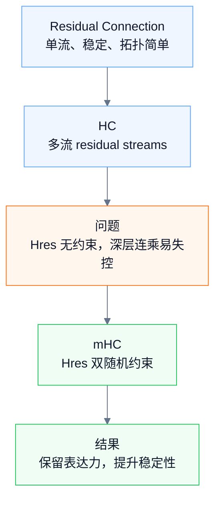

这篇论文的核心优化是：

> 残差连接需要 identity mapping 来保证训练稳定；HC 想扩宽 residual stream 来提高表达力；但自由的 residual mixing 会破坏稳定传播；mHC 用双随机矩阵约束 residual mixing，让多流结构既可表达、又可训练。

---

### 0.2 论文贡献拆成三层

| 层次 | mHC 做了什么 | 解决的问题 |
|---|---|---|
| 架构层 | 把 residual stream 从单流扩展到多流 | 增加跨层信息容量和拓扑表达力 |
| 稳定性层 | 把 $H_l^{res}$ 约束为双随机矩阵 | 控制多层传播增益，缓解信号爆炸/衰减 |
| 系统层 | Kernel Fusion、Recomputing、DualPipe Overlap | 降低 widened residual stream 带来的 I/O、显存和通信开销 |

一句话记忆：

> HC 证明了扩宽 residual stream 有价值；mHC 的贡献是让这种扩宽在数学上稳定、在系统上可训练、在实验上可扩展。

---

## 1. 传统残差连接：为什么 identity mapping 重要

传统残差连接写成：

$$
x_{l+1}=x_l+\mathcal{F}(x_l,W_l)
$$

其中 $x_l$ 是第 $l$ 层输入，$\mathcal{F}$ 是这一层真正做计算的模块，例如 Attention、FFN 或 Conv。

这个公式的重点不是“相加”本身，而是：

$$
\text{新表示}=\text{旧表示}+\text{本层学到的增量}
$$

因此，每一层不需要重新生成整个表示，只需要学习“应该改多少”。

如果把多层残差连接展开：

$$
x_L=x_l+\sum_{i=l}^{L-1}\mathcal{F}(x_i,W_i)
$$

这里最重要的是第一项 $x_l$ 仍然存在。浅层信号可以不被修改地传到深层，这就是 residual connection 的 **identity mapping property**。

它带来两个稳定性收益：

1. **前向信号稳定**：浅层特征不会被每一层强行重写。
2. **反向梯度稳定**：梯度有一条接近直接传递的路径。

但传统残差连接也有一个结构限制：只有一条 residual stream。所有层都在同一条隐藏状态上读写，跨层信息容量和拓扑结构都比较简单。

---

## 2. HC：扩宽 residual stream，提高拓扑表达力

### 2.1 HC 的核心想法

传统 residual stream 是：

$$
x_l\in\mathbb{R}^{C}
$$

HC 把它扩成 $n$ 条并行 residual streams：

$$
X_l\in\mathbb{R}^{n\times C}
$$

这里 $n$ 是 expansion rate，论文实验里常用 $n=4$。为了避免和论文中复用 $x_l$ 的写法混淆，这篇笔记用大写 $X_l$ 表示多流 residual state。

直观上：

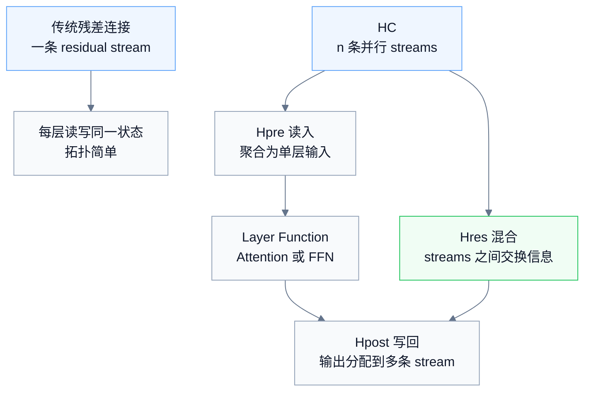

这样做的好处是：

| 维度 | 传统残差连接 | HC |
|---|---|---|
| residual stream 数量 | 1 条 | $n$ 条 |
| residual state 宽度 | $C$ | $nC$ |
| 跨层信息容量 | 较小 | 更大 |
| 拓扑结构 | 固定直连 | 多流读写与混合 |
| Attention/FFN 主计算维度 | $C$ | 仍主要是 $C$ |

关键点：HC 扩宽的是 residual stream，不是直接把 Attention/FFN 的 hidden size 扩到 $nC$。所以它增加的是跨层信息通道，而不是简单把主干计算量乘以 $n$。

---

### 2.2 HC 的单层公式

HC 一层可以写成：

$$
X_{l+1}=H_l^{res}X_l+(H_l^{post})^\top\mathcal{F}(H_l^{pre}X_l,W_l)
$$

其中：

| 符号 | 维度 | 作用 |
|---|---:|---|
| $X_l$ | $n\times C$ | 第 $l$ 层的多流 residual state |
| $H_l^{pre}$ | $1\times n$ | 从 $n$ 条 stream 聚合出一条 layer input |
| $H_l^{post}$ | $1\times n$ | 把 layer output 写回 $n$ 条 stream |
| $H_l^{res}$ | $n\times n$ | 在 residual streams 之间做信息混合 |
| $\mathcal{F}$ | $\mathbb{R}^{1\times C}\to\mathbb{R}^{1\times C}$ | 正常的 Attention / FFN 等层计算 |

拆成四步就是：

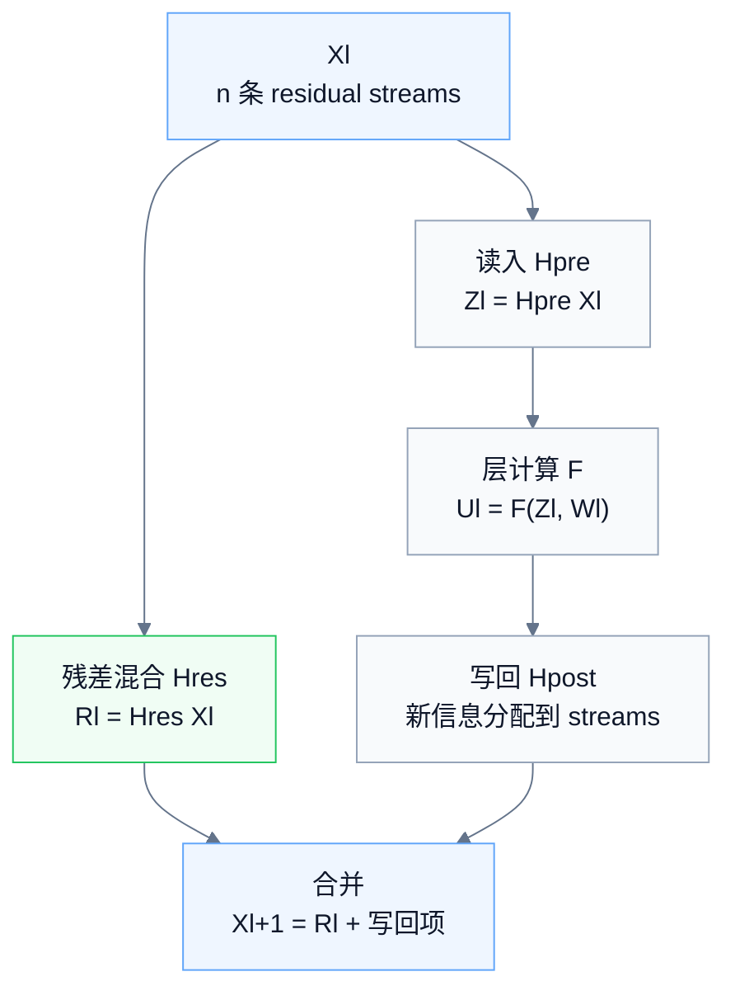

其中 $H_l^{res}$ 最关键。$H_l^{pre}$ 和 $H_l^{post}$ 解决的是“多流 residual 和单流 layer 之间怎么读写”的问题；$H_l^{res}$ 则决定多条 residual streams 之间是否能交换信息。

论文的 ablation 也说明，三个 mapping 里，$H_l^{res}$ 对性能收益最重要。这说明 HC 的价值不只是“多开几个 stream”，而是让 residual stream 内部形成可学习的信息交换结构。

---

### 2.3 HC 的价值与隐患

HC 的价值可以概括成两点：

1. **信息容量更大**：跨层传递的状态从 $C$ 扩展到 $nC$，不同层的信息不必全部挤在同一个 residual stream 里。
2. **拓扑更灵活**：每层可以动态选择从哪些 stream 读、向哪些 stream 写，并通过 $H_l^{res}$ 混合不同 stream。

但这里也埋下了 mHC 要解决的问题：

> HC 最关键的收益来自 $H_l^{res}$；但 $H_l^{res}$ 直接作用在 residual stream 主干上，一旦它无约束，多层连乘后就可能成为训练不稳定的主要来源。

---

## 3. HC 的问题：自由的 $H^{res}$ 会让传播失控

### 3.1 identity mapping 被替换成矩阵连乘

普通残差连接多层展开后，浅层信号是原样进入深层的：

$$
x_L=x_l+\sum_{i=l}^{L-1}\mathcal{F}(x_i,W_i)
$$

HC 中，浅层 residual state 不再原样传递，而是每层都要经过 $H_l^{res}$：

$$
X_L\approx \left(\prod_{i=l}^{L-1}H_i^{res}\right)X_l+\cdots
$$

也就是说，传统残差里的 identity mapping 被替换成了一个 composite mapping：

$$
\prod H_i^{res}
$$

如果每个 $H_i^{res}$ 都是自由学习的矩阵，那么多层连乘后可能出现两类问题：

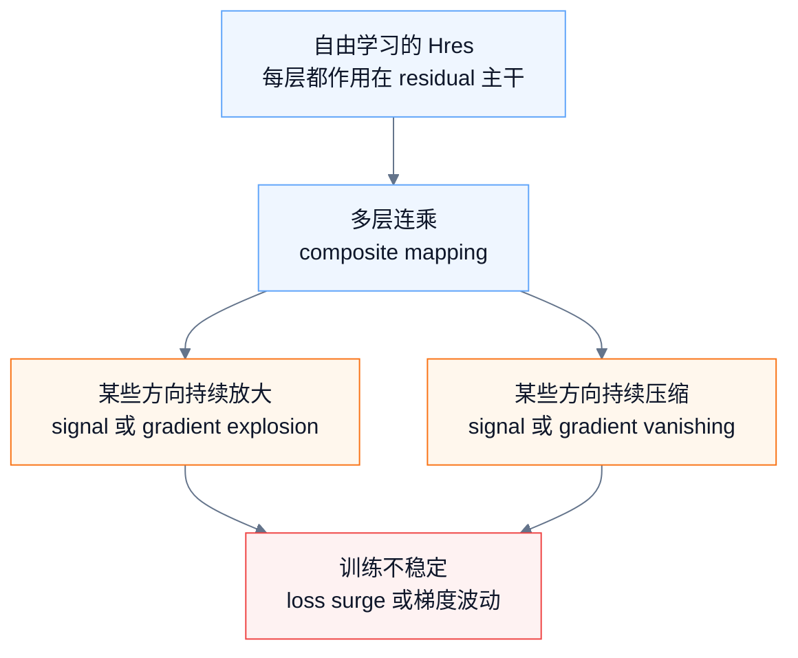

这就是 HC 在大规模训练中不稳定的根源。

---

### 3.2 论文中的不稳定证据

论文在 27B 模型上观察到 HC 的训练不稳定：

| 证据 | 说明 |
|---|---|
| Figure 2 | HC 出现 loss surge，并且和 gradient norm 不稳定相关 |
| Figure 3 | HC 的 composite mapping 出现极大的 Amax Gain Magnitude |
| 数值 | composite mapping 的 gain 峰值接近 3000 |

Amax Gain Magnitude 的计算思想是：

| 指标 | 对应传播方向 | 含义 |
|---|---|---|
| 最大绝对行和 | forward signal | 前向信号最坏情况下被放大多少 |
| 最大绝对列和 | backward gradient | 反向梯度最坏情况下被放大多少 |

理想情况下，residual 主干的传播增益应该接近 1。HC 的 composite gain 接近 3000，说明多层 $H^{res}$ 连乘已经明显偏离稳定传播。

---

### 3.3 系统层问题：HC 的代价不只是 FLOPs

HC 没有把 Attention/FFN 的主计算直接变成 $n$ 倍，所以从 FLOPs 看似比较克制。但 residual stream 从 $C$ 变成 $nC$ 后，系统代价会明显上升：

| 系统开销 | 原因 |
|---|---|
| memory I/O 增加 | 每层要读写 $nC$ residual state |
| activation memory 增加 | $H^{pre}$、$H^{post}$、$H^{res}$ 及中间状态要支持反向传播 |
| pipeline communication 增加 | stage 边界要传输 $nC$ 而不是 $C$ |

所以 HC 的两个核心问题是：

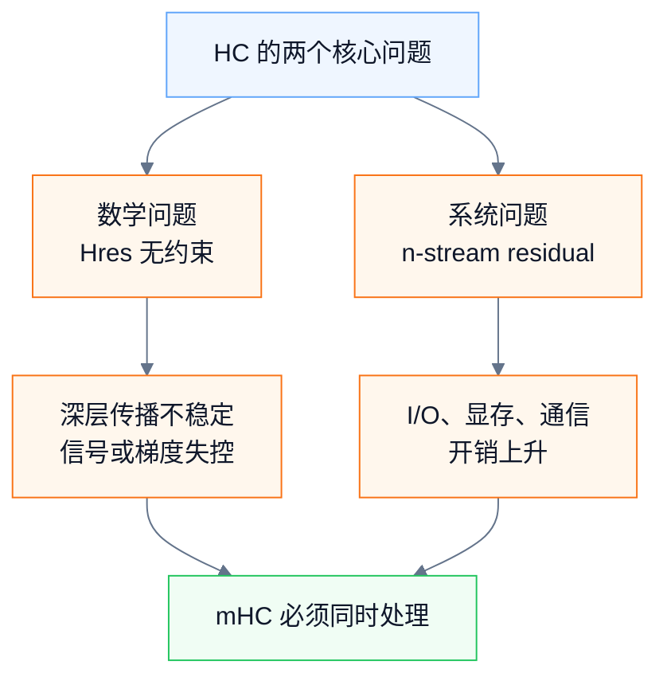

mHC 必须同时解决这两个问题。

---

## 4. mHC 的核心约束：稳定但不退化为 identity

### 4.1 为什么不是直接把 $H^{res}=I$

如果把 $H_l^{res}$ 固定成单位矩阵：

$$
H_l^{res}=I
$$

那么确实能恢复最稳定的 identity mapping。但这样会取消多条 stream 之间的信息交换，也就削弱了 HC 的核心收益。

因此 mHC 的目标不是“回到普通残差连接”，而是找一个折中：

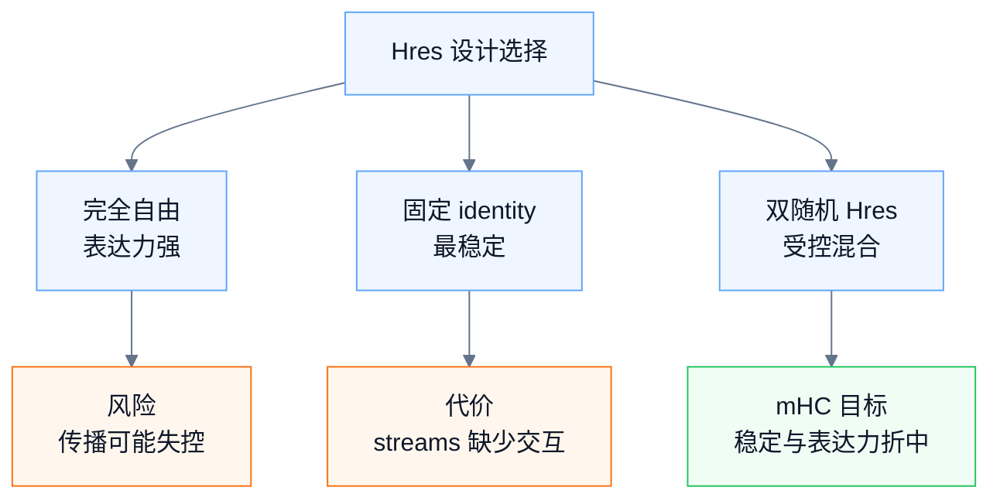

---

### 4.2 双随机约束

mHC 把 $H_l^{res}$ 约束为双随机矩阵：

$$
H_l^{res}\mathbf{1}_n=\mathbf{1}_n
$$

$$
\mathbf{1}_n^\top H_l^{res}=\mathbf{1}_n^\top
$$

$$
H_l^{res}\ge 0
$$

也就是：

1. 所有元素非负。
2. 每一行和为 1。
3. 每一列和为 1。

这些矩阵构成 **Birkhoff polytope**。论文把它作为一种 constrained manifold 使用；更严格地说，Birkhoff polytope 是双随机矩阵构成的凸多面体，也是 permutation matrices 的凸包。

---

### 4.3 这些约束为什么有用

| 性质 | 数学含义 | 对稳定性的作用 |
|---|---|---|
| 非负 | 不允许正负系数任意抵消 | 减少信号抵消和符号震荡 |
| 行和为 1 | 每条输出 stream 是输入 streams 的凸组合 | 前向传播不任意放大 |
| 列和为 1 | 跨 stream 的总量/均值被保留 | 反向传播中 $H^\top$ 也受约束 |
| 乘法封闭 | 双随机矩阵相乘仍是双随机矩阵 | 多层 composite mapping 仍稳定 |
| 谱范数不超过 1 | mapping 非扩张 | 有助于抑制梯度爆炸 |

更具体地说，前向传播是：

$$
X' = H^{res}X
$$

行和为 1 表示每条输出 stream 都是输入 streams 的非负加权平均；列和为 1 表示所有 streams 的总和/均值被保留。反向传播时梯度会经过 $H^\top$，所以行列约束共同控制 backward gradient gain。

此外，如果 $A$ 和 $B$ 都是双随机矩阵，那么 $AB$ 仍然是双随机矩阵。因此：

$$
\prod_{i=l}^{L-1} H_i^{res}
$$

不会像普通 HC 那样越乘越偏离稳定区域。

---

### 4.4 $n=1$ 时的退化关系

当 expansion rate $n=1$ 时，双随机矩阵只能是：

$$
[1]
$$

因此 mHC 的 residual mapping 部分退化为 identity mapping。

但当 $n>1$ 时，mHC 不是要求 $H_l^{res}=I$，而是允许受约束的信息混合。这个区别很重要：

> mHC 保留了 HC 的多流表达力，只是把 residual mixing 限制在稳定区域内。

---

## 5. mHC 一层到底怎么实现

### 5.1 主公式

mHC 一层仍然使用 HC 的整体结构：

$$
X_{l+1}=H_l^{res}X_l+(H_l^{post})^\top\mathcal{F}(H_l^{pre}X_l,W_l)
$$

维度速查：

| 项                                     |          维度 | 说明                   |
| ------------------------------------- | ----------: | -------------------- |
| $X_l$                                 | $n\times C$ | 多流 residual state    |
| $H_l^{pre}$                           | $1\times n$ | 读入 mapping           |
| $H_l^{pre}X_l$                        | $1\times C$ | layer input          |
| $\mathcal{F}(H_l^{pre}X_l,W_l)$       | $1\times C$ | layer output         |
| $(H_l^{post})^\top\mathcal{F}(\cdot)$ | $n\times C$ | 写回项                  |
| $H_l^{res}X_l$                        | $n\times C$ | residual 混合项         |
| $X_{l+1}$                             | $n\times C$ | 下一层多流 residual state |

---

### 5.2 根据 $X_l$ 动态生成 raw mappings

mHC 中的三个 mapping 不是固定常数，而是根据当前 $X_l$ 动态生成。

先展平：

$$
\bar X_l=\mathrm{vec}(X_l)\in\mathbb{R}^{1\times nC}
$$

再做 RMSNorm：

$$
\bar X'_l=\mathrm{RMSNorm}(\bar X_l)
$$

然后生成 raw mappings：

$$
\tilde H_l^{pre}=\alpha_l^{pre}(\bar X'_l\varphi_l^{pre})+b_l^{pre}
$$

$$
\tilde H_l^{post}=\alpha_l^{post}(\bar X'_l\varphi_l^{post})+b_l^{post}
$$

$$
\tilde H_l^{res}=\alpha_l^{res}\mathrm{mat}(\bar X'_l\varphi_l^{res})+b_l^{res}
$$

参数维度：

| 参数 | 维度 | 作用 |
|---|---:|---|
| $\varphi_l^{pre}$ | $nC\times n$ | 动态生成 $\tilde H_l^{pre}$ |
| $\varphi_l^{post}$ | $nC\times n$ | 动态生成 $\tilde H_l^{post}$ |
| $\varphi_l^{res}$ | $nC\times n^2$ | 动态生成 $\tilde H_l^{res}$ |
| $b_l^{pre}$ | $1\times n$ | 静态读入 bias |
| $b_l^{post}$ | $1\times n$ | 静态写回 bias |
| $b_l^{res}$ | $n\times n$ | 静态 residual mixing bias |
| $\alpha$ | scalar | 控制动态部分强度 |

可以这样理解：

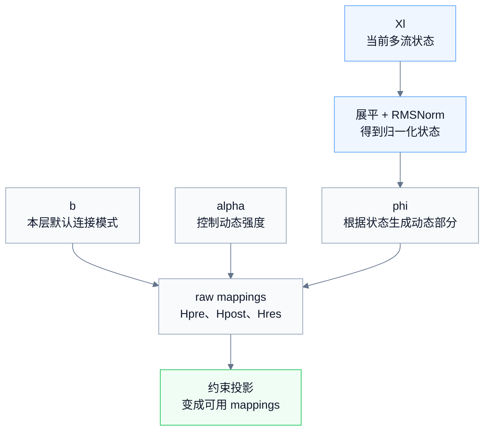

论文附录中 HC/mHC 的 gating factor 初始化为 $0.01$。

---

### 5.3 把 raw mappings 投影成合法 mappings

raw mappings 不能直接用，需要经过约束：

$$
H_l^{pre}=\sigma(\tilde H_l^{pre})
$$

$$
H_l^{post}=2\sigma(\tilde H_l^{post})
$$

$$
H_l^{res}=\mathrm{SinkhornKnopp}(\tilde H_l^{res})
$$

解释如下：

| mapping | 约束方式 | 结果 | 目的 |
|---|---|---|---|
| $H_l^{pre}$ | Sigmoid | 元素在 $(0,1)$ | 读入系数非负，减少符号抵消 |
| $H_l^{post}$ | $2\sigma$ | 元素在 $(0,2)$ | 写回系数非负，并让 raw value 接近 0 时尺度接近 1 |
| $H_l^{res}$ | Sinkhorn-Knopp | 近似双随机矩阵 | 控制 residual mixing 的传播增益 |

注意：$H_l^{pre}$ 用的是 Sigmoid，不是 Softmax，所以它只保证非负，不保证和为 1；它不是严格凸组合。严格的行/列归一约束主要施加在 $H_l^{res}$ 上。

---

### 5.4 Sinkhorn-Knopp 做了什么

对于 $\tilde H_l^{res}$，先做指数化，得到正矩阵：

$$
M^{(0)}=\exp(\tilde H_l^{res})
$$

然后交替做列归一化和行归一化：

$$
M^{(t)}=T_r(T_c(M^{(t-1)}))
$$

其中 $T_c$ 表示列归一化，$T_r$ 表示行归一化。迭代后得到：

$$
H_l^{res}=M^{(t_{\max})}
$$

当迭代次数足够多时，它会接近双随机矩阵。论文实验中取：

$$
t_{\max}=20
$$

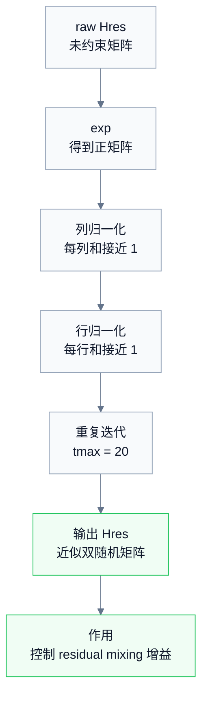

这就是 mHC 中“manifold projection”的具体实现。

---

### 5.5 一层 forward 的四步

最终，一层 mHC forward 可以压缩成四步：

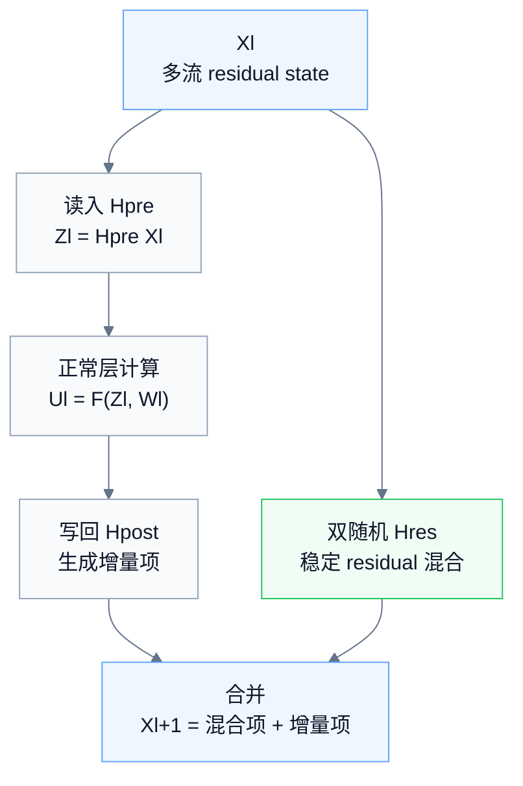

这里的核心记忆是：

> $H^{pre}$ 决定这一层读什么；$\mathcal{F}$ 做正常层计算；$H^{res}$ 让多条 residual streams 稳定混合；$H^{post}$ 决定新信息写回哪些 streams。

---

## 6. 4.3 工程优化：为什么数学设计还不够

### 6.1 mHC 的系统瓶颈

mHC 的数学设计解决了稳定性，但并不自动解决系统效率。只要 residual stream 从 $C$ 变成 $nC$，就会带来额外的硬件压力。

| 工程问题 | mHC 为什么会遇到 | 解决方法 |
|---|---|---|
| memory I/O 重 | residual stream 从 $C$ 变成 $nC$，每层读写更多状态 | Kernel Fusion |
| activation memory 重 | mapping 生成和多流 residual 中间激活要支持反向传播 | Recomputing |
| pipeline 通信重 | stage 边界传输 $B\times T\times n\times C$ | DualPipe Overlap |

所以论文 4.3 不是“附带工程优化”，而是 mHC 能不能用于大规模训练的必要条件。

---

### 6.2 Kernel Fusion：减少显存往返和小 kernel 开销

mHC 每层多了很多小操作：RMSNorm、mapping 生成、Sigmoid、Sinkhorn-Knopp、$H^{pre}$ 读入、$H^{res}$ 混合、$H^{post}$ 写回等。

如果每个操作都单独发 kernel，会产生大量：

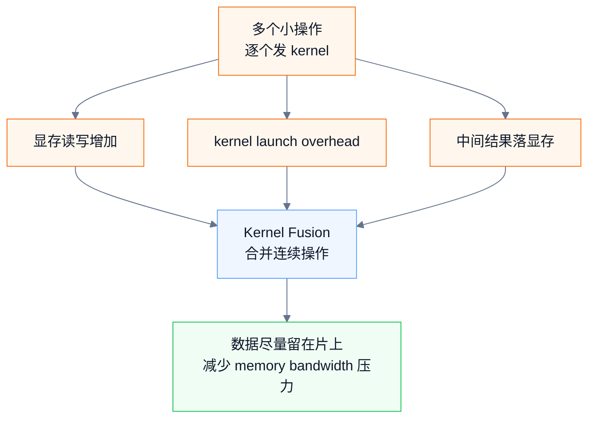

Kernel Fusion 的思路是：把共享输入或连续使用的操作合成更少的 kernel，让数据尽量留在寄存器 / shared memory / on-chip cache 中，减少往返显存。

论文中特别提到，把 $H^{post}$、$H^{res}$ 的应用和 residual merge 融合后，可以显著减少该 kernel 的读写元素数量。这说明 mHC 的效率关键不是 FLOPs，而是 memory bandwidth。

---

### 6.3 Recomputing：用少量重算换显存下降

mHC 的中间激活如果全部保存，显存压力会很大。论文选择在 forward 后丢弃部分 mHC kernels 的中间激活，backward 时再重算。

关键点是：

> 重算的是 mHC 的轻量 mapping / mixing 部分，而不是重算重型的 layer function $\mathcal{F}$。

因此它用少量额外计算换取显存下降。论文还给出 recomputing block 的近似最优长度：

$$
L_r^*\approx \sqrt{\frac{nL}{n+2}}
$$

实际实现中，recomputing 边界还要和 pipeline stage 边界对齐，避免跨 stage 重算带来额外通信依赖。

---

### 6.4 DualPipe Overlap：把通信藏进计算里

在 pipeline parallelism 中，stage 边界需要传 activation。普通 residual stream 传的是 $C$，mHC 要传的是 $nC$，通信量自然更大。

DualPipe Overlap 的目标是：

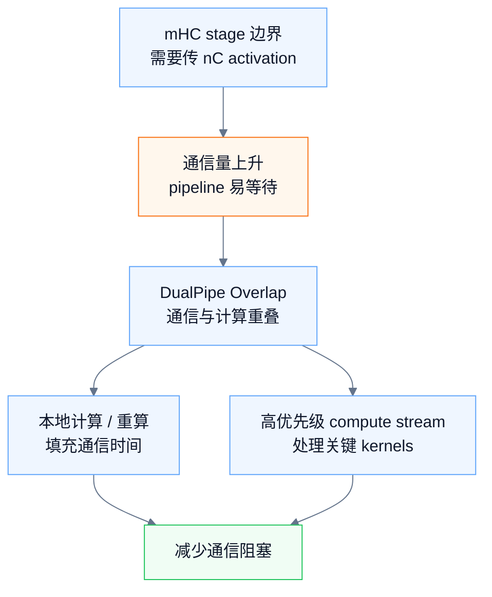

论文在 DualPipe schedule 上做扩展，使 stage 边界的 mHC 通信和计算更好重叠；同时使用高优先级 compute stream 处理部分 FFN 相关的 $F^{post,res}$ kernels，避免阻塞通信流。

---

### 6.5 本节结论

mHC 的系统优化可以压缩成一句话：

> mHC 的额外瓶颈主要不是 Attention/MLP FLOPs，而是 widened residual stream 带来的 I/O、activation footprint 和 pipeline communication；Kernel Fusion、Recomputing 和 DualPipe Overlap 分别压住这三类开销。

论文报告，在 $n=4$ 的大规模模型中，经过这些优化后，mHC 的额外训练时间开销为 **6.7%**。

这个数字要准确理解：

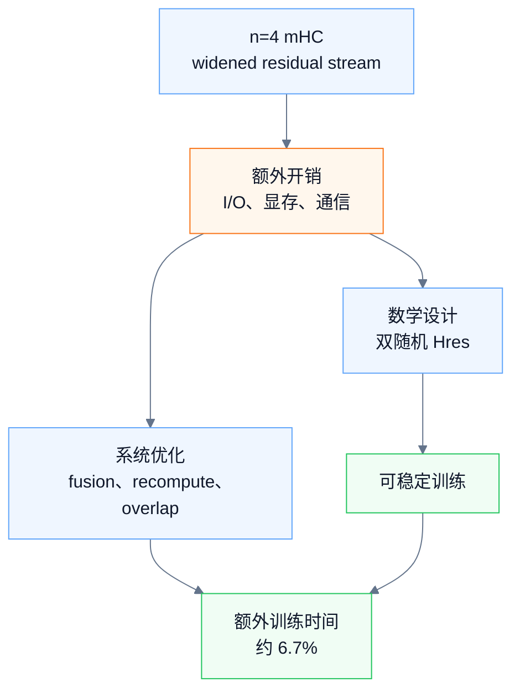

---

## 7. 第 5 节实验：mHC 是否真的有效

实验部分不要记成一堆 benchmark，而要记成一条证据链：

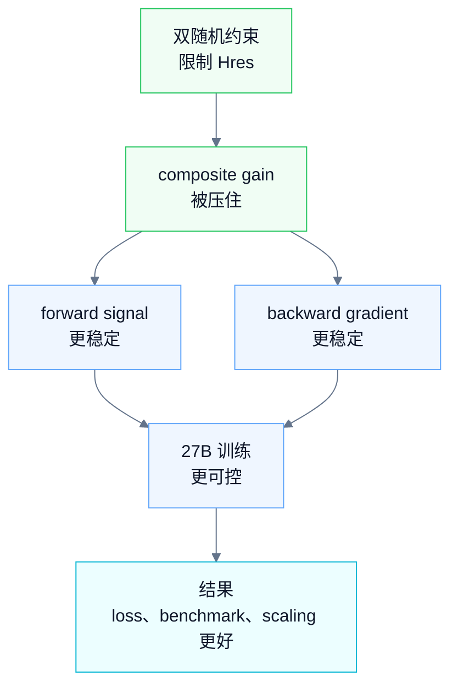

---

### 7.1 实验设置

论文做的是 language model pre-training 对比实验，比较三种结构：

| 方法 | 含义 |
|---|---|
| Baseline | 普通残差连接 |
| HC | 原始 Hyper-Connections |
| mHC | 加入双随机约束和系统优化的 HC |

实验基于类似 DeepSeek-V3 的 MoE 架构。HC 和 mHC 的 expansion rate 都设为：

$$
n=4
$$

主要实验包括：

| 实验 | 设置 |
|---|---|
| 主结果 | 27B 模型 |
| compute scaling | 3B、9B、27B |
| token scaling | 3B 模型训练到 1T tokens |
| stability analysis | 分析 $H^{res}$ 的 single-layer / composite gain |

---

### 7.2 Main Results：loss、gradient norm 和 benchmark

Figure 5 的结论：

| 指标 | 结论 |
|---|---|
| training loss | mHC 最终比 baseline 低 0.021 |
| gradient norm | mHC 明显比 HC 稳定，并接近 baseline 的平稳曲线 |
| HC 对比 | HC 有更明显的梯度波动和训练不稳定 |

Table 4 的 27B benchmark 结果可以压缩成：

| Benchmark | Baseline | HC | mHC |
|---|---:|---:|---:|
| BBH | 43.8 | 48.9 | **51.0** |
| DROP | 47.0 | 51.6 | **53.9** |
| GSM8K | 46.7 | 53.2 | **53.8** |
| HellaSwag | 73.7 | 74.3 | **74.7** |
| MATH | 22.0 | **26.4** | 26.0 |
| MMLU | 59.0 | 63.0 | **63.4** |
| PIQA | 78.5 | 79.9 | **80.5** |
| TriviaQA | 54.3 | 56.3 | **57.6** |

结论：

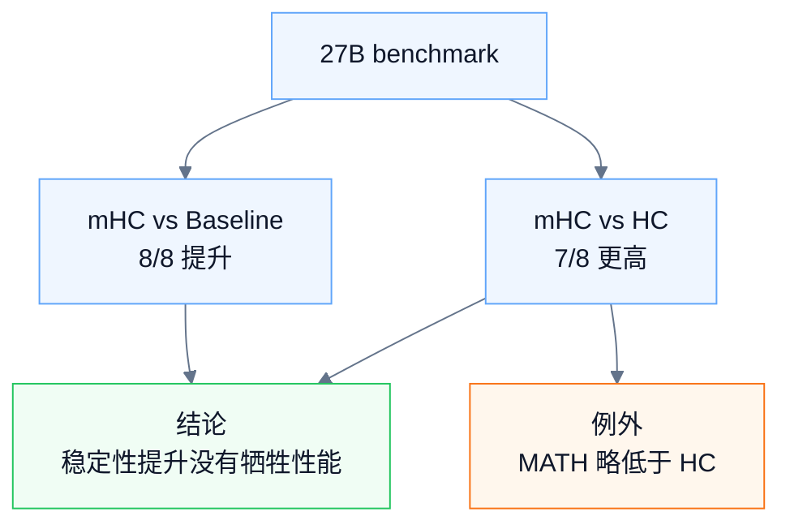

所以 mHC 不只是稳定性更好，也保留并增强了 HC 的性能收益。

---

### 7.3 Scaling：放大后收益是否还在

Figure 6 做了两类 scaling：

| scaling 类型 | 结论 |
|---|---|
| Compute Scaling | 从 3B、9B 到 27B，mHC 相对 baseline 的 loss 优势仍然保持，只是轻微衰减 |
| Token Scaling | 3B 训练到 1T tokens，mHC 的优势没有很快消失 |

这说明 mHC 的收益不是一个小模型或短训练阶段的偶然现象，而是在更大 compute budget 和更长 token budget 下仍然存在。

---

### 7.4 Stability：机制证据最关键

论文最强的机制证据来自 Figure 3 和 Figure 7：

| 方法 | composite mapping gain |
|---|---:|
| HC | 峰值接近 3000 |
| mHC | 最大值约 1.6 |

这说明：

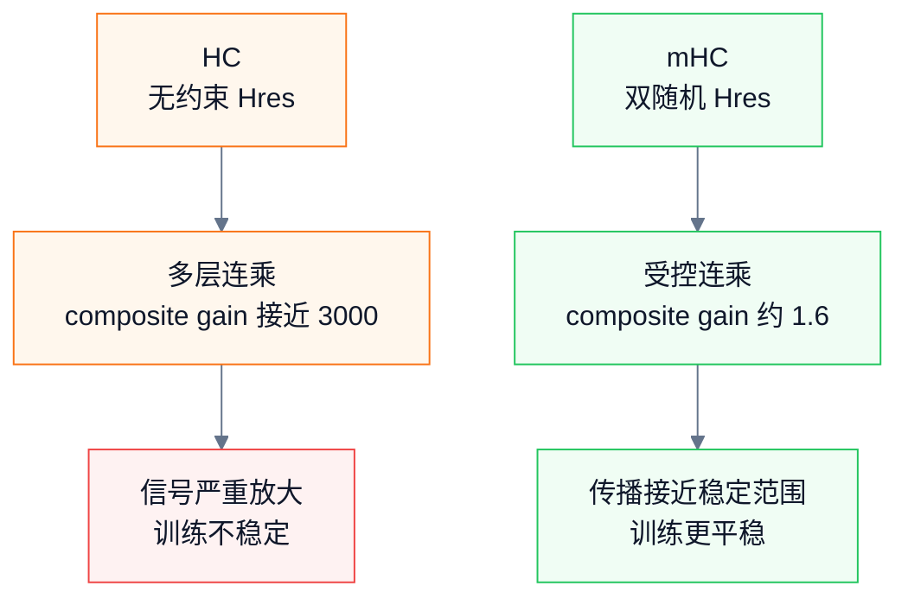

Figure 8 进一步展示了 HC 和 mHC 的 learnable mappings。HC 的矩阵中会出现大正值、大负值以及巨大 composite gain；mHC 的矩阵则更接近受控的非负混合，行列增益也更稳定。

这部分是整篇论文最重要的因果闭环：

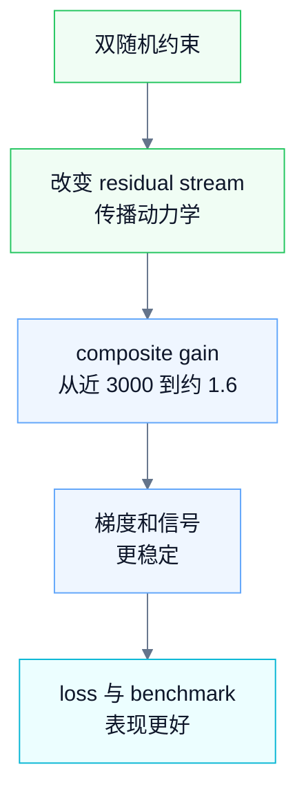

---

## 8. 最终总结：这篇论文的真正贡献

### 8.1 三层贡献

第一，**架构层**。

HC/mHC 把 residual stream 从单流扩展到多流，使跨层信息流拥有更大的容量和更复杂的拓扑结构。这条思路属于 macro-design，不是在 Attention/FFN 内部做 micro-design。

第二，**稳定性层**。

mHC 发现 HC 的核心风险在于自由的 $H_l^{res}$ 会破坏 identity mapping。通过把 $H_l^{res}$ 约束为双随机矩阵，mHC 让 residual mixing 变成受控的守恒混合，使多层 composite mapping 仍然保持稳定。

第三，**系统层**。

mHC 不是只给出一个数学约束，还针对 widened residual stream 带来的 I/O、activation 和 pipeline communication 开销做了工程优化，使 $n=4$ 的多流 residual 在大规模训练中变得可承受。

---

### 8.2 最终记忆版

可以把整篇论文压缩成这一段：

> 传统残差连接的强处是 identity mapping：浅层信号可以不被修改地传到深层，所以深层训练稳定。HC 试图把这条 residual stream 扩成 $n$ 条，让模型拥有更大的跨层信息容量和更复杂的拓扑连接；但无约束的 $H_l^{res}$ 在多层连乘后会偏离 identity mapping，导致 forward signal 和 backward gradient 放大或衰减。mHC 的关键是把 $H_l^{res}$ 约束为近似双随机矩阵，使 residual mixing 变成受控的信息混合；同时用 kernel fusion、recomputing 和 DualPipe overlap 解决 widened residual stream 带来的 I/O、显存和通信开销。最终，mHC 保留了 HC 的多流表达优势，又显著改善了大规模训练稳定性和可扩展性。

---

### 8.3 最容易混淆的点

| 容易误解 | 更准确的理解 |
|---|---|
| mHC 等于普通残差连接 | 只有 $n=1$ 时 residual mapping 退化为 $[1]$；$n>1$ 时仍然是多流混合 |
| 双随机约束让 $H^{res}=I$ | 不是固定成单位矩阵，而是限制为非负、行列和为 1 的可学习 mixing matrix |
| $H^{pre}$ 是 convex combination | 不一定。它用 Sigmoid，不要求和为 1；严格凸组合主要对应 $H^{res}$ 的行 |
| mHC 的 6.7% overhead 是天然的 | 不是。这个结果依赖 kernel fusion、recomputing 和 DualPipe overlap |
| 实验重点是 benchmark 分数 | benchmark 是结果；更重要的是 propagation gain 从近 3000 降到约 1.6 的机制证据 |

---

## 9. 复习提纲

最后复习时，只需要能回答下面 8 个问题：

1. 传统 residual connection 的 identity mapping 是什么？
2. HC 为什么要把 residual stream 从 $C$ 扩成 $nC$？
3. $H^{pre}$、$H^{post}$、$H^{res}$ 分别做什么？
4. 为什么 $H^{res}$ 是 HC 的收益核心，也是稳定性风险来源？
5. 双随机矩阵的非负、行和、列和分别约束了什么？
6. Sinkhorn-Knopp 如何把 raw $\tilde H^{res}$ 投影成近似双随机矩阵？
7. mHC 的主要系统瓶颈为什么是 I/O、显存和通信，而不只是 FLOPs？
8. 实验证据如何串起“约束 → 稳定 → scaling → 性能收益”这条链？

能回答这 8 个问题，就基本掌握了这篇论文。
