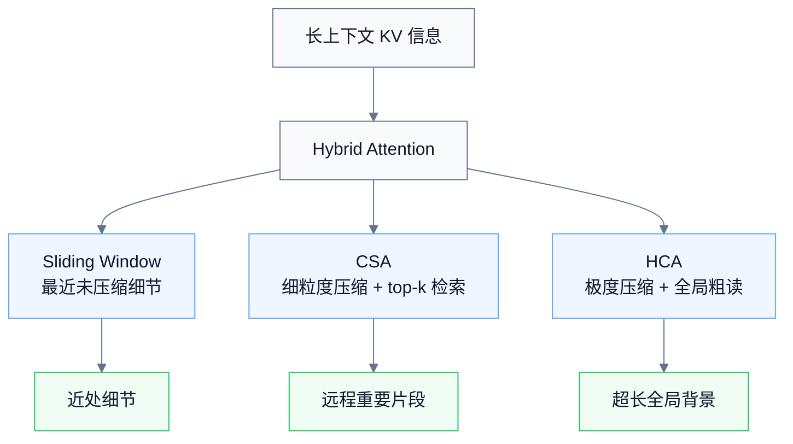
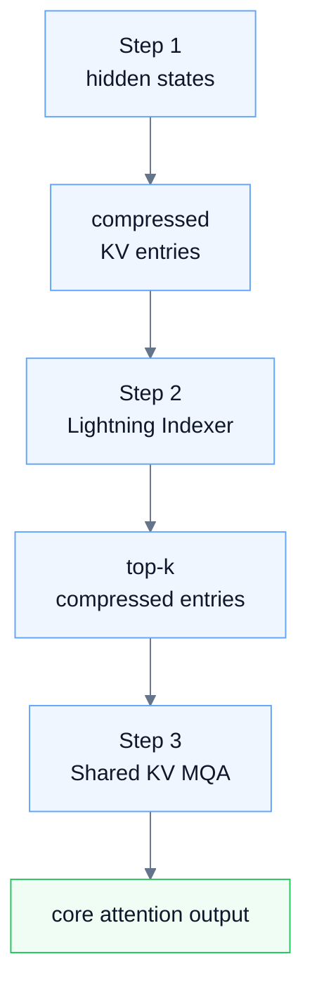
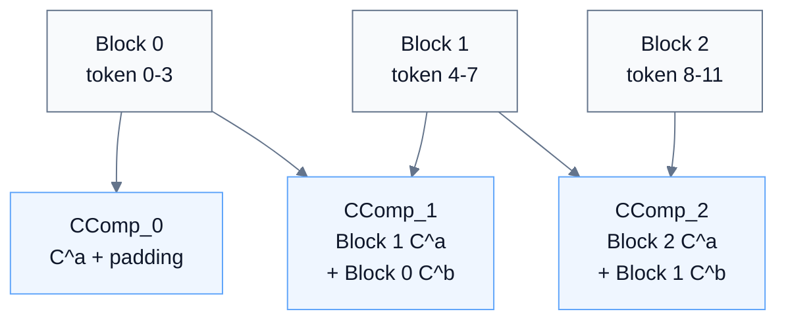
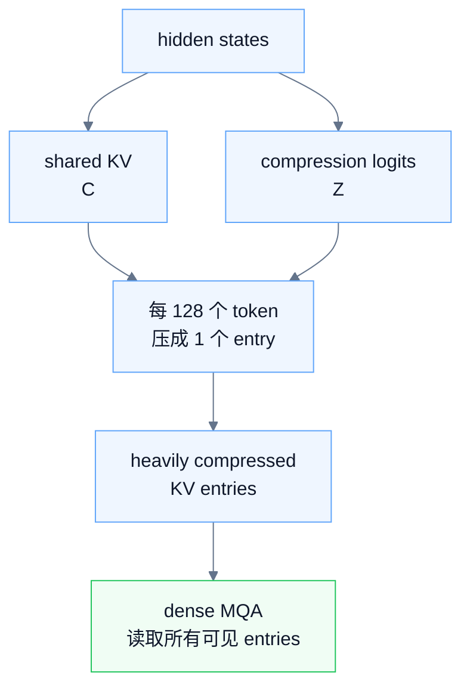
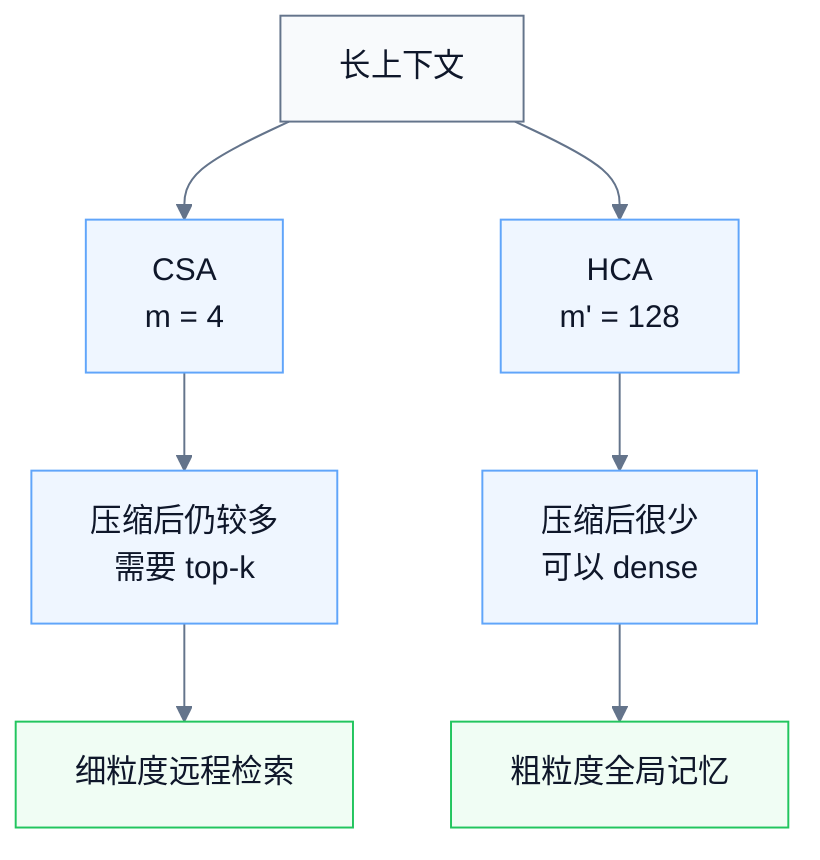
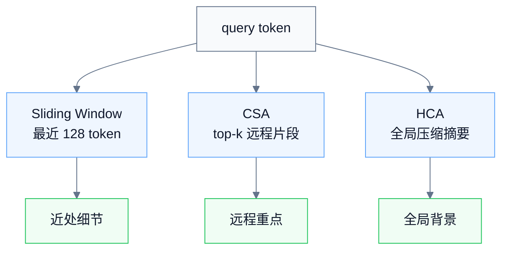

# DeepSeek-V4 Hybrid Attention 学习笔记：CSA 与 HCA

> [!info] 原始来源
> [DeepSeek-V4 官方模型卡 / Technical Report](https://huggingface.co/deepseek-ai/DeepSeek-V4-Pro)

> [!abstract] 本文主线
> DeepSeek-V4 为了支持百万 token 长上下文，引入了 **Hybrid Attention**。核心思路是：不再让每个 query token 对所有历史 token 做完整 attention，而是先压缩历史 KV 信息，再用更便宜的方式读取。

Hybrid Attention 的两个核心分支是：

$$
CSA = \text{Compressed Sparse Attention}
$$

$$
HCA = \text{Heavily Compressed Attention}
$$

CSA 会先把每 $m$ 个 token 的 KV cache 压缩成一个 entry，然后再做 sparse attention；HCA 则使用更大的压缩率 $m'$，把每 $m'$ 个 token 压成一个 entry，但保留 dense attention。DeepSeek-V4 的配置里，CSA 使用 $m=4$，HCA 使用 $m'=128$。

---

## 0. 总览



> [!tip] 一句话记忆
> **CSA 是“压缩后检索重要片段”，HCA 是“极度压缩后全局粗读”。两者配合 sliding window，使模型既能保留近处细节，又能低成本利用超长上下文。**

---

## 一、CSA：Compressed Sparse Attention

> [!summary] CSA 一句话概括
> **CSA = 较细粒度压缩 + 动态检索 top-k + MQA 读取。**

CSA 可以分成三大步：



---

### 1. CSA 第一步：原始 KV token 压缩成 compressed KV entries

输入是一段 hidden states：

$$
H \in \mathbb{R}^{n \times d}
$$

其中：

| 符号 | 含义 |
|---|---|
| $n$ | 序列长度 |
| $d$ | hidden size |

CSA 首先从 $H$ 生成两套 shared KV 表示：

$$
C^a = H W^a_{KV}
$$

$$
C^b = H W^b_{KV}
$$

同时生成两套压缩权重 logits：

$$
Z^a = H W^a_Z
$$

$$
Z^b = H W^b_Z
$$

这里可以这样理解：

| 符号 | 作用 |
|---|---|
| $C^a, C^b$ | 被压缩的内容，也就是 shared KV 表示 |
| $Z^a, Z^b$ | 决定压缩时每个 token 每个维度的重要性 |
| $a$ 分支 | 当前块使用 |
| $b$ 分支 | 给下一个 compressed entry 使用 |

---

### 2. CSA 的“带重叠压缩”

CSA 不是简单地每 $m$ 个 token 平均压成一个 entry。

它的第 $i$ 个 compressed entry 会使用两部分信息：

```text
当前块的 C^a / Z^a
前一块的 C^b / Z^b
```

如果 $m=4$，原始 token 分块为：

```text
Block 0: token 0,1,2,3
Block 1: token 4,5,6,7
Block 2: token 8,9,10,11
```

那么：

```text
CComp_0 = Block 0 的 C^a + padding
CComp_1 = Block 1 的 C^a + Block 0 的 C^b
CComp_2 = Block 2 的 C^a + Block 1 的 C^b
```

所以对于 Block 1 来说：

```text
Block 1 的 C^a 参与 CComp_1
Block 1 的 C^b 参与 CComp_2
```



这就是我们说的 **重叠**：

> 一个块既参与自己的 compressed entry，也参与下一个 compressed entry。

这种设计可以缓解硬分块带来的边界割裂问题。论文也明确说明，每个 $C_i^{Comp}$ 来自 $2m$ 个 KV entries，但因为相邻 compressed entries 使用的 token 范围有重叠，所以整体序列长度仍然压缩到原来的 $1/m$。

---

### 3. CSA 压缩的具体计算

对于第 $i$ 个 compressed entry，先取：

```text
当前块的 Za
前一块的 Zb
```

然后加上可学习的位置偏置：

$$
B^a, B^b \in \mathbb{R}^{m \times c}
$$

再拼接后做 softmax：

$$
[S^a; S^b]
=
\operatorname{Softmax}_{row}
\left(
[Z^a_{\text{current}} + B^a;
Z^b_{\text{previous}} + B^b]
\right)
$$

这里 softmax 是在 **当前块 + 前一块** 共 $2m$ 个位置上做的。并且因为 $Z$ 的形状是 $[n,c]$，所以权重不是单个标量，而是每个维度都有自己的权重。

然后用这些权重对 $C^a$ 和 $C^b$ 加权求和：

$$
C_i^{Comp}
=
\sum_{j=mi}^{m(i+1)-1}
S^a_j \odot C^a_j
+
\sum_{j=m(i-1)}^{mi-1}
S^b_j \odot C^b_j
$$

其中 $\odot$ 表示逐维相乘。

直觉上就是：

> 用当前块的 $Z^a$ 和前一块的 $Z^b$ 算出权重，再用这些权重加权当前块的 $C^a$ 和前一块的 $C^b$，得到当前 compressed KV entry。

对于 $i=0$，没有前一块，所以论文中把前一块的 $Z^b$ padding 成 $-\infty$，把 $C^b$ padding 成 0。

---

### 4. CSA 第二步：Lightning Indexer 选 top-k

压缩后，我们得到：

$$
C^{Comp} \in \mathbb{R}^{\frac{n}{m} \times c}
$$

如果上下文是 100 万 token，$m=4$，那仍然有 25 万个 compressed entries。直接对它们做 attention 还是很贵。

所以 CSA 继续使用 **Lightning Indexer** 做 sparse selection。

它的作用是：

> 对每个 query token，从所有历史 compressed KV entries 中选出最相关的 top-k 个。

---

### 5. $C^{Comp}$ 和 $K^{IComp}$ 的关系

Lightning Indexer 不直接用 $C^{Comp}$ 打分，而是额外生成一组 compressed indexer keys：

$$
K^{IComp} \in \mathbb{R}^{\frac{n}{m} \times c_I}
$$

你可以这样理解：

| 表示 | 作用 |
|---|---|
| $C^{Comp}$ | 真正要被 core attention 读取的内容 |
| $K^{IComp}$ | 用来做检索打分的索引 key |

类比成书：

```text
CComp    = 正文内容
KIComp   = 目录 / 索引标签
```

Indexer 先看索引，决定哪些 compressed entries 值得读；真正读的时候，再拿对应的 $C^{Comp}$。

---

### 6. query token 如何生成 indexer query？

对于当前 query token $t$，它的 hidden state 是：

$$
h_t \in \mathbb{R}^{d}
$$

先降维得到 latent query：

$$
c^Q_t = h_t W_{DQ}
$$

再升维生成多个 indexer query heads：

$$
[q^I_{t,1}; q^I_{t,2}; \cdots; q^I_{t,n^I_h}]
=
c^Q_t W_{IUQ}
$$

直觉上：

> 当前 token 生成多个“检索问题”，每个 indexer head 从不同角度判断哪些历史块相关。

---

### 7. Lightning Indexer 如何打分？

对于 query token $t$ 和历史 compressed block $s$，打分公式是：

$$
I_{t,s}
=
\sum_{h=1}^{n^I_h}
w^I_{t,h}
\cdot
\operatorname{ReLU}(q^I_{t,h} \cdot K^{IComp}_s)
$$

其中：

$$
w^I_t = h_t W_w
$$

含义是：

1. 每个 indexer query head 和 $K^{IComp}_s$ 做点积；
2. 用 ReLU 只保留正相关部分；
3. 用 $w^I_{t,h}$ 动态加权不同 indexer head 的贡献；
4. 得到 query token $t$ 对 compressed block $s$ 的 index score。

这一步很像普通 attention 里的 $QK^\top$，但目的不同。

| 机制 | 计算目的 |
|---|---|
| 普通 attention | Q 和 K 算 attention logits，softmax 后加权读取 V |
| Lightning Indexer | qI 和 KIComp 算 index score，然后选 top-k compressed blocks |

所以它不是最终 attention，而是一个 **检索器**。

---

### 8. top-k 选择

对于 query token $t$，得到所有历史 compressed blocks 的分数后：

$$
I_{t,:}
$$

选择分数最高的 top-k 个 compressed entries：

$$
C^{SprsComp}_t
=
\left\{
C^{Comp}_s
\mid
I_{t,s} \in \operatorname{TopK}(I_{t,:})
\right\}
$$

注意：

> Indexer 用 $K^{IComp}$ 打分，但最终选出来的是 $C^{Comp}$。

也就是：

```text
用索引找位置
再用位置取正文
```

另外，为了保持因果性，query token $t$ 只能选择自己所在压缩块之前的 compressed blocks：

$$
s < \left\lfloor \frac{t}{m} \right\rfloor
$$

这意味着 query 不能直接看自己所在 compressed block，因为那个 compressed block 可能包含同块内未来 token 的信息。

---

### 9. CSA 第三步：Shared Key-Value MQA 做核心 attention

选出 top-k entries 后，CSA 才做真正的 core attention。

先用同一个 latent query $c^Q_t$ 生成真正的 attention queries：

$$
[q_{t,1}; q_{t,2}; \cdots; q_{t,n_h}]
=
c^Q_t W_{UQ}
$$

然后每个 query head 都对同一组 selected compressed entries 做 attention：

$$
o_{t,i}
=
\operatorname{CoreAttn}(
query=q_{t,i},
key=C^{SprsComp}_t,
value=C^{SprsComp}_t
)
$$

这里有两个重要点。

#### 9.1 MQA 的含义

MQA，即 **Multi-Query Attention**，在这里的意思是：

> 多个 query heads 共享同一组 KV memory。

普通 MHA 是：

```text
Head 1: Q1, K1, V1
Head 2: Q2, K2, V2
Head 3: Q3, K3, V3
```

而 MQA 是：

```text
Head 1: Q1
Head 2: Q2
Head 3: Q3

所有 heads 共享同一组 K/V
```

所以 CSA 中：

```text
q_{t,1}, q_{t,2}, ..., q_{t,n_h}
共同访问 C_t^{SprsComp}
```

#### 9.2 Shared Key-Value 的含义

这里的 compressed KV entry 同时作为 key 和 value：

```text
key   = C_t^{SprsComp}
value = C_t^{SprsComp}
```

普通 attention 里，key 负责匹配，value 负责承载内容。

CSA 里，这两者共用一个 compressed 表示。

这是一种效率优先的设计。它会牺牲一部分表达自由度，但可以大幅降低 KV cache 和 attention 成本。不同 query heads 仍然可以产生不同的 attention 分布，因为它们的 query 不同。

直觉上：

> 多个 query heads 看同一本压缩资料，但每个 head 带着不同问题去读。

---

### 10. CSA 小结

CSA 可以这样记：

```text
1. 每 m 个 token 压成 1 个 compressed KV entry
2. 压缩时使用当前块 + 前一块，也就是 overlapped compression
3. Lightning Indexer 为每个 query token 选 top-k 个 compressed entries
4. Core attention 使用 MQA
5. selected compressed entries 同时作为 key 和 value
```

一句话：

> **CSA 是一个“压缩 + 检索 + 精读”的注意力机制。**

---

## 二、HCA：Heavily Compressed Attention

> [!summary] HCA 一句话概括
> **HCA = 更大比例压缩 KV + 不做 top-k + 直接对压缩后的 entries 做 dense attention。**

论文中说，HCA 使用更大的压缩率 $m'$，其中 $m' \gg m$，并且不使用 overlapped compression。

在 DeepSeek-V4 中：

```text
CSA: m = 4
HCA: m' = 128
```

也就是说：

```text
CSA 每 4 个 token 压成 1 个 entry
HCA 每 128 个 token 压成 1 个 entry
```



---

### 1. HCA 第一步：生成 shared KV 和压缩权重

输入仍然是：

$$
H \in \mathbb{R}^{n \times d}
$$

HCA 生成：

$$
C = H W_{KV}
$$

$$
Z = H W_Z
$$

其中：

| 符号 | 作用 |
|---|---|
| $C$ | 原始 token 的 shared KV 表示 |
| $Z$ | 压缩权重 logits |

和 CSA 不同，HCA 没有：

```text
C^a, C^b, Z^a, Z^b
```

只有：

```text
C, Z
```

原因是 HCA 不做重叠压缩。

---

### 2. HCA 第二步：每 $m'$ 个 token 压成一个 entry

假设：

$$
m' = 128
$$

那么分块是：

```text
Block 0: token 0 ~ 127
Block 1: token 128 ~ 255
Block 2: token 256 ~ 383
...
```

每个 block 生成一个 compressed entry：

```text
CComp_0 = 压缩 token 0 ~ 127
CComp_1 = 压缩 token 128 ~ 255
CComp_2 = 压缩 token 256 ~ 383
```

所以输出是：

$$
C^{Comp} \in \mathbb{R}^{\frac{n}{m'} \times c}
$$

---

### 3. HCA 的压缩公式

对于第 $i$ 个 block，先计算权重：

$$
S_{m'i:m'(i+1)-1}
=
\operatorname{Softmax}_{row}
\left(
Z_{m'i:m'(i+1)-1} + B
\right)
$$

其中：

$$
B \in \mathbb{R}^{m' \times c}
$$

是可学习的位置偏置。

然后加权求和：

$$
C_i^{Comp}
=
\sum_{j=m'i}^{m'(i+1)-1}
S_j \odot C_j
$$

直觉上：

> 对当前 128 个 token，用 $Z+B$ 算出每个 token 每个维度的重要性，然后对 $C$ 加权求和，得到一个 heavily compressed KV entry。

---

### 4. HCA 的 attention

压缩之后，HCA 不使用 Lightning Indexer。

它直接让 query 对压缩后的 $C^{Comp}$ 做 attention。

对于 query token $t$，先生成 query：

$$
c^Q_t = h_t W_{DQ}
$$

$$
[q_{t,1}; q_{t,2}; \cdots; q_{t,n_h}]
=
c^Q_t W_{UQ}
$$

然后做：

$$
o_{t,i}
=
\operatorname{CoreAttn}(
query=q_{t,i},
key=C^{Comp},
value=C^{Comp}
)
$$

实际因果实现中，query 只能访问前面的 compressed KV blocks，不能访问会泄露未来信息的块。论文在后续细节中也说明，CSA 和 HCA 为了严格保持因果性，每个 query 只 attend 到 preceding compressed KV blocks。

---

### 5. 为什么 HCA 不需要 top-k？

因为 HCA 压缩得非常狠。

如果上下文是 1M token：

```text
CSA: 1,000,000 / 4 = 250,000 compressed entries
HCA: 1,000,000 / 128 ≈ 7,812 compressed entries
```

CSA 压缩后仍然很多，所以还需要 Lightning Indexer 选 top-k。

HCA 压缩后 entries 数量已经相对较少，所以可以直接 dense attention。

因此：

```text
CSA = 细粒度压缩 + top-k 检索
HCA = 粗粒度压缩 + 全量读取
```

---

### 6. HCA 的代价

HCA 的问题是：压缩太狠，信息粒度粗。

每 128 个 token 压成 1 个 entry，肯定会丢失很多细节。

所以 HCA 更适合提供：

```text
长程主题信息
远距离全局摘要
粗粒度上下文记忆
```

不适合单独承担：

```text
精确数字
代码细节
近距离语法关系
具体 token 级依赖
```

这些细节要依赖 CSA 和 sliding window branch 来补。

---

## 三、CSA 与 HCA 的核心对比

| 项目 | CSA | HCA |
|---|---|---|
| 全称 | Compressed Sparse Attention | Heavily Compressed Attention |
| 压缩率 | 较小，例如 $m=4$ | 很大，例如 $m'=128$ |
| 是否重叠压缩 | 是 | 否 |
| 是否有 $a/b$ 分支 | 有，$C^a,C^b,Z^a,Z^b$ | 没有，只有 $C,Z$ |
| 是否使用 Lightning Indexer | 使用 | 不使用 |
| attention 范围 | 选 top-k compressed entries | dense attention over heavily compressed entries |
| 信息粒度 | 相对细 | 很粗 |
| 主要作用 | 从长上下文中检索重要片段 | 提供低成本全局记忆 |
| 成本 | 比 HCA 高，但比完整 attention 低很多 | 非常低 |
| 风险 | 依赖 indexer 选得准 | 可能丢细节 |



---

## 四、Sliding Window Branch 的补充作用

CSA 和 HCA 都有一个共同问题：

> 为了保持因果性，query 不能访问自己所在 compressed block 内的信息。

比如 $m=4$，query token 23 属于 block 5：

```text
Block 5: token 20,21,22,23
```

如果它直接访问 block 5 的 compressed entry，就可能间接看到同块中不该看的信息。

但语言模型中，最近 token 往往非常重要。

所以论文给 CSA 和 HCA 都额外加入了 **sliding window attention branch**。每个 query token 还能访问最近 $n_{win}$ 个未压缩 KV entries。DeepSeek-V4 配置中，window size $n_{win}=128$。

这样三种记忆分工就很清楚：

| 分支             | 作用             |
| -------------- | -------------- |
| Sliding Window | 保存最近 token 的细节 |
| CSA            | 检索较细粒度的远程重要信息  |
| HCA            | 提供超长范围的粗粒度全局信息 |



---

## 五、一个总类比

可以把 DeepSeek-V4 的 CSA / HCA 想象成读一本超长书。

| 分支             | 类比                     | 负责内容          |
| -------------- | ---------------------- | ------------- |
| Sliding Window | 我正在看的当前页附近几行           | 最近、最细的上下文     |
| CSA            | 我先查索引，找到最相关的几个段落，再认真读  | 从长上下文中动态找重要内容 |
| HCA            | 我把每一大章压成摘要，然后随时扫一遍所有摘要 | 低成本的全局背景      |

---

## 六、最终记忆版

最简洁的复习版可以这样写：

> [!note] CSA
> Hidden states 先生成两套 shared KV 表示 $C^a/C^b$ 和两套压缩权重 $Z^a/Z^b$。
> 每个 compressed entry 使用当前块的 $C^a/Z^a$ 和前一块的 $C^b/Z^b$，通过 softmax 权重做逐维加权求和，实现 overlapped compression。
> 压缩后，Lightning Indexer 用 indexer query 和 compressed indexer key 打分，为每个 query token 选出 top-k 个 compressed KV entries。
> 最后用 Shared Key-Value MQA 做 core attention。

> [!note] HCA
> Hidden states 生成一套 shared KV 表示 $C$ 和压缩权重 $Z$。
> 每 $m'$ 个 token 通过 learned softmax 权重压成一个 heavily compressed KV entry。
> 由于 $m'$ 很大，compressed entries 数量很少，所以不需要 top-k，直接对所有可见的 heavily compressed entries 做 dense MQA。

> [!summary] 最终总结
> **CSA 是“压缩后检索重要片段”，HCA 是“极度压缩后全局粗读”。两者配合 sliding window，使模型既能保留近处细节，又能低成本利用超长上下文。**
