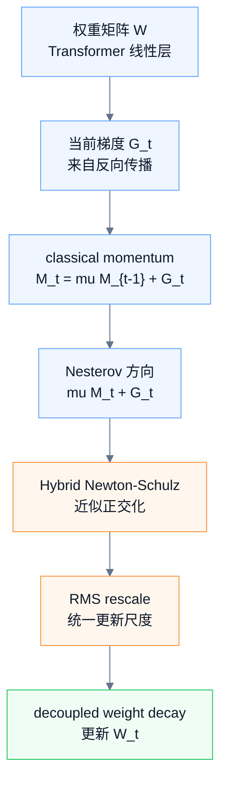
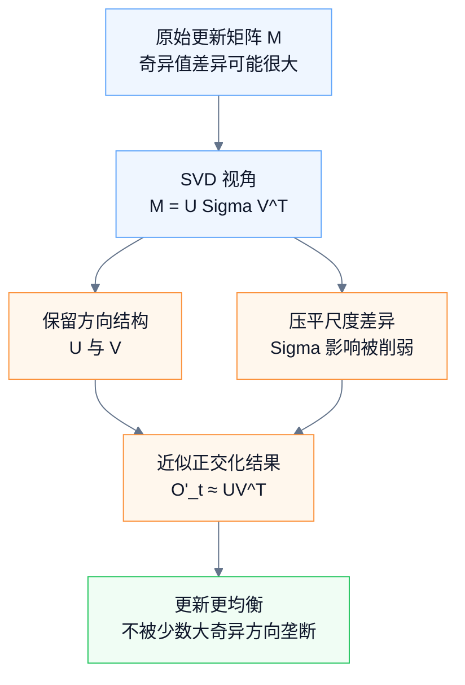
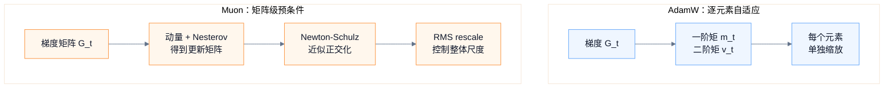

---
aliases:
  - DeepSeek-V4 Muon
  - Muon 优化器
tags:
  - DeepSeek-V4
  - optimizer
  - Muon
  - LLM-training
topic: DeepSeek-V4 Muon optimizer
status: 整理完成
---
# DeepSeek-V4 Muon 优化器学习笔记

> [!info] 原始来源
> [DeepSeek-V4 官方模型卡 / Technical Report](https://huggingface.co/deepseek-ai/DeepSeek-V4-Pro)

> [!summary] 一句话理解
> **Muon 是一种矩阵级优化器。** AdamW 主要逐元素调整梯度更新；Muon 把 Transformer 里的权重矩阵当成整体，对更新矩阵做近似正交化，让更新不被少数大奇异值方向支配。

> [!tip] 记忆抓手
> **AdamW 调每个元素，Muon 调整个矩阵的更新方向。**  
> DeepSeek-V4 里，大多数矩阵参数使用 Muon；embedding、prediction head、mHC 的 static biases / gating factors、RMSNorm 权重仍使用 AdamW。

---

## 0. 总览图

![[08-图片/deepseek_v4_muon_mainflow.canvas]]



---

## 1. Muon 的完整更新流程

对每个逻辑独立的权重矩阵：

```text
W ∈ R^{n × m}
```

Muon 的一步更新可以拆成 6 个动作：

| 步骤      | 公式                                      | 作用                                  |
| ------- | --------------------------------------- | ----------------------------------- |
| 1. 计算梯度 | `G_t = ∇_W L_t(W_{t-1})`                | 得到当前 batch 对矩阵 `W` 的更新信号            |
| 2. 更新动量 | `M_t = μM_{t-1} + G_t`                  | 用 classical momentum 平滑更新方向         |
| 3. 构造方向 | `μM_t + G_t`                            | Nesterov 风格的前瞻更新矩阵                  |
| 4. 正交化  | `O'_t = HybridNewtonSchulz(μM_t + G_t)` | 近似得到矩阵的 `UV^T` 方向                   |
| 5. 重缩放  | `O_t = O'_t · sqrt(max(n,m)) · γ`       | 把不同形状矩阵的更新 RMS 拉到可控范围               |
| 6. 更新参数 | `W_t = W_{t-1}(1 - ηλ) - ηO_t`          | 使用 AdamW 风格的 decoupled weight decay |

其中：

| 符号 | 含义 |
|---|---|
| `η` | learning rate |
| `μ` | momentum |
| `λ` | weight decay |
| `γ` | update rescaling factor |

> [!note] DeepSeek-V4 的关键设置
> 论文中的 Algorithm 1 使用上述形式。DeepSeek-V4 训练设置里，Muon momentum 设为 `0.95`，weight decay 设为 `0.1`，并把每个 update matrix 的 RMS rescale 到约 `0.18`，以复用 AdamW 学习率。

---

## 2. 为什么动量写成 `M_t = μM_{t-1} + G_t`？

AdamW 常见的一阶矩写法是：

```text
m_t = βm_{t-1} + (1 - β)G_t
```

这更像指数移动平均，重点是让动量的尺度接近普通梯度。

Muon 使用的是 classical momentum：

```text
M_t = μM_{t-1} + G_t
```

它没有乘 `(1 - μ)`，所以动量 buffer 的绝对尺度会更大。但 Muon 后面会先做矩阵归一化和 Newton-Schulz 正交化，再做 RMS rescale，因此它不太依赖动量 buffer 的绝对大小。

> [!important] 区分重点
> - **AdamW 的 momentum**：更重视“梯度平均值的尺度”。
> - **Muon 的 momentum**：更重视“更新方向的平滑”。

---

## 3. Hybrid Newton-Schulz 在做什么？

设待处理矩阵为：

```text
M = μM_t + G_t
```

如果它的 SVD 是：

```text
M = UΣV^T
```

Muon 希望把它近似变成：

```text
UV^T
```

也就是：

> [!quote] 核心直觉
> 保留 `U`、`V` 表达的方向结构，削弱 `Σ` 中奇异值大小差异对更新的支配。

### 3.1 为什么要先归一化？

Newton-Schulz 迭代前会先做：

```text
M_0 = M / ||M||_F
```

这样可以让最大奇异值不超过 1，使后续迭代更稳定。

### 3.2 迭代形式

```text
M_k = aM_{k-1}
    + b(M_{k-1}M_{k-1}^T)M_{k-1}
    + c(M_{k-1}M_{k-1}^T)^2M_{k-1}
```

DeepSeek-V4 使用 10 次 hybrid Newton-Schulz：

| 迭代阶段 | 系数 `(a, b, c)` | 作用 |
|---|---|---|
| 前 8 次 | `(3.4445, -4.7750, 2.0315)` | 快速把奇异值推近 1 |
| 后 2 次 | `(2, -1.5, 0.5)` | 稳定奇异值到 1 附近 |



---

## 4. 为什么正交化后还要 RMS rescale？

正交化后：

```text
O'_t ≈ UV^T
```

如果矩阵有效 rank 接近 `min(n,m)`，那么：

```text
||UV^T||_F ≈ sqrt(min(n,m))
```

矩阵一共有 `nm` 个元素，所以：

```text
RMS(UV^T)
= sqrt(min(n,m)) / sqrt(nm)
= sqrt(min(n,m) / nm)
= sqrt(1 / max(n,m))
= 1 / sqrt(max(n,m))
```

因此乘上：

```text
sqrt(max(n,m))
```

可以把更新矩阵的 RMS 大致拉回 1。再乘 `γ` 后，最终 RMS 约等于 `γ`。

> [!warning] 不要混淆
> 这里是 **RMS rescale**，不是 RMSNorm。它的作用是控制 Muon update matrix 的整体更新尺度，而不是对激活或 hidden states 做归一化。

---

## 5. Muon 和 AdamW 的核心区别

| 维度 | AdamW | Muon |
|---|---|---|
| 优化粒度 | 逐元素 | 矩阵级 |
| 核心机制 | element-wise preconditioning | matrix-wise preconditioning |
| 依赖信息 | 一阶矩、二阶矩 | 梯度矩阵的整体几何结构 |
| 更新尺度 | 每个参数元素单独调节 | 正交化后整体 RMS rescale |
| 适合对象 | 通用参数、embedding、norm、bias 等 | Transformer 中大量线性层权重矩阵 |
| 主要风险 | 二阶矩估计成本和自适应偏差 | 可能抬高噪声方向的小奇异值影响 |



> [!success] 更稳妥的理解
> Muon 不完全相信原始梯度矩阵的奇异值大小，而是更重视梯度矩阵的左右奇异向量所表达的方向子空间。这可以避免更新过度集中在少数大奇异值方向上。

---

## 6. 好处、风险与配套机制

### 6.1 好处

- 削弱大奇异值方向的垄断。
- 让矩阵更新在不同奇异方向上更均衡。
- 对 Transformer 中大量线性层矩阵，可能带来更快收敛和更稳定训练。

### 6.2 风险

如果某些小奇异值方向主要是噪声，正交化可能会把这些方向的相对影响抬高。

所以 Muon 不是无条件更好，它需要配合一组稳定机制：

| 配套机制 | 作用 |
|---|---|
| momentum | 平滑随机梯度噪声 |
| RMS rescale | 控制整体更新尺度 |
| weight decay | 约束参数规模 |
| 部分参数保留 AdamW | 避免不适合矩阵正交化的参数被错误处理 |
| attention Q/KV RMSNorm | 控制 attention logits 稳定 |

---

## 7. 为什么 DeepSeek-V4 不用 QK-Clip？

一些 Muon 训练方案会配合 QK-Clip，防止 attention logits 爆炸。

DeepSeek-V4 的处理方式不同：CSA/HCA attention 可以在 core attention 前直接对 query 和 compressed KV entries 做 RMSNorm。这样点积前 `q` 和 `kv` 的范数已经被控制，attention logits 不容易爆炸，所以不需要额外使用 QK-Clip。

| 机制 | 控制位置 | 直觉 |
|---|---|---|
| QK-Clip | 点积之后 | 对已经产生的 logits 做限制 |
| Q/KV RMSNorm | 点积之前 | 先控制向量范数，再计算 logits |

---

## 8. 工程实现难点：Muon 需要完整梯度矩阵

AdamW 是逐元素优化器，所以 ZeRO 可以把一个参数矩阵切到多个 rank 上，各自更新自己的部分。

Muon 不行。Muon 要做：

```text
MM^T
```

以及 Newton-Schulz 正交化，因此它需要看到完整的逻辑矩阵。这和传统 ZeRO 的参数切分方式冲突。

DeepSeek-V4 的解决方式可以整理成：

| 问题 | 处理方式 |
|---|---|
| dense 参数不能随意切开 | 限制 ZeRO 并行规模 |
| 多个矩阵如何分给 rank | 用 knapsack algorithm 做 bucket assignment |
| MoE 参数规模大 | 每个 expert 独立优化，保证不切开逻辑独立矩阵 |
| 相同 shape 的连续参数 | 自动合并，做 batched Newton-Schulz，提高硬件利用率 |
| Newton-Schulz 计算成本 | 可用 BF16 matmul 稳定计算 |
| MoE 梯度通信成本 | BF16 随机舍入量化，减少通信量 |

> [!important] 工程关键点
> Muon 的数学对象是“完整逻辑矩阵”，不是被 ZeRO 任意切开的参数 shard。实现时必须先解决矩阵归属和通信问题，优化器本身才跑得起来。

---

## 9. 面试回答模板

> DeepSeek-V4 的 Muon 是一种矩阵级优化器。它先计算梯度 `G_t`，用 classical momentum 得到 `M_t = μM_{t-1}+G_t`，然后用 Nesterov 风格的 `μM_t+G_t` 作为待处理更新矩阵。接下来通过 Hybrid Newton-Schulz 将该矩阵近似正交化：如果更新矩阵 `M = UΣV^T`，Muon 试图把它变成 `UV^T`，也就是保留左右奇异向量表达的方向结构，同时削弱奇异值大小差异对更新的支配。之后再通过 `sqrt(max(n,m))·γ` 做 RMS rescale，让不同形状矩阵的更新尺度可控。最后使用 AdamW 风格的 decoupled weight decay 更新参数：`W_t = W_{t-1}(1-ηλ)-ηO_t`。

---

## 10. 最终记忆版

```text
DeepSeek-V4 Muon
= classical momentum
+ Nesterov direction
+ Hybrid Newton-Schulz matrix orthogonalization
+ RMS rescale
+ decoupled weight decay
```

最核心的两句话：

> [!quote]
> AdamW 是逐元素调节；Muon 是矩阵级正交化更新。
>
> Muon 不完全相信梯度矩阵的奇异值大小，而是更重视矩阵方向结构，从而避免更新被少数大奇异方向支配。
