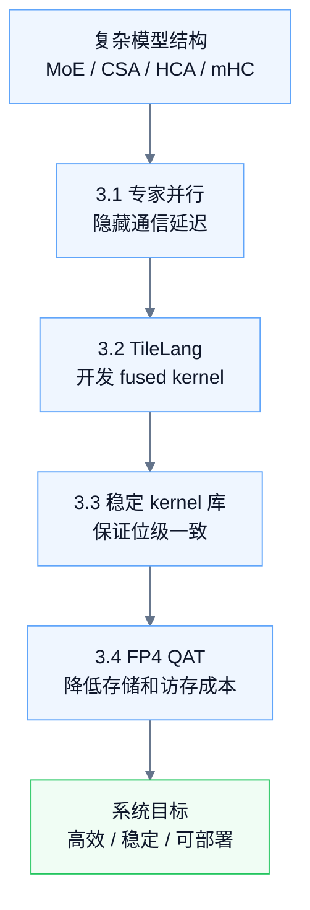
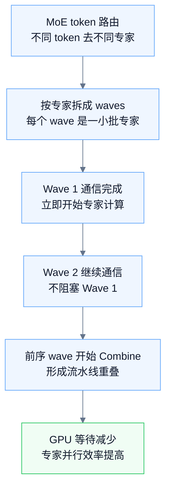
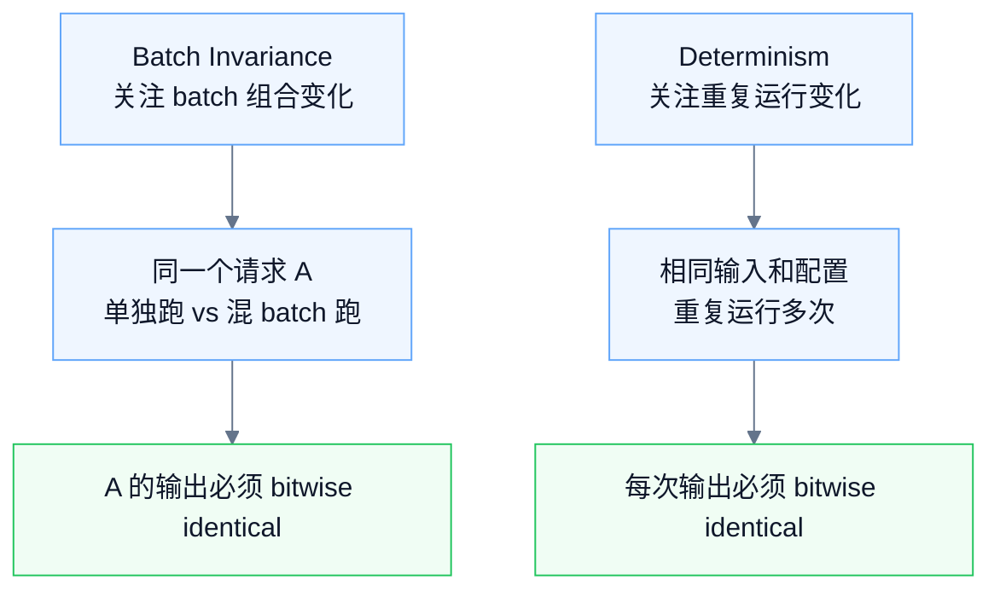
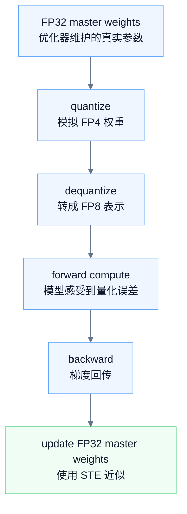
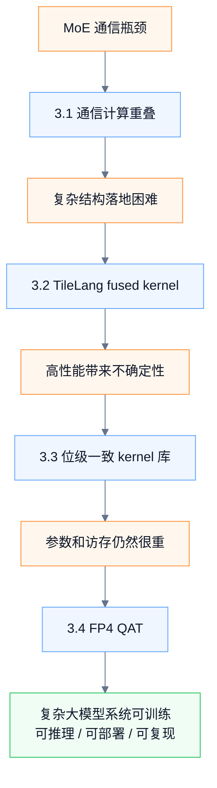

# DeepSeek-V4 论文学习笔记：3.1-3.4 通用系统底座

> [!info] 原始来源
> [DeepSeek-V4 官方模型卡 / Technical Report](https://huggingface.co/deepseek-ai/DeepSeek-V4-Pro)

> [!summary] 学习定位
> 第三章 **General Infrastructures** 不是在继续讲模型结构本身，而是在回答一个系统工程问题：
> 
> **DeepSeek-V4 这些复杂结构，如何在大规模训练、长上下文推理和低精度部署中高效、稳定、可复现地运行？**

第二章更像是在定义“模型长什么样”：CSA/HCA、mHC、MoE、Muon 等。

第三章的 3.1-3.4 则是在补齐“模型怎么跑起来”：通信如何隐藏、kernel 如何开发、结果如何复现、FP4 如何训练和部署。

![[08-图片/deepseek_v4_general_infra.canvas]]

---

## 0. 总览：四个工程问题

| 小节  | 核心问题                   | DeepSeek-V4 的解法                             | 记忆关键词                         |
| --- | ---------------------- | ------------------------------------------- | ----------------------------- |
| 3.1 | MoE 专家并行通信太重           | 细粒度 wave 调度，让通信和计算重叠                        | overlap / wave                |
| 3.2 | 复杂结构需要高性能 fused kernel | 用 TileLang 在开发效率和底层性能之间折中                   | TileLang / Host Codegen / SMT |
| 3.3 | 高性能 kernel 可能不稳定、不可复现  | 构建 batch-invariant 和 deterministic kernel 库 | bitwise identical             |
| 3.4 | FP4 直接量化可能掉性能          | 用 QAT 让模型训练时提前适应 FP4                        | FP4 QAT / STE                 |

> [!tip] 一句话主线
> **3.1 让 MoE 跑得快，3.2 让复杂算子写得快，3.3 让结果稳定可复现，3.4 让低精度部署真的可用。**



---

# 3.1 Fine-Grained Communication-Computation Overlap in Expert Parallelism

## 3.1.1 这一节要解决什么？

DeepSeek-V4 是 MoE 模型。MoE 的优势是：总参数规模可以很大，但每个 token 只激活一部分专家，所以单个 token 的计算量不会跟总参数量线性增长。

问题在于：

> token 会被路由到不同专家，而专家可能分布在不同 GPU 或不同节点上，因此 MoE 层天然会产生大量跨设备通信。

一个典型 MoE 层可以拆成：

```text
Dispatch -> Linear-1 -> Activation -> Linear-2 -> Combine
```

| 阶段 | 主要性质 | 含义 |
|---|---|---|
| Dispatch | 通信 | 把 token 发给对应专家所在设备 |
| Linear-1 | 计算 | 专家 FFN 的第一层线性变换 |
| Activation | 计算 | 通常是 SwiGLU 等激活 |
| Linear-2 | 计算 | 专家 FFN 的第二层线性变换 |
| Combine | 通信 | 把多个专家输出聚合回原 token 位置 |

如果这些阶段串行执行，GPU 会在通信阶段等待，整体吞吐会被通信拖慢。

---

## 3.1.2 核心洞察：通信可以被计算藏起来

论文的关键观察是：

> 在 DeepSeek-V4 的 MoE 层中，通信时间通常小于专家计算时间，因此通信延迟有机会被计算过程隐藏。

这意味着不必等待所有专家通信完成后再统一计算。更合理的方式是：哪个专家或哪一批专家的数据先到，就先计算哪一批。

串行执行是：

```text
所有 Dispatch 完成 -> 所有专家计算 -> 所有 Combine 完成
```

细粒度重叠是：

```text
Wave 1 通信完成 -> Wave 1 开始计算
Wave 2 继续通信
Wave 0 结果开始 Combine
```



---

## 3.1.3 DeepSeek 的做法：wave-based expert scheduling

DeepSeek-V4 把专家拆成多个 **waves**。每个 wave 包含一小部分专家。

某个 wave 的输入通信完成后，就可以立刻进入专家计算；不需要等全部专家的数据都到齐。这样 Dispatch、专家计算和 Combine 可以在更细粒度上交叠。

可以把它理解成一个流水线：

| 时间片 | Wave 0 | Wave 1 | Wave 2 |
|---|---|---|---|
| t1 | Dispatch | 等待 | 等待 |
| t2 | Linear-1/Activation | Dispatch | 等待 |
| t3 | Linear-2/Combine | Linear-1/Activation | Dispatch |
| t4 | 完成 | Linear-2/Combine | Linear-1/Activation |

这比只在大阶段之间做 overlap 更细。传统做法可能只是重叠 `Dispatch + Linear-1` 或 `Linear-2 + Combine`；DeepSeek-V4 进一步把专家粒度拆小，让整个 MoE 层持续保持流水线状态。

---

## 3.1.4 效果和意义

论文中给出的效果包括：

- 相比强非融合 baseline，一般推理工作负载加速 **1.50x-1.73x**。
- 在 RL rollout、高速 agent serving 等延迟敏感场景中，最高可达 **1.96x**。
- 相关 CUDA mega-kernel 被开源为 DeepGEMM 的组件。

> [!note] 本节记忆点
> 3.1 的本质不是“减少通信量”，而是 **改变执行调度方式，把通信藏到计算后面**。
>
> 它解决的是：**MoE 在分布式环境中通信多、GPU 等待多的问题。**

---

# 3.2 Flexible and Efficient Kernel Development with TileLang

## 3.2.1 这一节要解决什么？

DeepSeek-V4 的模型结构很复杂，包含：

```text
CSA / HCA 混合注意力
mHC
MoE
FP4 / FP8 量化
稀疏 attention
KV cache 管理
```

如果直接用 PyTorch 的许多小算子拼起来，会产生几个问题：

| 问题 | 后果 |
|---|---|
| ATen operator 很多 | CPU 调度压力变大 |
| kernel launch 很多 | 每次 launch 都有固定开销 |
| 中间张量频繁读写 | 显存带宽被浪费 |
| 算子之间难以融合 | GPU 利用率下降 |

如果全部手写 CUDA，性能可以很强，但开发和维护成本过高。DeepSeek 因此使用 **TileLang** 来开发 fused kernel。

---

## 3.2.2 TileLang 的定位

TileLang 介于 PyTorch 和手写 CUDA 之间。

| 方案          | 优点              | 问题                    |
| ----------- | --------------- | --------------------- |
| PyTorch 小算子 | 开发快，表达自然        | kernel 多，中间张量多，性能不够极致 |
| 手写 CUDA     | 性能上限高           | 开发慢，调试难，维护成本高         |
| TileLang    | 接近底层性能，同时提升开发效率 | 需要掌握 DSL 和编译器约束       |

> [!tip] 直观理解
> TileLang 的目标不是取代所有 CUDA，而是让复杂模型结构中大量可融合的算子，能以更高开发效率写成高性能 kernel。

---

## 3.2.3 TileLang 重点解决的三个问题

### 1. Host Codegen：降低 CPU 端调用开销

现代 GPU 很快，CPU 端准备和调度 kernel 的开销会变得明显。一次 kernel 调用前，Python 或 host 侧可能需要做：

```text
dtype 检查
shape 检查
stride / layout 检查
参数封装
kernel launch
```

这些 CPU-side validation overhead 可能达到几十甚至上百微秒。

DeepSeek 使用 **Host Codegen**，把这些 host-side 逻辑生成到轻量级 host launcher 中，而不是每次都在 Python 层动态执行。

结果是：

> CPU-side validation overhead 可以从几十或上百微秒降到小于 1 微秒。

---

### 2. SMT Solver：辅助复杂整数分析

TileLang kernel 中会有很多复杂 tensor index 计算，例如：

```text
是否越界？
是否可以 vectorize？
是否需要 barrier？
不同线程写入是否冲突？
padding 和 block 对齐是否安全？
```

DeepSeek 在 TileLang 中集成 Z3 SMT solver，用来辅助编译器分析复杂整数表达式。

这对 CSA/HCA 这类结构尤其重要，因为它们涉及：

```text
KV 压缩比例 m
HCA 压缩比例 m'
top-k sparse attention
sliding window
padding
不同 block layout
variable sequence length
```

SMT solver 能帮助编译器做更安全、更激进的优化：

| 分析目标 | 作用 |
|---|---|
| bound analysis | 判断索引是否越界 |
| vectorization | 判断是否能合并向量化访问 |
| barrier insertion | 判断线程同步是否必要 |
| code simplification | 消除冗余分支和检查 |

---

### 3. 数值精度和 bitwise reproducibility

高性能 kernel 常常会使用 fast-math，例如近似 `exp`、近似除法，或者改变浮点累加顺序。

这些优化可能更快，但会带来风险：

```text
结果只保证数值接近，不保证 bitwise identical
```

DeepSeek 的策略是：

```text
默认关闭 fast-math
默认优先保证准确性和可复现性
需要近似优化时，由开发者显式选择
```

TileLang 也提供严格 IEEE-754 语义的 intrinsics，让开发者能够控制数值行为。

> [!note] 本节记忆点
> 3.2 的本质是：**用 TileLang 把复杂模型结构工程化成高性能 fused kernel，同时保留开发效率和数值控制能力。**
>
> 它解决的是：**复杂结构如何高效落地，而不是停留在论文结构图上。**

---

# 3.3 High-Performance Batch-Invariant and Deterministic Kernel Libraries

## 3.3.1 这一节要解决什么？

3.3 进一步提出：kernel 不能只追求快，还要满足两个性质：

```text
Batch Invariance：批次不变性
Determinism：确定性
```

这两个性质对大规模训练、后训练、推理一致性和 debug 都非常重要。

---

## 3.3.2 Batch Invariance：批次不变性

### 定义

**Batch invariance** 指的是：

> 同一个 token 的输出，不应该因为它被放进不同 batch，或者和不同请求一起组成 batch，而发生 bitwise 变化。

例如：

```text
请求 A 单独推理 -> 输出 X
请求 A 和请求 B 一起组成 batch -> 请求 A 仍然输出 X
```

这里要求的不是“数值接近”，而是 **bitwise identical**。

---

### 为什么难？

很多高性能 GPU kernel 会根据 batch size、sequence length、SM 分配策略改变计算路径。

例如 attention decoding 中常见的 **split-KV** 会把一个序列的 KV 计算拆给多个 SM 并行处理。这样吞吐更高，但会改变浮点累加顺序。

浮点加法不满足严格结合律：

```text
(a + b) + c 不一定 bitwise 等于 a + (b + c)
```

所以 batch 组合变化可能导致同一个 token 的输出出现 bit 级差异。

---

### Attention 的解决方案：dual-kernel strategy

为了实现 batch-invariant decoding，DeepSeek 不能直接依赖传统 split-KV。

但完全不用 split-KV 又会带来 GPU 利用率问题，尤其是最后一批 SM 填不满时，会出现 wave-quantization 问题。

因此 DeepSeek 使用双 kernel 策略：

| kernel     | 作用                                                           | 目标               |
| ---------- | ------------------------------------------------------------ | ---------------- |
| 第一个 kernel | 尽量让一个序列的 attention 在单个 SM （Streaming Multiprocessor，计算单元）内完成 | 固定累加顺序           |
| 第二个 kernel | 处理最后 partially-filled wave                                   | 降低延迟，同时保持同样的累加路径 |

核心思想是：

> 可以为了性能调整并行方式，但必须让同一个 token 的计算路径和 reduce 顺序保持一致。

---

### Matrix Multiplication 的解决方案：DeepGEMM

传统 cuBLAS 不保证 batch invariance。

在小 batch 场景中，GEMM 可能使用 **split-k** 提升性能。但 split-k 的 reduction 顺序也可能随 batch 或调度变化而改变。

DeepSeek 因此使用 **DeepGEMM** 替代 cuBLAS，并在多数场景中避免 split-k，同时通过额外优化让性能仍然接近甚至超过标准 split-k 实现。

---

## 3.3.3 Determinism：确定性

### 定义

**Determinism** 指的是：

> 相同输入、相同参数、相同运行配置，多次运行应该得到完全一致的结果。

它和 batch invariance 的区别是：

| 概念 | 关注点 | 例子 |
|---|---|---|
| Batch invariance | 和谁一起组成 batch，会不会影响结果 | 请求 A 单独跑和与 B 一起跑，A 的输出是否一致 |
| Determinism | 同一个任务重复运行，会不会得到相同结果 | 同一 batch 连续跑两次，输出是否一致 |



---

### 非确定性的主要来源：atomicAdd

训练中的非确定性主要来自 backward pass 里的非确定性累加，尤其是 `atomicAdd`。

多个线程同时对同一个地址加梯度时，执行顺序不固定：

```text
grad += a
grad += b
grad += c
```

这次可能是：

```text
(a + b) + c
```

下次可能是：

```text
(a + c) + b
```

由于浮点加法顺序不同，结果可能不是 bitwise identical。

---

## 3.3.4 DeepSeek 处理的三个关键场景

| 场景                 | 难点                                  | DeepSeek 的处理方式                                                |
| ------------------ | ----------------------------------- | ------------------------------------------------------------- |
| Attention Backward | 多个 query 可能对同一个 KV token 贡献梯度       | 每个 SM 使用独立 accumulation buffer，再做全局确定性 summation              |
| MoE Backward       | 多个 rank 可能写入接收 rank 的同一 buffer      | 单 rank 内 token order preprocessing，多 rank 之间 buffer isolation |
| mHC 小矩阵乘法          | 输出维度很小，小 batch 下 naive split-k 会非确定 | 每个 split 单独输出，再由后续 kernel 做确定性 reduction                      |

这些做法的共同点是：

```text
不让多个并行执行单元以不可控顺序写同一个累加目标
```

而是改成：

```text
先隔离局部结果 -> 再按固定顺序做全局归约
```

> [!note] 本节记忆点
> 3.3 的本质是：**DeepSeek-V4 构建了一套高性能、批次不变、确定性的 kernel 库。**
>
> 它解决的是：**系统结果不稳定、不可复现、难以 debug 的问题。**

---

# 3.4 FP4 Quantization-Aware Training

## 3.4.1 这一节要解决什么？

DeepSeek-V4 希望在推理时使用 FP4，减少显存占用和访存开销。

但如果训练时模型一直看到高精度权重，推理时突然把权重量化成 FP4，模型行为可能发生偏移，性能可能下降。

因此需要 **QAT：Quantization-Aware Training，量化感知训练**。

> [!summary] 直观理解
> QAT 的目的不是只在推理时压缩模型，而是让模型在训练阶段就“见过”量化误差，并学会适应这种误差。

---

## 3.4.2 为什么要用 FP4？

FP4 是非常低精度的数据格式。相比 BF16、FP8，它占用的存储更小，能降低显存和内存带宽压力。

DeepSeek-V4 主要把 FP4 用在两个地方：

| 位置 | 为什么适合 FP4 | 收益 |
|---|---|---|
| MoE expert weights | MoE 专家参数很多，是存储大户 | 降低专家权重显存占用和加载成本 |
| CSA indexer 的 QK path | 长上下文下 indexer 需要缓存、读取、计算 QK 激活 | 降低 attention indexer 的计算和访存成本 |

所以 FP4 的目标不是“省一点显存”，而是直接服务于 DeepSeek-V4 的两个核心负担：

```text
MoE 专家参数很大
长上下文 indexer 计算很重
```

---

## 3.4.3 为什么不能只做推理后量化？

直接推理后量化的风险是：

```text
训练时：模型看到高精度权重
推理时：模型突然看到 FP4 权重
结果：训练分布和推理分布不一致
```

QAT 的做法是：

```text
训练时就模拟推理时的低精度效果
让模型提前适应量化误差
```

具体到 MoE expert weights，DeepSeek-V4 保留一份 **FP32 master weights** 给优化器维护；前向计算时使用经过 FP4 量化再反量化后的权重。



---

## 3.4.4 关键点：FP4 -> FP8 dequantization 是 lossless

论文特别强调，DeepSeek-V4 的 FP4 到 FP8 反量化是 **lossless** 的。

直观理解：

- FP4 表达能力弱。
- FP8 的动态范围更大。
- 论文使用的 FP8 E4M3 比 FP4 E2M1 有更多 exponent bits。
- 因此 FP4 量化后的值可以被 FP8 表达，不会在 FP4 -> FP8 这一步产生额外信息损失。

这件事很重要，因为它让 DeepSeek-V4 可以复用已有的 FP8 training framework，而不需要为 FP4 backward 重写完整训练管线。

---

## 3.4.5 backward 如何处理？

训练时，forward 使用的是“模拟 FP4 量化之后再转成 FP8 的权重”。

backward 计算梯度时，梯度会直接传回 FP32 master weights。这相当于使用常见的 **STE：Straight-Through Estimator**。

STE 可以这样理解：

```text
前向：让模型真实感受到量化误差
反向：不精确求量化操作的导数，而是近似把梯度传回高精度参数
```

这是量化训练中常见的工程近似。

---

## 3.4.6 推理和 RL rollout 阶段真的使用 FP4

训练阶段为了兼容 backward，使用的是“模拟 FP4 量化”。

但在 **inference** 和 **RL rollout** 阶段，不需要 backward，所以论文直接使用真实 FP4 quantized weights。

| 阶段 | 使用方式 | 原因 |
|---|---|---|
| 训练 forward | FP32 master -> FP4 模拟 -> FP8 compute | 让模型适应量化误差，同时复用 FP8 训练框架 |
| 训练 backward | 梯度回传到 FP32 master weights | 用 STE 近似处理不可导量化操作 |
| RL rollout | 真实 FP4 weights | 让采样行为接近线上部署 |
| inference | 真实 FP4 weights | 获得显存和访存收益 |

这样可以避免 train-serving mismatch：RL rollout 生成的数据和线上推理使用同样的真实 FP4 权重路径，行为更一致。

---

## 3.4.7 index scores：从 FP32 到 BF16

除了 FP4，论文还提到一个实用优化：CSA indexer 产生的 index scores 会用于 top-k selector。

DeepSeek-V4 在 QAT 过程中把这些 index scores 从 FP32 量化到 BF16。

效果是：

```text
top-k selector 加速 2x
同时保持 99.7% 的 KV entry recall rate
```

这里的 recall rate 可以理解为：

> 原本 FP32 top-k 会选中的重要 KV entries，BF16 之后仍然大部分能被选中。

这说明该优化基本保留了检索质量，同时显著加速 top-k 选择。

> [!note] 本节记忆点
> 3.4 的本质是：**用 QAT 让模型提前适应 FP4，从而让推理和 rollout 阶段可以真正使用 FP4。**
>
> 它解决的是：**低精度部署省显存、省带宽，但不能明显损害模型行为的问题。**

---

# 4. 四节之间的关系

这四节不是孤立的技巧，而是一条层层推进的系统工程链路。

```text
MoE 很强，但通信重
    -> 3.1 用专家 wave 调度隐藏通信

结构很复杂，小算子拼接太慢
    -> 3.2 用 TileLang 开发 fused kernel

kernel 很快，但结果可能不稳定
    -> 3.3 做 batch-invariant 和 deterministic kernel

即使 kernel 很快，参数和 indexer 仍然占资源
    -> 3.4 用 FP4 QAT 降低存储和访存成本
```



---

# 5. 最终理解

如果说第二章是 **模型结构创新**，那么 3.1-3.4 是 **底层执行系统创新**。

DeepSeek-V4 的能力不是只靠参数规模堆出来的，而是依赖一整套系统工程：

| 需求 | 对应系统能力 |
|---|---|
| MoE 要跑得快 | 通信和计算必须细粒度重叠 |
| CSA/HCA/mHC 要落地 | 需要高效 fused kernel 开发工具 |
| 大规模训练和推理要可控 | kernel 结果必须 batch-invariant 和 deterministic |
| 长上下文和 MoE 要省资源 | 需要 FP4 QAT 支持低精度部署 |

> [!important] 核心理解
> 这四节的重点不是“模型更聪明”，而是：
>
> **如何让一个极其复杂的大模型系统高效、稳定、可复现地运行。**

---

# 6. 复习问题

用下面几个问题检查自己是否真正理解了 3.1-3.4：

1. 为什么 MoE 会带来大量通信？Dispatch 和 Combine 分别在做什么？
2. DeepSeek-V4 为什么要把专家拆成 waves，而不是等全部专家通信完成后统一计算？
3. TileLang 相比 PyTorch 小算子和手写 CUDA，分别解决了什么痛点？
4. Host Codegen 为什么能降低 CPU-side validation overhead？
5. SMT solver 在 TileLang 中主要帮助分析什么问题？
6. Batch invariance 和 determinism 的区别是什么？
7. 为什么 split-KV、split-k、atomicAdd 容易破坏 bitwise reproducibility？
8. DeepSeek 如何避免 backward 中多个线程或 rank 乱序累加？
9. FP4 QAT 为什么比推理后直接量化更稳？
10. 为什么 inference 和 RL rollout 阶段要使用真实 FP4 weights？

---

# 7. 本节速记

```text
3.1 MoE overlap
    专家拆成 waves，通信完成一批就计算一批，隐藏通信延迟。

3.2 TileLang
    用 DSL 写 fused kernel，通过 Host Codegen、SMT、严格数值语义提升工程化能力。

3.3 Kernel stability
    batch invariance 保证混 batch 不改变单 token 输出；determinism 保证重复运行一致。

3.4 FP4 QAT
    训练时模拟 FP4 误差，推理和 rollout 用真实 FP4，降低 MoE 和长上下文成本。
```
